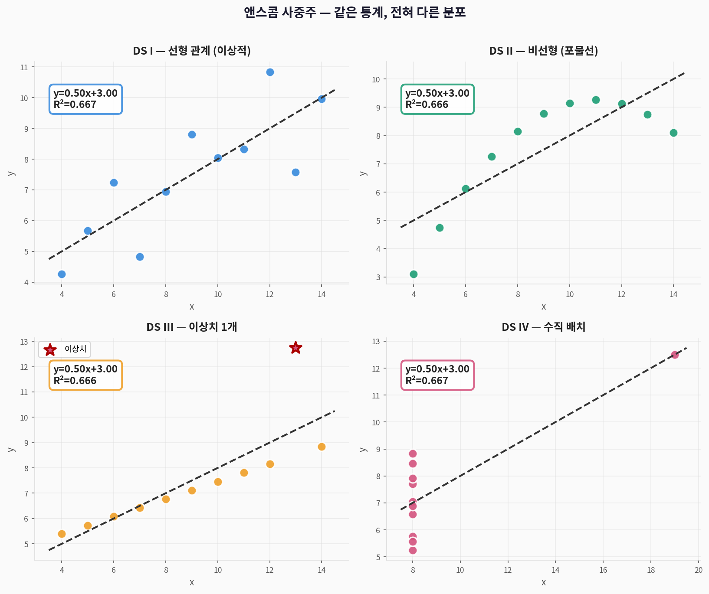
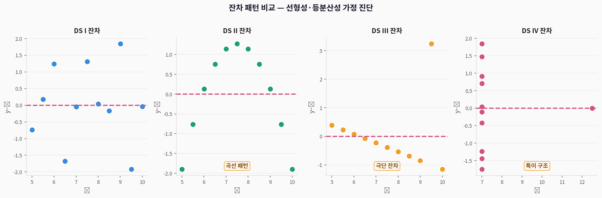
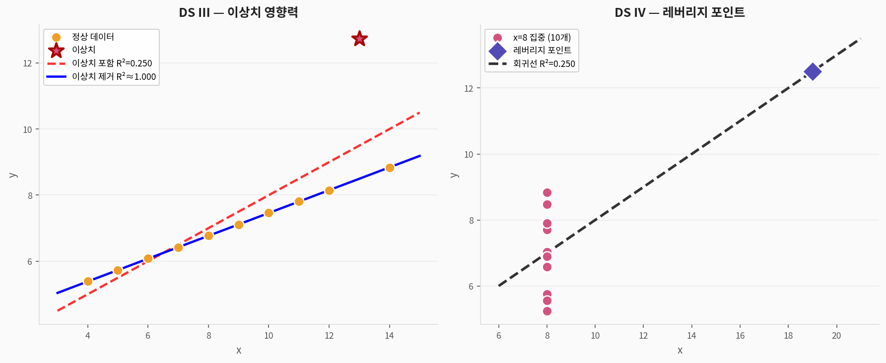
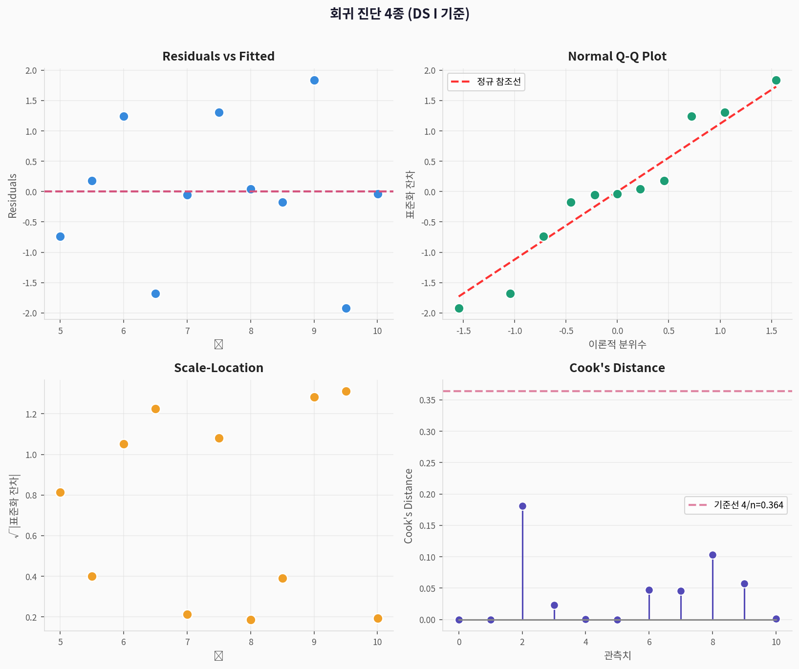
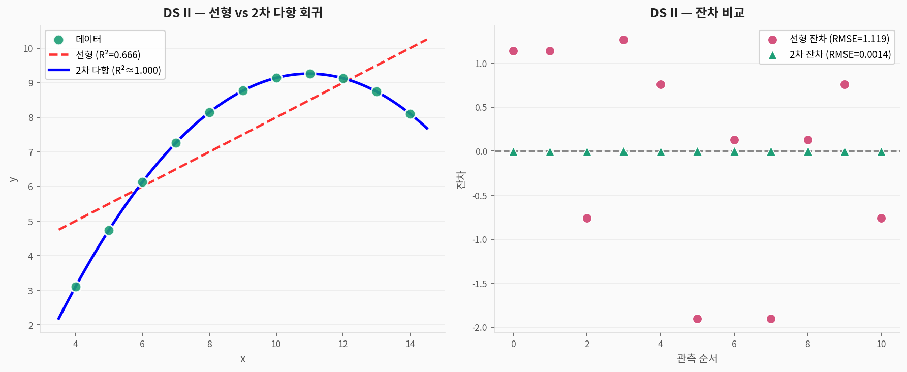

# 📐 Anscombe 사중주 — 시각화 연습 완전 가이드

> **앤스콤 사중주(Anscombe's Quartet)**로 배우는 데이터 시각화의 핵심 원칙  
> 출처: Anscombe, F.J. (1973). *Graphs in Statistical Analysis*. American Statistician, 27(1), 17–21  
> 주제: **항상 데이터를 먼저 시각화하라** — 수치 통계만으로는 데이터를 이해할 수 없다

---

## 1. 데이터셋 소개

### 핵심 메시지

> 4개 데이터셋이 **동일한 기술통계**를 가지지만, 분포는 **완전히 다르다**  
> → 회귀 분석 전에 반드시 **산점도부터 그려야** 한다는 교훈

| 구분 | 내용 |
|------|------|
| **제안자** | Francis Anscombe (1973년) |
| **목적** | 시각화 없는 통계 분석의 위험성 시연 |
| **구조** | 4개 데이터셋(I~IV), 각 11개 관측치 |
| **변수** | `dataset` (I~IV), `x` (독립변수), `y` (종속변수) |

### 변수 설명

| 변수명 | 설명 | 타입 |
|--------|------|------|
| `dataset` | 데이터셋 구분자 (I, II, III, IV) | 범주형 |
| `x` | 독립변수 | 수치형 |
| `y` | 종속변수 | 수치형 |

---

## 2. 핵심 원리: 같은 통계, 다른 분포

### 기술통계 비교

| 데이터셋 | x 평균 | y 평균 | x 분산 | y 분산 | 회귀식 | R² |
|----------|:------:|:------:|:------:|:------:|--------|:---:|
| **I** | 9.000 | 7.500 | 11.00 | 4.127 | y = 0.50x + 3.00 | 0.667 |
| **II** | 9.000 | 7.500 | 11.00 | 4.127 | y = 0.50x + 3.00 | 0.666 |
| **III** | 9.000 | 7.500 | 11.00 | 4.122 | y = 0.50x + 3.00 | 0.666 |
| **IV** | 9.000 | 7.500 | 11.00 | 4.123 | y = 0.50x + 3.00 | 0.667 |

> ⚠️ **수치만 보면 4개 데이터셋이 동일하다!**

---

## 3. 시각화 결과

### 3-1. 핵심: 사중주 산점도



> **해석:**
> - **DS I**: 이상적인 선형 관계 — 회귀 가정 모두 충족
> - **DS II**: 이차함수(포물선) 패턴 — 선형 회귀가 부적합, 다항 회귀 필요
> - **DS III**: 10개 점이 완벽한 선형이나 **이상치 1개**가 회귀선 전체를 왜곡
> - **DS IV**: x값이 8로 거의 고정, **레버리지 포인트** 1개가 회귀선 결정

```python
import seaborn as sns
import matplotlib.pyplot as plt

anscombe = sns.load_dataset('anscombe')

g = sns.FacetGrid(anscombe, col='dataset', col_wrap=2, height=4)
g.map_dataframe(sns.scatterplot, x='x', y='y', s=80)
g.map_dataframe(sns.regplot, x='x', y='y',
                scatter=False, ci=95, line_kws={'color':'red','linestyle':'--'})
g.set_titles(col_template="DS {col_name}")
plt.suptitle("Anscombe's Quartet", y=1.02)
plt.show()
```

---

### 3-2. 잔차 패턴 — 선형성·등분산성 진단



> **잔차가 알려주는 것:**

| 데이터셋 | 잔차 패턴 | 진단 결과 |
|----------|-----------|-----------|
| **DS I** | 0 주변 무작위 | ✅ 선형 가정 충족 |
| **DS II** | 곡선 형태 (U자) | ❌ 비선형 — 다항 회귀 필요 |
| **DS III** | 1개 극단값 | ❌ 이상치가 모델 왜곡 |
| **DS IV** | 대부분 0, 1개 이탈 | ❌ 레버리지 포인트 |

```python
from scipy import stats

for ds in ['I', 'II', 'III', 'IV']:
    sub = anscombe[anscombe['dataset'] == ds]
    slope, intercept, r, p, se = stats.linregress(sub['x'], sub['y'])
    y_hat = slope * sub['x'] + intercept
    residuals = sub['y'] - y_hat

    plt.scatter(y_hat, residuals, label=f'DS {ds}')
    plt.axhline(0, color='red', linestyle='--')
plt.xlabel('Fitted ŷ'); plt.ylabel('Residuals')
plt.title('Residuals vs Fitted')
plt.show()
```

---

### 3-3. 분포 시각화 4종


> **4가지 시각화 도구 비교:**

| 시각화 | 특징 | 언제 사용 |
|--------|------|-----------|
| **히스토그램** | 빈도 기반, 구간(bin) 크기 영향 | 전체 분포 빠른 파악 |
| **KDE** | 연속 밀도 추정, 부드러운 곡선 | 분포 형태 비교 |
| **박스플롯** | 5수치 요약 + 이상치 표시 | 중앙값·사분위범위 비교 |
| **바이올린** | KDE + 박스플롯 결합 | 분포 전체 형태 파악 |

```python
import seaborn as sns

fig, axes = plt.subplots(2, 2, figsize=(12, 9))

# ① 히스토그램
for ds in ['I','II','III','IV']:
    axes[0,0].hist(anscombe[anscombe['dataset']==ds]['y'],
                   bins=8, alpha=0.5, label=f'DS {ds}')
axes[0,0].legend(); axes[0,0].set_title('히스토그램')

# ② KDE
for ds in ['I','II','III','IV']:
    sns.kdeplot(anscombe[anscombe['dataset']==ds]['y'],
                ax=axes[0,1], label=f'DS {ds}', fill=True, alpha=0.3)
axes[0,1].legend(); axes[0,1].set_title('KDE 밀도 추정')

# ③ 박스플롯
sns.boxplot(data=anscombe, x='dataset', y='y', ax=axes[1,0], notch=True)
axes[1,0].set_title('박스플롯')

# ④ 바이올린
sns.violinplot(data=anscombe, x='dataset', y='y', ax=axes[1,1])
axes[1,1].set_title('바이올린 플롯')

plt.tight_layout()
plt.show()
```

---

### 3-4. 통계 비교 + Q-Q Plot


> **Q-Q Plot 해석:**
> - 점들이 대각선(정규 참조선)에 가까울수록 정규 분포에 가까움
> - DS III: 이상치가 극단 위치에 표시 → 정규성 위반

---

### 3-5. 이상치·레버리지 영향



> **DS III (이상치):**
> - 이상치 1개 포함: R² = 0.666
> - 이상치 제거 후: R² ≈ 1.000
> - → **1개 관측치가 회귀 결과 전체를 지배**

> **DS IV (레버리지 포인트):**
> - x=8인 점 10개 + x=19인 점 1개
> - x=19 점 하나가 회귀선의 기울기와 절편 모두 결정
> - → **극단적인 x값 = 높은 레버리지 = 큰 영향력**

```python
# DS III 이상치 제거 비교
ds3 = anscombe[anscombe['dataset'] == 'III']
ds3_clean = ds3[ds3['y'] < 10]  # 이상치 제거

s1, i1, r1, _, _ = stats.linregress(ds3['x'], ds3['y'])
s2, i2, r2, _, _ = stats.linregress(ds3_clean['x'], ds3_clean['y'])

print(f"이상치 포함: R²={r1**2:.3f}")
print(f"이상치 제거: R²={r2**2:.3f}")  # ≈ 1.000
```

---

### 3-6. 회귀 진단 4종 (Regression Diagnostics)



> **4종 진단 플롯 — DS I (선형 가정 충족 사례):**

| 플롯 | 진단 목적 | 좋은 패턴 |
|------|-----------|-----------|
| **Residuals vs Fitted** | 선형성·등분산성 | 수평 무작위 산포 |
| **Normal Q-Q** | 잔차 정규성 | 대각선 근접 |
| **Scale-Location** | 등분산성 | 수평 직선 |
| **Cook's Distance** | 영향력 관측치 | 모든 값 < 4/n |

```python
# statsmodels로 완전한 회귀 진단
import statsmodels.api as sm

ds1 = anscombe[anscombe['dataset'] == 'I']
X = sm.add_constant(ds1['x'])
model = sm.OLS(ds1['y'], X).fit()

# 영향력 측정
influence = model.get_influence()
cooks = influence.cooks_distance[0]
leverage = influence.hat_matrix_diag

print(f"Cook's Distance 최대값: {cooks.max():.4f}")
print(f"기준선 4/n = {4/len(ds1):.4f}")
print(f"영향력 있는 관측치: {(cooks > 4/len(ds1)).sum()}개")
```

---

### 3-7. 비선형 회귀 비교 (DS II)



> **DS II에서 선형 회귀 vs 2차 다항 회귀:**
> - 선형 회귀: R² = 0.666, 잔차에 곡선 패턴 존재
> - 2차 다항 회귀: R² ≈ 1.000, 잔차가 무작위 분포

```python
import numpy as np
from numpy.polynomial import polynomial as P

ds2 = anscombe[anscombe['dataset'] == 'II']

# 선형 회귀
slope, intercept, r_lin, _, _ = stats.linregress(ds2['x'], ds2['y'])

# 2차 다항 회귀
coeffs = np.polyfit(ds2['x'], ds2['y'], 2)

x_fit = np.linspace(3, 15, 100)
y_linear = slope * x_fit + intercept
y_quad = np.polyval(coeffs, x_fit)

# 잔차 비교
resid_linear = ds2['y'].values - (slope * ds2['x'].values + intercept)
resid_quad = ds2['y'].values - np.polyval(coeffs, ds2['x'].values)

print(f"선형 RMSE: {resid_linear.std():.4f}")
print(f"2차 RMSE:  {resid_quad.std():.6f}")  # 훨씬 작음
```

---

### 3-8. 분석 흐름 파이프라인


---

## 4. 핵심 seaborn 코드 총정리

```python
import seaborn as sns
import pandas as pd
import numpy as np
import matplotlib.pyplot as plt
from scipy import stats

# ① 데이터 로드
anscombe = sns.load_dataset('anscombe')
print(anscombe.head())
print(anscombe['dataset'].unique())  # ['I', 'II', 'III', 'IV']

# ② 기술통계 — 4개가 거의 동일!
for ds in ['I', 'II', 'III', 'IV']:
    sub = anscombe[anscombe['dataset'] == ds]
    slope, intercept, r, p, se = stats.linregress(sub['x'], sub['y'])
    print(f"DS {ds}: x̄={sub['x'].mean():.3f}, ȳ={sub['y'].mean():.3f}, "
          f"slope={slope:.3f}, R²={r**2:.3f}")

# ③ FacetGrid 산점도 + 회귀선 (seaborn 핵심 패턴)
g = sns.FacetGrid(anscombe, col='dataset', col_wrap=2, height=4, aspect=1.2)
g.map_dataframe(sns.scatterplot, x='x', y='y', s=80, color='steelblue')
g.map_dataframe(sns.regplot, x='x', y='y',
                scatter=False, ci=95,
                line_kws={'color':'crimson', 'linestyle':'--', 'linewidth':2})
g.set_titles(col_template="Dataset {col_name}")
plt.suptitle("Anscombe's Quartet", y=1.02, fontsize=14, fontweight='bold')
plt.tight_layout()
plt.show()

# ④ 분포 시각화 (KDE)
fig, axes = plt.subplots(1, 2, figsize=(12, 5))
for ds in ['I', 'II', 'III', 'IV']:
    sub = anscombe[anscombe['dataset'] == ds]
    sns.kdeplot(sub['y'], ax=axes[0], label=f'DS {ds}', fill=True, alpha=0.3)
    axes[1].hist(sub['y'], bins=8, alpha=0.5, label=f'DS {ds}', edgecolor='white')
for ax in axes:
    ax.legend(); ax.grid(alpha=0.4)
axes[0].set_title('KDE 비교'); axes[1].set_title('히스토그램 비교')
plt.tight_layout(); plt.show()

# ⑤ 잔차 진단 (seaborn residplot)
fig, axes = plt.subplots(1, 4, figsize=(14, 4))
for ax, ds in zip(axes, ['I', 'II', 'III', 'IV']):
    sub = anscombe[anscombe['dataset'] == ds]
    sns.residplot(data=sub, x='x', y='y', ax=ax,
                  lowess=True,
                  scatter_kws={'s':60, 'alpha':0.8},
                  line_kws={'color':'red', 'linewidth':2})
    ax.set_title(f'DS {ds} 잔차')
plt.suptitle('잔차 패턴 비교', y=1.02)
plt.tight_layout(); plt.show()
```

---

## 5. 학습 포인트 요약

| 번호 | 핵심 교훈 | 실천 방법 |
|:----:|-----------|-----------|
| ① | 같은 R²·회귀식도 분포는 다를 수 있다 | 항상 산점도부터 그릴 것 |
| ② | 잔차 패턴으로 모델 적합성 진단 | 곡선 패턴 → 다항 회귀 검토 |
| ③ | 이상치 1개가 전체 회귀를 왜곡 | Cook's Distance로 영향력 측정 |
| ④ | 레버리지 포인트 식별 필수 | hat matrix 대각값 확인 |
| ⑤ | 비선형 패턴에는 다항 회귀 | 2차 이상의 다항식 적합 |

```
📌 최종 요약
데이터셋:  4개 (각 11행 × 2열)
핵심 교훈: 동일한 통계량 ≠ 동일한 데이터
핵심 기술: FacetGrid / residplot / regplot / kdeplot
경고:      수치 통계만으로 분석 결론 내리지 말 것
권장:      분석 시작 전 반드시 시각화(EDA) 먼저 수행
```
