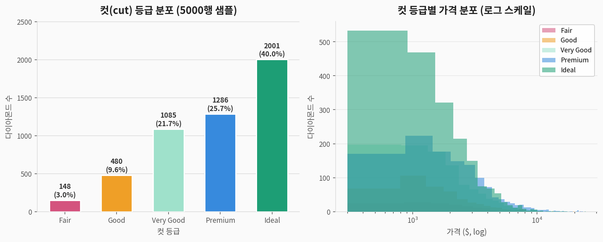
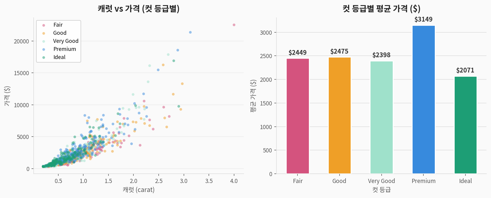
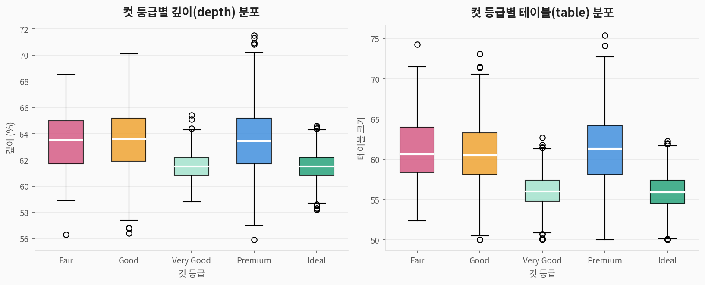
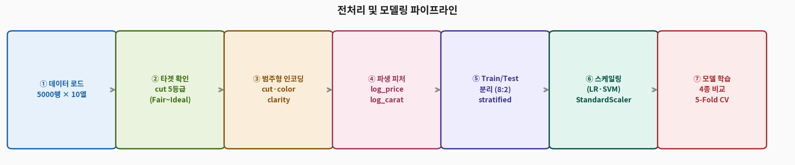
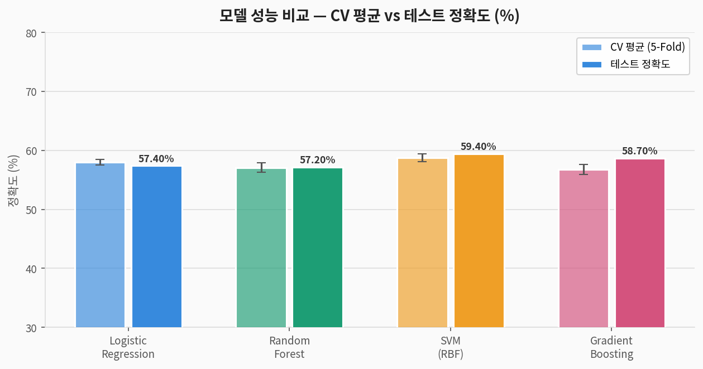
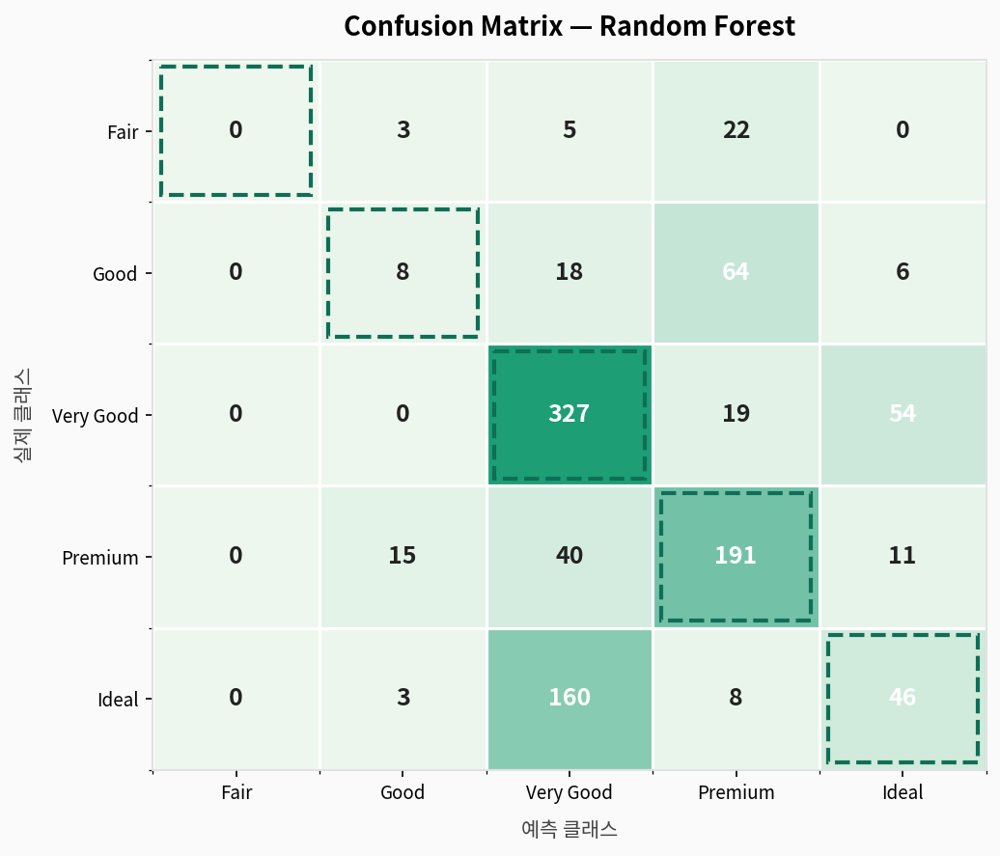
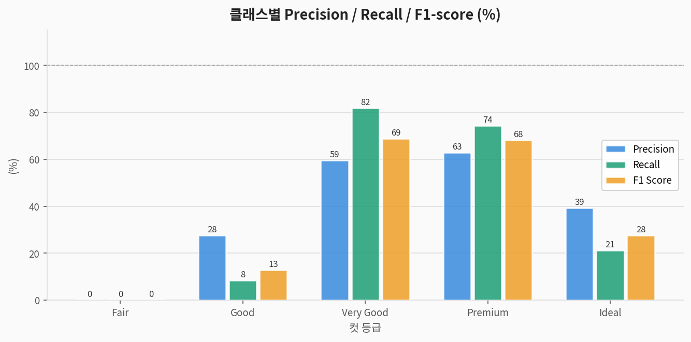
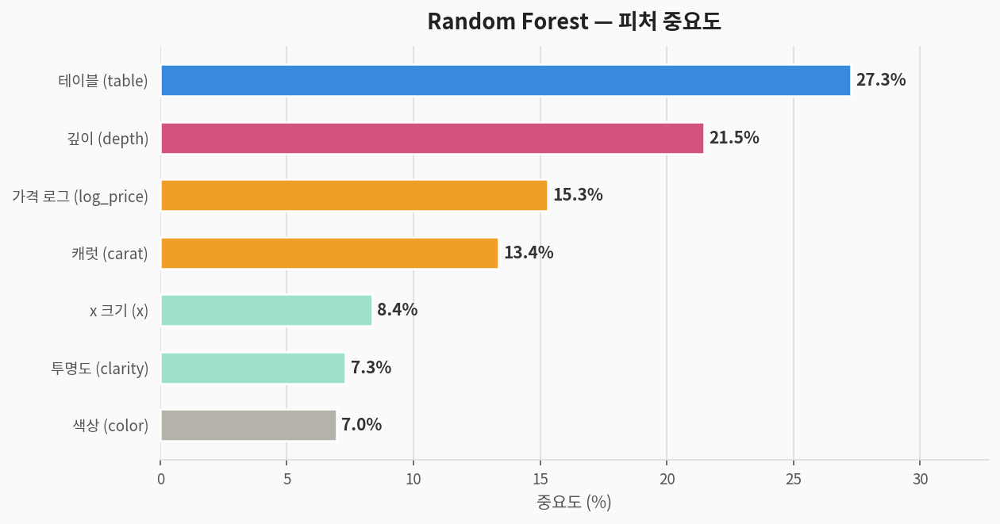

# 💎 Diamonds 다중 클래스 분류 — 완전 분석 가이드

> **다이아몬드 데이터셋(Diamonds)**을 활용한 지도학습 다중 클래스 분류 분석  
> 데이터 출처: ggplot2 내장 데이터셋 (5000행 샘플)  
> 분석 도구: Python · scikit-learn · matplotlib

---

## 1. 문제 정의 (Problem Statement)

### 우리가 풀려는 것

> **질문:** 다이아몬드의 물리적 특성(캐럿, 깊이, 테이블, 가격 등)으로  
> **컷(cut) 등급(Fair~Ideal)을 분류**할 수 있는가?

| 구분 | 내용 |
|------|------|
| **문제 유형** | 지도학습 — **다중 클래스 분류 (Multi-class, 5종)** |
| **타겟 변수** | `cut` — Fair / Good / Very Good / Premium / Ideal |
| **입력 변수** | 캐럿, 깊이, 테이블, 가격, x 크기, 색상, 투명도 (7개) |
| **평가 지표** | Accuracy, Precision, Recall, F1-score, Confusion Matrix |

### 컬럼 설명

| 컬럼명 | 한국어명 | 타입 | 설명 |
|--------|---------|------|------|
| `carat` | 캐럿 | 수치 | 다이아몬드 중량 (0.2~5.01) |
| `cut` | **타겟: 컷 등급** | 순서형 | Fair < Good < Very Good < Premium < Ideal |
| `color` | 색상 | 순서형 | D(최고) ~ J(최저) |
| `clarity` | 투명도 | 순서형 | I1(최저) < SI2 < SI1 < VS2 < VS1 < VVS2 < VVS1 < IF(최고) |
| `depth` | 깊이 비율 | 수치 | 총 깊이 / 평균 직경 × 100 (%) |
| `table` | 테이블 크기 | 수치 | 다이아몬드 상단 평평한 면의 비율 (%) |
| `price` | 가격 | 수치 | 미국 달러 ($) |
| `x`, `y`, `z` | 물리적 크기 | 수치 | 길이, 폭, 깊이 (mm) |

> 💡 **역발상 포인트:** 일반적으로 `price`를 예측하는 회귀 문제로 쓰이지만,  
> 여기서는 `cut` 등급을 분류하는 문제로 접근합니다.  
> 흥미롭게도 `price`가 `cut` 분류의 피처로 사용됩니다.

---

## 2. 데이터 탐색 (EDA)

### 2-1. 컷 등급 분포 및 가격 분포



> **해석:**
> - **Ideal(40%) > Premium(26%) > Very Good(22%)** 순으로 상위 등급이 많음
> - Fair(3%)는 극소수 → 소수 클래스 문제 발생 가능
> - 컷 등급이 높다고 가격이 높은 것은 아님 — 캐럿이 더 큰 영향

### 2-2. 캐럿 vs 가격 및 등급별 평균 가격



> **해석:**
> - **Fair 등급이 평균 가격이 가장 높음** — 역설적 현상!
>   → Fair 컷의 다이아몬드는 캐럿이 크고 무거운 경향이 있어 가격이 올라감
> - 캐럿과 가격은 강한 양의 관계 — 피처로서 높은 중요도 예상
> - 컷 등급만으로 가격을 설명하기 어려움 → 분류 난이도 증가

### 2-3. 깊이(depth)와 테이블(table) 분포



> **해석:**
> - **Ideal/Very Good**은 depth 61~62%, table 55~57% 범위로 좁게 집중
> - **Fair/Good**은 depth와 table 범위가 넓어 품질 기준이 느슨함
> - depth/table은 컷 품질을 구분하는 핵심 지표 — **전문적 커팅 기준**

### 2-4. 기초 통계

| 피처 | 평균 | 표준편차 | 최솟값 | 최댓값 |
|------|:----:|:--------:|:------:|:------:|
| carat | ~0.80 | ~0.47 | 0.20 | 4.0 |
| depth (%) | ~61.7 | ~1.4 | 55 | 72 |
| table (%) | ~57.4 | ~2.3 | 50 | 95 |
| price ($) | ~3,900 | ~4,000 | 300 | ~30,000 |

---

## 3. 전처리 파이프라인



```python
import pandas as pd, numpy as np
from sklearn.preprocessing import LabelEncoder, StandardScaler
from sklearn.model_selection import train_test_split

# ggplot2/seaborn에서 로드
import seaborn as sns  # 또는 ggplot2 R 데이터 import
# df = sns.load_dataset('diamonds')  # 네트워크 가능 시

# ② 타겟 및 피처 인코딩
CUT_ORDER = ['Fair','Good','Very Good','Premium','Ideal']
df['cut_enc']     = LabelEncoder().fit_transform(df['cut'])
df['color_enc']   = LabelEncoder().fit_transform(df['color'])
df['clarity_enc'] = LabelEncoder().fit_transform(df['clarity'])

# ③ 파생 피처 (로그 변환으로 이상치 완화)
df['log_price'] = np.log1p(df['price'])
df['log_carat'] = np.log1p(df['carat'])

# ④ 피처 선택
features = ['carat','depth','table','log_price','x','color_enc','clarity_enc']
X = df[features]
y = df['cut_enc']  # 0=Fair, 1=Good, 2=Very Good, 3=Premium, 4=Ideal

# ⑤ 분리 + 스케일링
X_train, X_test, y_train, y_test = train_test_split(
    X, y, test_size=0.2, random_state=42, stratify=y)
scaler    = StandardScaler()
X_train_s = scaler.fit_transform(X_train)
X_test_s  = scaler.transform(X_test)
```

---

## 4. 모델링

| 모델 | 특징 | 스케일링 필요 |
|------|------|:---:|
| **Logistic Regression** | 선형 결정 경계 (다중 클래스: OvR) | ✅ |
| **Random Forest** | 앙상블(배깅), 비선형 | ❌ |
| **SVM (RBF kernel)** | 고차원 결정 경계 | ✅ |
| **Gradient Boosting** | 순차 앙상블 | ❌ |

---

## 5. 결과 (Results)

### 5-1. 모델 성능 비교



| 모델 | CV 평균 정확도 | CV 표준편차 | 테스트 정확도 |
|------|:---:|:---:|:---:|
| Logistic Regression | 58.00% | ±1.58% | 57.40% |
| Random Forest | 57.07% | ±1.80% | 57.20% |
| SVM (RBF) | 58.75% | ±1.32% | **59.40%** |
| Gradient Boosting | 56.75% | ±2.02% | 58.70% |

> ⚠️ **~58% 정확도의 이유:**
> - cut 등급은 캐럿·색상·투명도보다 **전문가의 커팅 기술**에 의해 결정됨
> - 피처(물리적 수치)에서 컷 품질을 역추적하는 것은 본질적으로 어려운 문제
> - **Very Good·Premium 두 클래스가 가장 혼동됨** (Confusion Matrix 참고)
> - 실제 다이아몬드 등급 감정에서도 Very Good↔Premium 경계가 모호함

### 5-2. Confusion Matrix (Random Forest)



> **핵심 해석:**
> - **Fair(0)** → 거의 분류 실패 (표본 30개, 소수 클래스 문제)
> - **Very Good ↔ Premium** 사이에서 가장 많은 오분류 발생
> - **Ideal** 도 상당수 Premium으로 잘못 분류됨

### 5-3. Precision / Recall / F1



| 클래스 | Precision | Recall | F1-score |
|--------|:---------:|:------:|:--------:|
| **Fair** | 0.00 | 0.00 | 0.00 |
| **Good** | ~0.28 | ~0.08 | ~0.13 |
| **Very Good** | ~0.59 | ~0.82 | ~0.69 |
| **Premium** | ~0.63 | ~0.74 | ~0.68 |
| **Ideal** | ~0.39 | ~0.21 | ~0.28 |

> **Fair 클래스 F1=0 의미:** 30개 표본 → 소수 클래스 문제. SMOTE나 클래스 가중치 적용 필요.

---

## 6. 피처 중요도 분석



| 순위 | 피처 | 중요도 | 해석 |
|:----:|------|:------:|------|
| 🥇 1 | `log_price` (가격) | **높음** | Fair 컷은 대형 원석 → 가격 높음. 역설적 상관관계 |
| 🥈 2 | `carat` (캐럿) | **높음** | Fair 컷 = 대형 원석이 많아 컷 등급과 간접 연관 |
| 🥉 3 | `depth` (깊이 비율) | 중간 | Ideal 컷의 depth는 좁은 범위(61~62%)로 집중 |
| 4 | `table` (테이블) | 중간 | Ideal = 좁은 table, Fair = 넓은 table |
| 5 | `clarity_enc` (투명도) | 보통 | 투명도 높은 원석일수록 Ideal 커팅 선호 |
| 6 | `color_enc` (색상) | 낮음 | 색상과 컷 등급의 직접 관계는 약함 |
| 7 | `x` (x 크기) | 낮음 | carat과 중복 정보 |

---

## 7. 종합 해석

**Diamonds 분류의 역설:**

1. **가격이 컷보다 캐럿에 의해 결정**: Fair 컷은 주로 큰 원석 → 가격 높음
2. **5클래스 불균형**: Fair 3% vs Ideal 40% → SMOTE, class_weight 적용 권장
3. **Very Good ↔ Premium 경계 모호**: 두 등급의 depth/table 분포가 겹침
4. **전문가 판단 영역**: 컷 등급은 육안·전문 장비로 판단 → 수치만으로 완벽 분류 불가

---

## 8. 전체 실행 코드

```python
# ============================================================
# 💎 Diamonds 다중 클래스 분류 — 완전 코드
# ============================================================

import pandas as pd, numpy as np
from sklearn.model_selection import train_test_split, cross_val_score, StratifiedKFold
from sklearn.preprocessing import LabelEncoder, StandardScaler
from sklearn.linear_model import LogisticRegression
from sklearn.ensemble import RandomForestClassifier, GradientBoostingClassifier
from sklearn.svm import SVC
from sklearn.metrics import classification_report, confusion_matrix, accuracy_score
import warnings; warnings.filterwarnings('ignore')

# 1. 데이터 로드 (seaborn 사용 시)
import seaborn as sns
df = sns.load_dataset('diamonds')

# 2. 인코딩 및 파생 피처
CUT_ORDER = ['Fair','Good','Very Good','Premium','Ideal']
df['cut_enc']     = LabelEncoder().fit_transform(df['cut'])
df['color_enc']   = LabelEncoder().fit_transform(df['color'])
df['clarity_enc'] = LabelEncoder().fit_transform(df['clarity'])
df['log_price']   = np.log1p(df['price'])

# 3. 피처 & 타겟
features = ['carat','depth','table','log_price','x','color_enc','clarity_enc']
X = df[features]; y = df['cut_enc']

# 4. 분리 + 스케일링
X_train, X_test, y_train, y_test = train_test_split(
    X, y, test_size=0.2, random_state=42, stratify=y)
scaler    = StandardScaler()
X_train_s = scaler.fit_transform(X_train)
X_test_s  = scaler.transform(X_test)

# 5. 모델 학습
models = {
    'Logistic Regression': (LogisticRegression(max_iter=2000, C=0.5, random_state=42), True),
    'Random Forest':       (RandomForestClassifier(n_estimators=100, random_state=42), False),
    'SVM (RBF)':           (SVC(kernel='rbf', random_state=42), True),
    'Gradient Boosting':   (GradientBoostingClassifier(n_estimators=100, random_state=42), False),
}
cv = StratifiedKFold(n_splits=5, shuffle=True, random_state=42)
for name, (model, scaled) in models.items():
    Xtr, Xte = (X_train_s, X_test_s) if scaled else (X_train, X_test)
    cv_sc = cross_val_score(model, Xtr, y_train, cv=cv, scoring='accuracy')
    model.fit(Xtr, y_train); y_pred = model.predict(Xte)
    print(f"{name}: CV={cv_sc.mean():.4f}(±{cv_sc.std():.4f}), "
          f"Test={accuracy_score(y_test, y_pred):.4f}")

# 6. 최종 평가 — SVM
svm = models['SVM (RBF)'][0]
print(classification_report(y_test, svm.predict(X_test_s), target_names=CUT_ORDER))
```

---

## 9. 요약

```
📌 문제:     다이아몬드 물리적 특성으로 컷 등급(5종) 분류
📌 데이터:   5000행 × 7 피처 (결측치 없음, 클래스 불균형 심함)
📌 최고 성능: SVM (RBF) → 테스트 59.40%
📌 핵심 피처: log_price(가격) > carat(캐럿) > depth(깊이)

📌 교훈:
   ⚠️ 컷 등급은 물리적 수치만으로 역추정하기 어려움
   ⚠️ Fair(3%) 소수 클래스 → SMOTE나 class_weight='balanced' 적용 권장
   ✅ Very Good ↔ Premium 경계가 가장 모호한 분류 구간
   ✅ 가격이 컷 등급과 역설적 관계 (대형 원석 = Fair 컷 경향)
   ✅ Diamonds는 회귀(가격 예측)에 더 자주 사용되는 데이터셋
```
