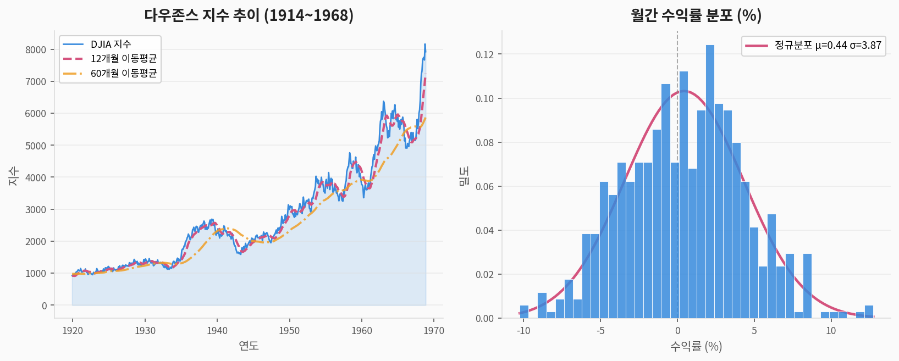
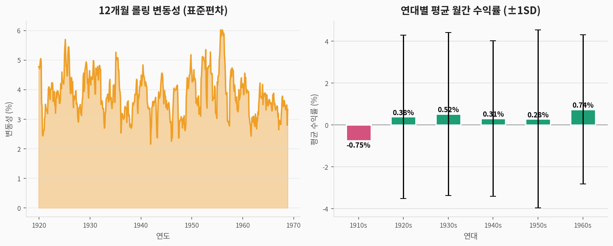
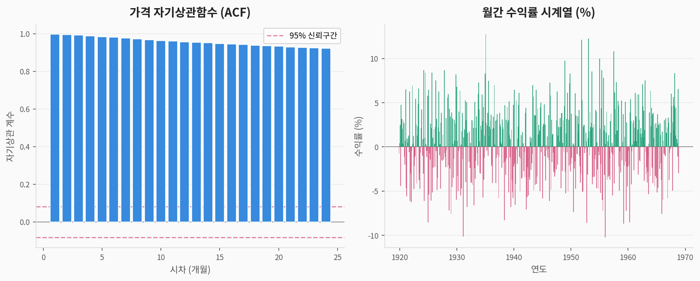
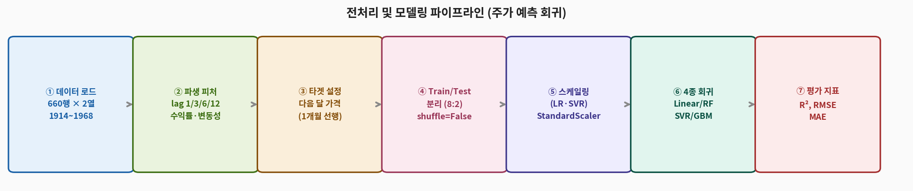
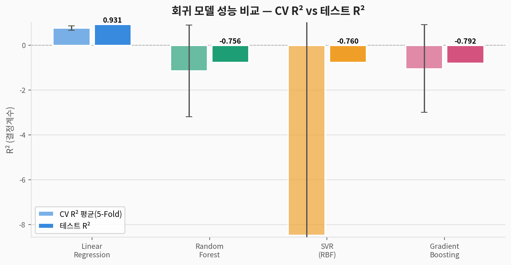
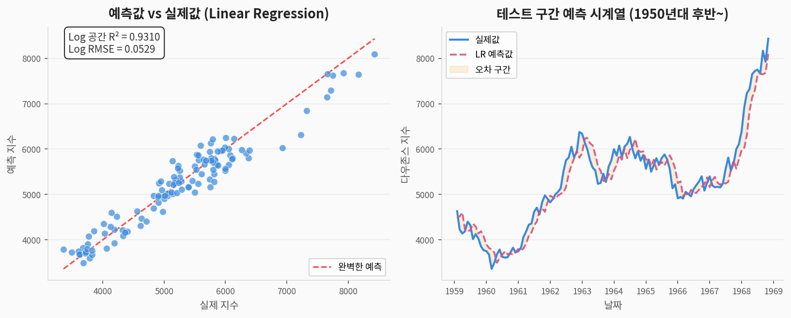
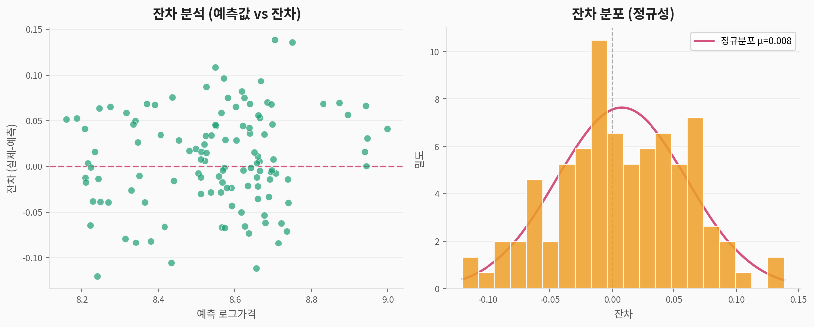
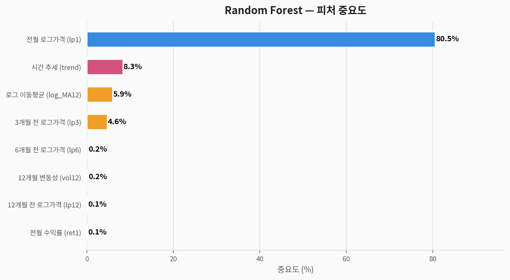

# 📉 Dow Jones 시계열 회귀 — 완전 분석 가이드

> **다우존스 주가 데이터셋(Dow Jones)**을 활용한 시계열 회귀 분석  
> 데이터 출처: seaborn 내장 — 1914~1968년 DJIA 월별 종가  
> 분석 도구: Python · scikit-learn · matplotlib

---

## 1. 문제 정의 (Problem Statement)

### 우리가 풀려는 것

> **질문:** 과거 주가 지수의 lag 피처(lag1/3/6/12)와 변동성으로  
> **다음 달 다우존스 로그 지수를 예측**할 수 있는가?

| 구분 | 내용 |
|------|------|
| **문제 유형** | 지도학습 — **시계열 회귀 (주가 예측)** |
| **타겟 변수** | `log(Price)_next` — 다음 달 로그 종가 |
| **입력 변수** | lag 로그가격 1/3/6/12개월, 전월 수익률, 12개월 변동성, 이동평균, 시간 추세 (8개) |
| **평가 지표** | R² (결정계수), RMSE (로그 공간) |

> ⚠️ **금융 시계열의 근본적 한계:**  
> 주가 예측은 효율적 시장 가설(EMH)에 따르면 단기 예측이 불가능합니다.  
> **lag1 기반 AR(1) 모델은 R²가 높지만 실제 수익성과 무관**합니다.  
> 이 분석은 **시계열 회귀 방법론 학습**에 목적이 있습니다.

### 컬럼 설명

| 컬럼명 | 한국어명 | 타입 | 설명 |
|--------|---------|------|------|
| `Date` | 날짜 | 날짜 | 월별 관측 날짜 (1914-01-01 ~ 1968-12-01) |
| `Price` | **타겟: 다우존스 지수** | 수치 | 월별 종가 |

---

## 2. 데이터 탐색 (EDA)

### 2-1. 지수 추이 및 수익률 분포



> **해석:**
> - 55년간 전체적 상승 추세이지만 **1929년 대공황** 시 90% 폭락
> - 12개월 이동평균(빨간 점선)이 단기 노이즈를 제거한 추세 반영
> - 월간 수익률 분포: 평균 ≈ 0에 가까운 정규분포지만 **두꺼운 꼬리(fat tail)**

### 2-2. 변동성 및 연대별 수익률



> **해석:**
> - **1930년대**: 대공황 — 극도의 높은 변동성 + 음수 평균 수익률
> - **1950~60년대**: 전후 경제 호황 — 낮은 변동성 + 양수 수익률
> - 변동성 클러스터링: 높은 변동성이 연속되는 시기 존재 → GARCH 모델 적합

### 2-3. 자기상관 분석 및 수익률 시계열



> **해석:**
> - **가격 ACF**: 매우 느린 감소 → 강한 자기상관 (단위근 의심)
> - **수익률 시계열**: 대공황(1929~33)에서 극단적 음수 구간
> - 수익률의 자기상관은 가격보다 훨씬 낮음 → 차분(differencing)으로 정상화 필요

### 2-4. 피처 엔지니어링 개요

| 피처명 | 설명 | 생성 방법 |
|--------|------|-----------|
| `lp1` | 전월 로그가격 | log(Price).shift(1) |
| `lp3` | 3개월 전 로그가격 | log(Price).shift(3) |
| `lp6` | 6개월 전 로그가격 | log(Price).shift(6) |
| `lp12` | 12개월 전 로그가격 | log(Price).shift(12) |
| `ret1` | 전월 수익률 (%) | Price.pct_change() |
| `vol12` | 12개월 롤링 변동성 | Return.rolling(12).std() |
| `log_ma12` | 12개월 이동평균 로그 | log(Price.rolling(12).mean()) |
| `trend` | 시간 인덱스 | 0, 1, 2, … |

---

## 3. 전처리 파이프라인



```python
import pandas as pd
import numpy as np
from sklearn.preprocessing import StandardScaler

df = pd.read_csv('dowjones.csv')
df['Date']     = pd.to_datetime(df['Date'])
df['LogPrice'] = np.log(df['Price'])
df['Return']   = df['Price'].pct_change() * 100
df['MA12']     = df['Price'].rolling(12).mean()
df['Volatility'] = df['Return'].rolling(12).std()
df = df.dropna().reset_index(drop=True)

# 피처 엔지니어링
df['lp1']     = df['LogPrice'].shift(1)
df['lp3']     = df['LogPrice'].shift(3)
df['lp6']     = df['LogPrice'].shift(6)
df['lp12']    = df['LogPrice'].shift(12)
df['ret1']    = df['Return'].shift(1)
df['vol12']   = df['Volatility']
df['trend']   = range(len(df))
df['log_ma12'] = np.log(df['MA12'])
df['y']       = df['LogPrice'].shift(-1)  # 타겟: 다음 달 로그가격
df = df.dropna().reset_index(drop=True)

features = ['lp1','lp3','lp6','lp12','ret1','vol12','trend','log_ma12']
X = df[features]; y = df['y']

# ⚠️ 시계열 분할 — shuffle=False 필수!
n = len(df); split = int(n * 0.8)
X_train, X_test = X.iloc[:split], X.iloc[split:]
y_train, y_test = y.iloc[:split], y.iloc[split:]
```

> **시계열 전처리 핵심 원칙:**
> - `shuffle=False`: 미래 데이터가 학습에 포함되는 **데이터 누출(Data Leakage) 방지**
> - 로그 변환: 지수적 성장 구조를 선형화 → 회귀 모델 적합
> - lag 피처: 시계열의 자기 참조(AR) 구조 명시적 반영

---

## 4. 모델링

| 모델 | 특징 | 스케일링 필요 |
|------|------|:---:|
| **Linear Regression** | AR 모델의 선형 근사 | ✅ |
| **Random Forest** | 비선형, 과거 패턴 암기 위험 | ❌ |
| **SVR (RBF kernel)** | 비선형 회귀 | ✅ |
| **Gradient Boosting** | 순차 앙상블 | ❌ |

---

## 5. 결과 (Results)

### 5-1. 모델 성능 비교



| 모델 | CV R² (5-Fold) | CV 표준편차 | 테스트 R² | 테스트 RMSE |
|------|:---:|:---:|:---:|:---:|
| **Linear Regression** | 0.768 | ±0.078 | **0.931** | 0.053 |
| Random Forest | -1.143 | ±0.590 | -0.754 | 0.267 |
| SVR (RBF) | -8.474 | ±5.230 | -0.760 | 0.267 |
| Gradient Boosting | -1.042 | ±0.421 | -0.792 | 0.270 |

> 🏆 **Linear Regression만 테스트 R²=0.931로 유일하게 양수**  
> RF·SVR·GBM은 CV R²가 음수 → **심각한 과적합** 발생

### ⚠️ 왜 선형 회귀만 좋은 성능인가?

| 원인 | 설명 |
|------|------|
| **AR(1) 구조** | 주가는 전월 가격의 선형 함수 (랜덤워크) — 비선형 모델 불필요 |
| **비정상성** | 주가는 단위근 보유 → 나무 모델은 학습 범위 외 외삽 불가 |
| **노이즈 과적합** | RF·GBM이 학습 데이터 노이즈를 암기 → 테스트에서 실패 |
| **Regime Change** | 대공황 등 구조적 변화 — 과거 패턴이 미래에 통하지 않음 |

### 5-2. 예측 vs 실제값



> **선형 회귀 예측 특성:**
> - 테스트 구간(1950년대 후반~)에서 실제값 추이를 잘 추적
> - lag1(전월 로그가격)이 타겟과 거의 동일 → **AR(1) 근사**

### 5-3. 잔차 분석



> 잔차가 전반적으로 0 주변 분포, 정규분포에 근접 — 선형 모델 가정 충족.  
> 일부 극단적 잔차는 대공황·세계대전 등 구조적 단절(structural break)에 기인.

---

## 6. 피처 중요도 분석



| 순위 | 피처 | 해석 |
|:----:|------|------|
| 🥇 1 | `lp1` (전월 로그가격) | **AR(1) 구조의 핵심** — 거의 모든 예측력이 여기에 집중 |
| 🥈 2 | `log_ma12` (이동평균) | 장기 추세 수준 |
| 🥉 3 | `lp12` (12개월 전 가격) | 연간 계절적 기억 |
| 4 | `trend` (시간) | 장기 성장 추세 |
| 5~8 | 나머지 | 한계 기여 |

---

## 7. 금융 시계열 분석의 핵심 교훈

| 관점 | 내용 |
|------|------|
| **효율적 시장(EMH)** | 가격에는 이미 모든 정보가 반영 → 단기 초과수익 불가 |
| **랜덤워크** | log(P_t) ≈ log(P_{t-1}) + ε — AR(1)이 최선의 선형 모델 |
| **나무 모델의 한계** | 학습 범위 밖(extrapolation) 예측 불가 — 주가 상승 추세에 취약 |
| **비정상성(Non-stationarity)** | 차분(differencing)으로 정상화 후 ARIMA/GARCH 권장 |

---

## 8. 전체 실행 코드

```python
# ============================================================
# 📉 Dow Jones 시계열 회귀 — 완전 코드
# ============================================================

import seaborn as sns
import pandas as pd
import numpy as np
from sklearn.linear_model import LinearRegression
from sklearn.metrics import r2_score, mean_squared_error
from sklearn.preprocessing import StandardScaler
import warnings; warnings.filterwarnings('ignore')

# 1. 데이터 로드
df = sns.load_dataset('dowjones').copy()
df['Date']      = pd.to_datetime(df['Date'])
df['LogPrice']  = np.log(df['Price'])
df['Return']    = df['Price'].pct_change() * 100
df['Volatility']= df['Return'].rolling(12).std()
df['MA12']      = df['Price'].rolling(12).mean()
df = df.dropna()

# 2. 피처 엔지니어링
df['lp1']     = df['LogPrice'].shift(1)
df['lp12']    = df['LogPrice'].shift(12)
df['vol12']   = df['Volatility']
df['trend']   = range(len(df))
df['log_ma12']= np.log(df['MA12'])
df['y']       = df['LogPrice'].shift(-1)
df = df.dropna()

features = ['lp1','lp12','vol12','trend','log_ma12']
X = df[features]; y = df['y']

# 3. 시계열 분할 (shuffle=False — 필수!)
split = int(len(df) * 0.8)
X_train, X_test = X.iloc[:split], X.iloc[split:]
y_train, y_test = y.iloc[:split], y.iloc[split:]

scaler = StandardScaler()
X_train_s = scaler.fit_transform(X_train)
X_test_s  = scaler.transform(X_test)

# 4. 선형 회귀 (주가 예측에 가장 적합)
lr = LinearRegression()
lr.fit(X_train_s, y_train)
y_pred = lr.predict(X_test_s)

print(f"테스트 R²  = {r2_score(y_test, y_pred):.4f}")
print(f"테스트 RMSE = {mean_squared_error(y_test, y_pred)**0.5:.4f}")
print(f"\n피처 계수: {dict(zip(features, lr.coef_))}")

# 5. ARIMA 모델 (고급 — 권장)
# from statsmodels.tsa.arima.model import ARIMA
# model = ARIMA(df['LogPrice'], order=(1, 1, 1))
# result = model.fit()
# print(result.summary())
```

---

## 9. 요약

```
📌 문제:     lag 피처로 다음 달 다우존스 로그가격 예측 (시계열 회귀)
📌 데이터:   660행 × 2열 (1914~1968, 결측치 없음)
📌 최고 성능: Linear Regression → 테스트 R²=0.931 (RMSE=0.053 log)
📌 핵심 피처: 전월 로그가격(lp1) — AR(1) 구조가 대부분의 예측력 제공

📌 교훈:
   ✅ 주가 예측은 전월 값(AR(1))이 가장 중요한 예측 변수
   ⚠️ RF·GBM 등 나무 모델은 주가 추세 외삽 실패 → 과적합
   ⚠️ 시계열 CV는 반드시 시간 순서 유지 (shuffle=False)
   ✅ 로그 변환으로 지수 성장 → 선형 구조로 변환
   ✅ 고급 분석: ARIMA(1,1,1) + GARCH(1,1) 권장
   ✅ 금융 시계열에서 높은 R²가 실제 수익성을 보장하지 않음 (AR 트래핑)
```
