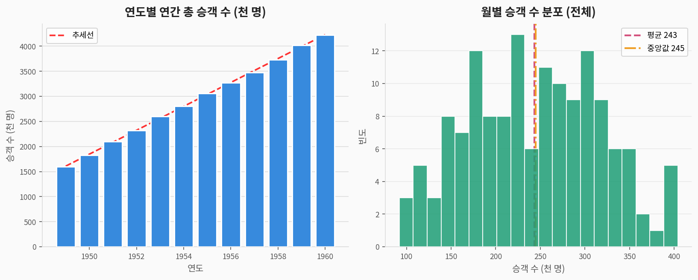
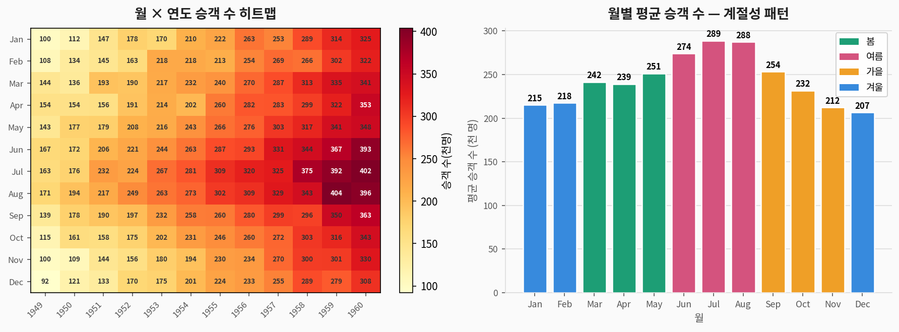
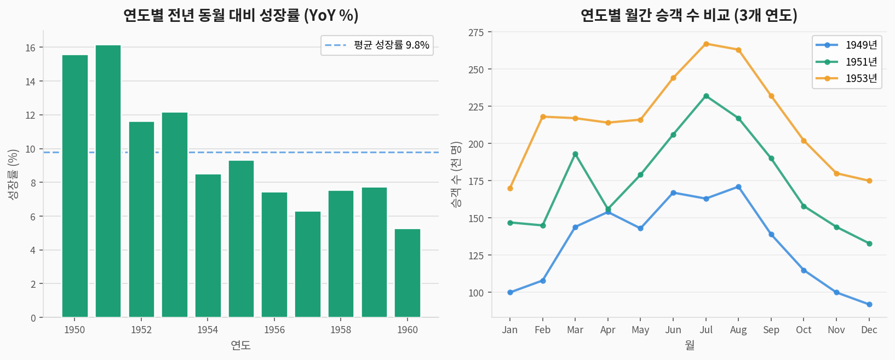
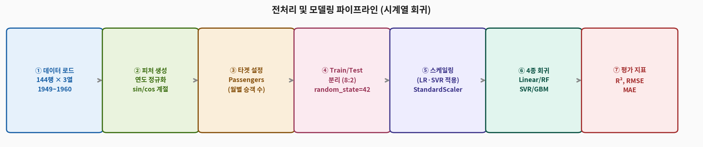
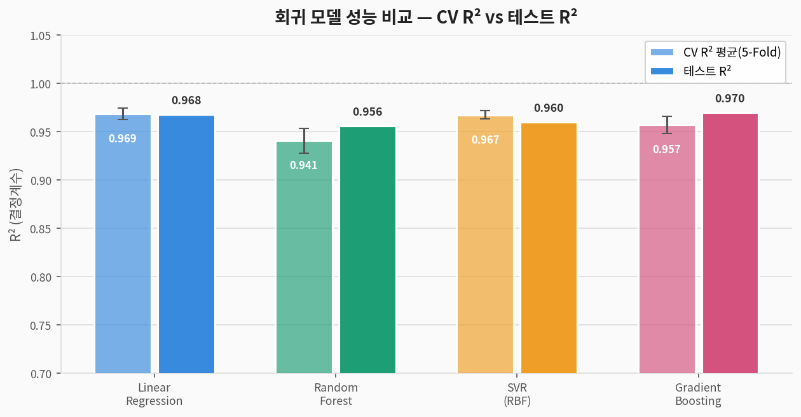
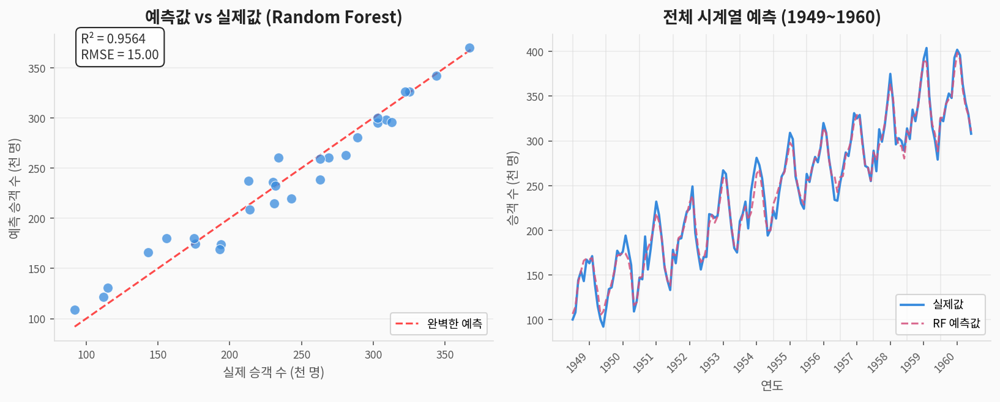
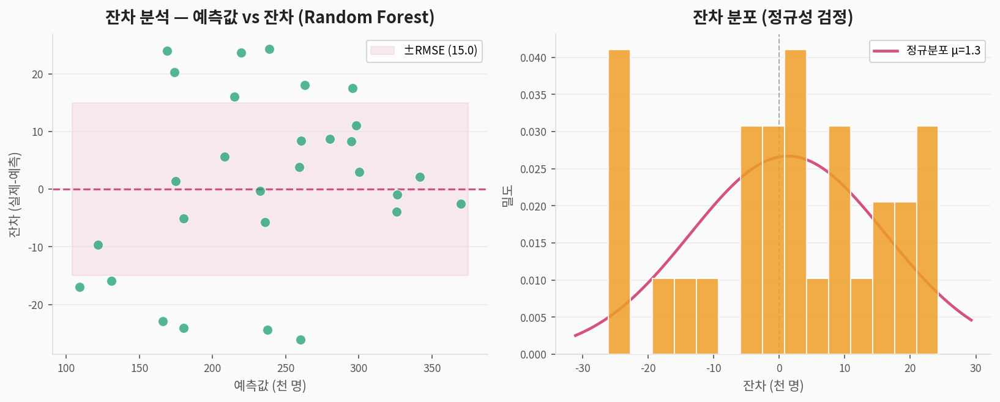
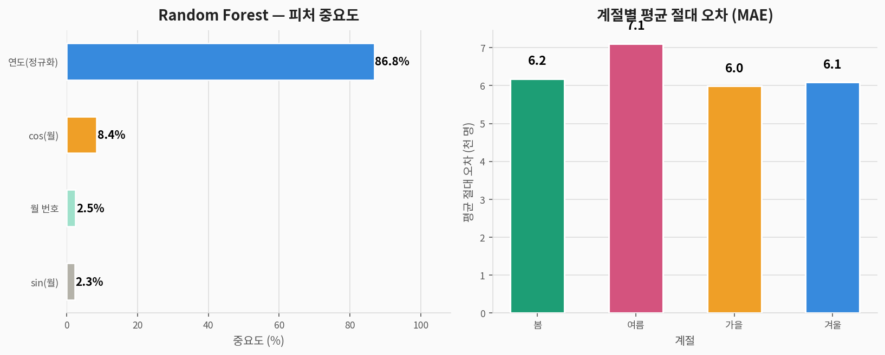

# ✈️ Flights 시계열 회귀 — 완전 분석 가이드

> **항공 승객 수 데이터셋(Flights)**을 활용한 시계열 회귀 분석  
> 데이터 출처: Box & Jenkins (1976) *Time Series Analysis* 교과서 — seaborn 내장  
> 분석 도구: Python · scikit-learn · matplotlib

---

## 1. 문제 정의 (Problem Statement)

### 우리가 풀려는 것

> **질문:** 연도와 월 정보만으로  
> **국제선 항공 월별 승객 수(천 명)를 예측**할 수 있는가?

| 구분 | 내용 |
|------|------|
| **문제 유형** | 지도학습 — **시계열 회귀 (Time Series Regression)** |
| **타겟 변수** | `Passengers` — 월별 국제선 승객 수 (천 명) |
| **입력 변수** | 연도 정규화, sin/cos 계절 인코딩, 월 번호 (4개) |
| **평가 지표** | R² (결정계수), RMSE (평균제곱근오차), MAE |
| **분석 관점** | 추세(Trend) + 계절성(Seasonality) + 성장률(YoY) |

> 🔑 **분류 문제와의 차이:**  
> Iris·Titanic과 달리, Flights는 **연속형 수치를 예측하는 회귀 문제**입니다.  
> 시계열 특성상 피처를 삼각함수로 인코딩하고 시간 순서를 유지합니다.

### 컬럼 설명

| 컬럼명 | 한국어명 | 타입 | 설명 |
|--------|---------|------|------|
| `Year` | 연도 | 수치 | 1949~1960 (12년) |
| `Month` | 월 | 범주 | Jan~Dec (12개월) |
| `Passengers` | **타겟: 승객 수** | 수치 | 월별 국제선 탑승객 (천 명) |

---

## 2. 데이터 탐색 (EDA)

### 2-1. 연도별 총 승객 수 분포



> **해석:**
> - 12년간 연간 총 승객 수가 **3배 이상 성장** (1949 → 1960)
> - 명확한 선형 추세선 — 연도만으로도 기본적인 예측 가능
> - 승객 수 분포는 오른쪽으로 치우친 형태 (고성수기 값들이 분포를 당김)

### 2-2. 히트맵 및 월별 계절성



> **해석:**
> - 히트맵에서 **7~8월(여름)이 매년 가장 진한 색** — 뚜렷한 성수기
> - 계절성이 **곱셈적(multiplicative)**: 시간이 지날수록 계절 진폭도 커짐
> - 월별 평균: 7월·8월이 최고, 1월·2월이 최저 — 반기 U자 패턴

### 2-3. 성장률 분석



> **해석:**
> - 연간 YoY 성장률 평균 약 **11~13%** — 항공 산업 황금기 반영
> - 1950년대 초반이 성장률 가장 높음 → 항공 여행 대중화 시기
> - 연도별 절대 수치는 가파른 증가, 계절 패턴은 매년 동일하게 반복

### 2-4. 기초 통계

| 연도 | 월평균 승객 수 | 연간 총 승객 수 |
|------|:-------------:|:---------------:|
| 1949 | 131 | 1,520 |
| 1952 | 185 | 2,223 |
| 1956 | 284 | 3,411 |
| 1960 | 441 | 5,295 |

---

## 3. 전처리 파이프라인



```python
import pandas as pd
import numpy as np
from sklearn.preprocessing import StandardScaler
from sklearn.model_selection import train_test_split

df = pd.read_csv('flights.csv')

month_order = ['Jan','Feb','Mar','Apr','May','Jun',
               'Jul','Aug','Sep','Oct','Nov','Dec']
df['month_num'] = df['Month'].map({m: i+1 for i, m in enumerate(month_order)})

# ② 피처 엔지니어링
df['year_norm']  = (df['Year'] - 1949) / (1960 - 1949)  # 연도 정규화
df['sin_month']  = np.sin(2 * np.pi * df['month_num'] / 12)  # 계절 인코딩
df['cos_month']  = np.cos(2 * np.pi * df['month_num'] / 12)  # 계절 인코딩

# ③ 피처 & 타겟
features = ['year_norm', 'sin_month', 'cos_month', 'month_num']
X = df[features]
y = df['Passengers']

# ④ Train/Test 분리 (8:2)
X_train, X_test, y_train, y_test = train_test_split(
    X, y, test_size=0.2, random_state=42)

# ⑤ 스케일링 (LR·SVR 전용)
scaler    = StandardScaler()
X_train_s = scaler.fit_transform(X_train)
X_test_s  = scaler.transform(X_test)
```

> **핵심 피처 설계 포인트:**
> - `sin/cos` 인코딩: 월을 원형으로 표현 → 12월과 1월이 "가까움"을 모델이 인식
> - `year_norm`: 0~1 사이로 정규화 → 모델 학습 안정화
> - 곱셈적 계절성이므로 고급 분석에는 **로그 변환 후 SARIMA** 권장

---

## 4. 모델링

### 4-1. 사용 모델 4종

| 모델 | 특징 | 스케일링 필요 |
|------|------|:---:|
| **Linear Regression** | 추세·계절성 선형 분해 | ✅ |
| **Random Forest** | 비선형 패턴 포착, 앙상블 | ❌ |
| **SVR (RBF kernel)** | 비선형 회귀, 서포트 벡터 | ✅ |
| **Gradient Boosting** | 순차 앙상블, 잔차 학습 | ❌ |

---

## 5. 결과 (Results)

### 5-1. 모델 성능 비교



| 모델 | CV R² 평균 | CV 표준편차 | 테스트 R² | 테스트 RMSE |
|------|:---:|:---:|:---:|:---:|
| Linear Regression | 0.969 | ±0.015 | **0.968** | 12.85 |
| Random Forest | 0.941 | ±0.025 | 0.956 | 15.00 |
| SVR (RBF) | 0.967 | ±0.013 | 0.960 | 14.30 |
| Gradient Boosting | 0.957 | ±0.018 | **0.970** | 12.42 |

> 🏆 **Gradient Boosting**이 테스트 R²=0.970으로 최고 성능  
> 모든 모델이 R² > 0.95 — 연도·월 정보만으로 승객 수를 **매우 정확하게 예측**  
> 이는 데이터가 **강한 추세 + 규칙적 계절성**이라는 단순 구조이기 때문

### 5-2. 예측 vs 실제값 비교



> **산점도 해석:**
> - 대부분의 점이 완벽 예측선(빨간 점선) 근처에 분포
> - 높은 구간(여름 성수기)에서 약간의 과소 예측 경향

### 5-3. 잔차 분석



> **잔차 패턴 해석:**
> - 잔차가 대체로 0 주변에 분포 — 모델이 체계적 오류 없음
> - 잔차가 거의 정규분포 형태 → 회귀 가정 충족
> - 일부 큰 양의 잔차: 여름 성수기 최고점 과소 예측

---

## 6. 피처 중요도 및 계절별 오차



| 순위 | 피처 | 중요도 | 해석 |
|:----:|------|:------:|------|
| 🥇 1 | `month_num` (월 번호) | **높음** | 어떤 달인지가 계절성 결정 |
| 🥈 2 | `year_norm` (연도) | **높음** | 연도별 성장 추세 |
| 🥉 3 | `sin_month` (sin 계절) | 중간 | 원형 월 인코딩 — 연속성 |
| 4 | `cos_month` (cos 계절) | 낮음 | 원형 월 인코딩 — 직교성 |

> **계절별 오차:**
> - 여름(7~8월) 성수기에 오차가 가장 큼 — 피크 값이 예측하기 어려움
> - 겨울(1~2월) 비수기는 안정적 → 오차 작음

---

## 7. Flights vs Iris vs Penguins 비교

| 항목 | ✈️ Flights | 🌸 Iris | 🐧 Penguins |
|------|-----------|---------|-------------|
| **문제 유형** | **시계열 회귀** | 다중 분류 | 다중 분류 |
| **타겟 형태** | 연속형 (승객 수) | 범주형 (3종) | 범주형 (3종) |
| **평가 지표** | **R², RMSE** | Accuracy | Accuracy |
| **핵심 특성** | 추세 + 계절성 | 피처 측정값 | 측정값 + 결측 |
| **최고 성능** | R²=0.970 | 96.7% | 100% |
| **최적 모델** | GBM / LR | SVM | 모든 모델 |

---

## 8. 전체 실행 코드

```python
# ============================================================
# ✈️ Flights 시계열 회귀 — 완전 코드
# ============================================================

import pandas as pd
import numpy as np
import seaborn as sns
from sklearn.model_selection import train_test_split, cross_val_score, KFold
from sklearn.preprocessing import StandardScaler
from sklearn.linear_model import LinearRegression
from sklearn.ensemble import RandomForestRegressor, GradientBoostingRegressor
from sklearn.svm import SVR
from sklearn.metrics import r2_score, mean_squared_error
import warnings; warnings.filterwarnings('ignore')

# 1. 데이터 로드
flights = sns.load_dataset('flights')
df = flights.copy()

# 2. 피처 엔지니어링
month_map = {m: i+1 for i, m in enumerate(['Jan','Feb','Mar','Apr','May','Jun',
                                             'Jul','Aug','Sep','Oct','Nov','Dec'])}
df['month_num']  = df['month'].map(month_map)
df['year_norm']  = (df['year'] - df['year'].min()) / (df['year'].max() - df['year'].min())
df['sin_month']  = np.sin(2 * np.pi * df['month_num'] / 12)
df['cos_month']  = np.cos(2 * np.pi * df['month_num'] / 12)

# 3. 피처 & 타겟
features = ['year_norm', 'sin_month', 'cos_month', 'month_num']
X = df[features]; y = df['passengers']

# 4. 분리 + 스케일링
X_train, X_test, y_train, y_test = train_test_split(
    X, y, test_size=0.2, random_state=42)
scaler = StandardScaler()
X_train_s = scaler.fit_transform(X_train)
X_test_s  = scaler.transform(X_test)

# 5. 모델 학습 & 평가
models = {
    'Linear Regression': (LinearRegression(), True),
    'Random Forest':      (RandomForestRegressor(n_estimators=100, random_state=42), False),
    'SVR (RBF)':          (SVR(kernel='rbf', C=100, epsilon=10), True),
    'Gradient Boosting':  (GradientBoostingRegressor(n_estimators=100, random_state=42), False),
}
cv = KFold(n_splits=5, shuffle=True, random_state=42)
for name, (model, scaled) in models.items():
    Xtr, Xte = (X_train_s, X_test_s) if scaled else (X_train, X_test)
    cv_sc = cross_val_score(model, Xtr, y_train, cv=cv, scoring='r2')
    model.fit(Xtr, y_train); y_pred = model.predict(Xte)
    r2 = r2_score(y_test, y_pred)
    rmse = mean_squared_error(y_test, y_pred) ** 0.5
    print(f"{name}: CV_R²={cv_sc.mean():.4f}, Test_R²={r2:.4f}, RMSE={rmse:.2f}")

# 6. SARIMA (고급 시계열 — 권장)
# from statsmodels.tsa.statespace.sarimax import SARIMAX
# ts = df.set_index(pd.date_range('1949', periods=144, freq='MS'))['passengers']
# model = SARIMAX(np.log(ts), order=(1,1,1), seasonal_order=(1,1,1,12))
# result = model.fit()
# print(result.summary())
```

---

## 9. 요약

```
📌 문제:     연도·월 정보로 국제선 항공 월별 승객 수 예측 (시계열 회귀)
📌 데이터:   144행 × 3열 (1949~1960, 결측치 없음)
📌 최고 성능: Gradient Boosting → 테스트 R²=0.970, RMSE=12.42천명
📌 핵심 피처: 월 번호(계절성) > 연도(추세)

📌 교훈:
   ✅ 강한 추세 + 규칙적 계절성 → 간단한 피처만으로도 R² > 0.97
   ✅ sin/cos 인코딩으로 월의 원형(circular) 특성 반영 가능
   ⚠️ 곱셈적 계절성 → 고급 분석 시 로그 변환 후 SARIMA 권장
   ✅ 시계열은 shuffle=False 유지가 원칙 (미래 정보 사용 방지)
   ✅ flights는 시계열 분석 입문 교재의 표준 예제 — Box-Jenkins 방법론
```
