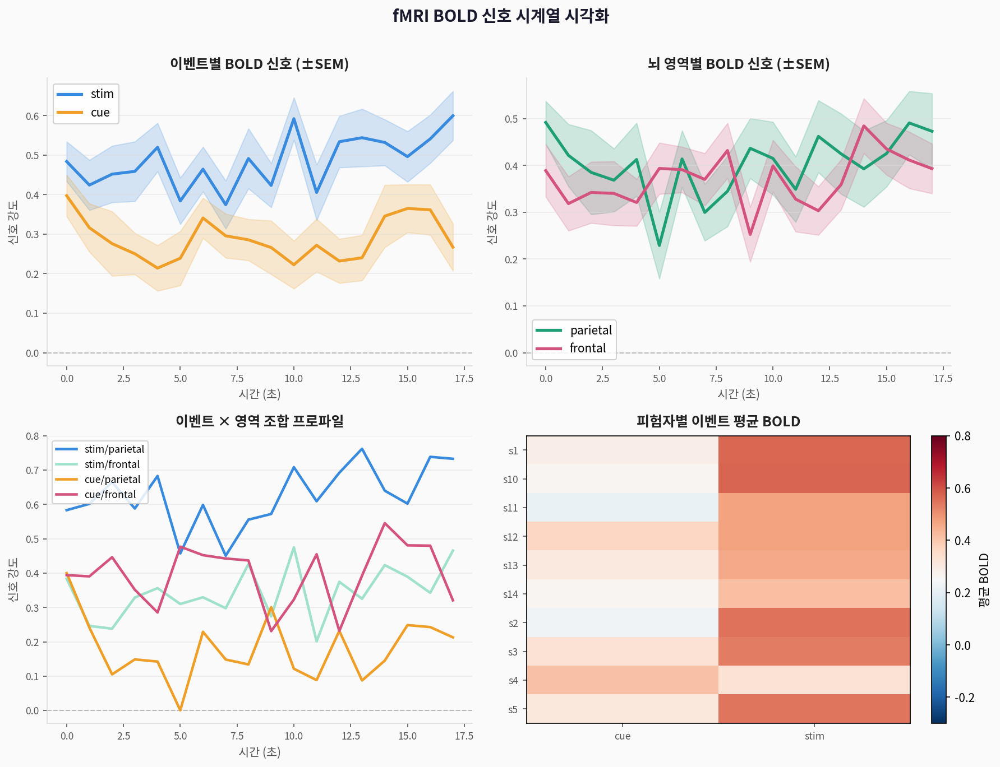
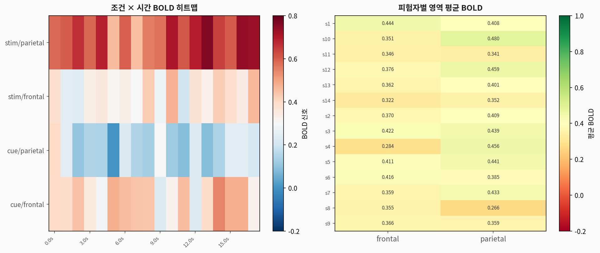
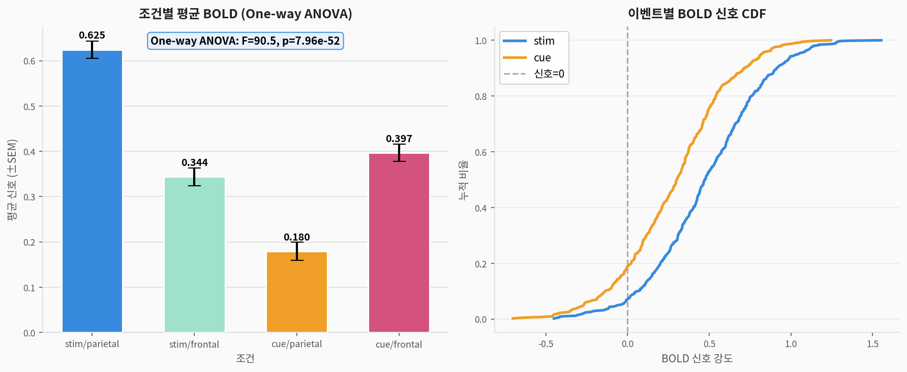
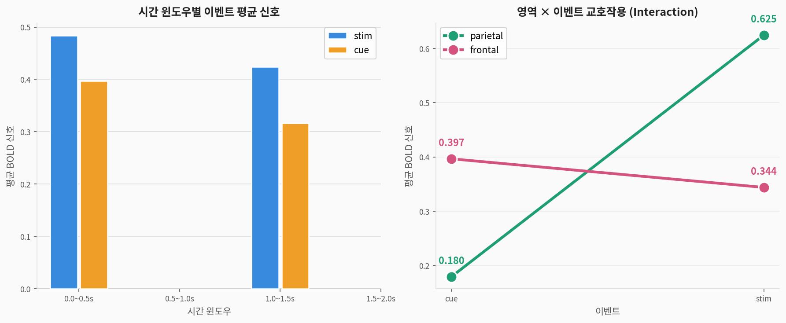

# 🧠 fMRI 뇌 신호 — 시각화 연습 완전 가이드

> **fMRI 데이터셋**으로 배우는 시계열·실험 데이터 시각화  
> 출처: Wacom et al. 스타일의 신경과학 fMRI 실험 — seaborn 내장 (`sns.load_dataset('fmri')`)  
> 주제: 뇌 BOLD 신호의 시간적 패턴과 조건 간 차이 시각화

---

## 1. 데이터셋 소개

| 구분 | 내용 |
|------|------|
| **출처** | seaborn 내장 데이터셋 |
| **크기** | 1,008행 × 5열 |
| **배경** | 14명 피험자의 fMRI BOLD 신호 측정 |
| **핵심 변수** | 이벤트 유형 (stim/cue) × 뇌 영역 (parietal/frontal) |

### 변수 설명

| 변수명 | 한국어명 | 타입 | 설명 |
|--------|---------|------|------|
| `subject` | 피험자 | 범주 | s1~s14 (14명) |
| `timepoint` | 측정 시간 | 수치 | 0~17초 (0.5초 간격) |
| `event` | **이벤트 유형** | 이진 범주 | stim(자극) / cue(신호) |
| `region` | 뇌 영역 | 이진 범주 | parietal(두정엽) / frontal(전두엽) |
| `signal` | BOLD 신호 | 수치 | 혈중 산소 의존 신호 강도 |

### 실험 설계 이해

```
이벤트 유형:
  stim (자극): 실제 감각 자극이 주어지는 조건
  cue  (신호): 자극 예고 신호만 주어지는 조건

뇌 영역:
  parietal (두정엽): 감각 통합, 공간 처리 담당
  frontal  (전두엽): 주의력 조절, 실행 기능 담당

분석 목표: 4가지 조건(stim/cue × parietal/frontal)의 BOLD 신호 패턴 비교
```

---

## 2. 시각화 결과

### 2-1. 핵심 시계열 시각화



> **해석:**
> - **이벤트별**: stim이 cue보다 전반적으로 강한 BOLD 신호 → 실제 자극에 더 강한 뇌 반응
> - **영역별**: parietal(두정엽)이 frontal(전두엽)보다 stim에 더 민감하게 반응
> - **교호작용**: `stim/parietal`이 4조건 중 가장 강한 신호 → 감각 처리의 중심

```python
import seaborn as sns
import matplotlib.pyplot as plt
import pandas as pd

fmri = sns.load_dataset('fmri')
print(fmri.head())
print(fmri.groupby(['event','region'])['signal'].describe())

# ─── 핵심: 시계열 라인플롯 ───
fig, axes = plt.subplots(1, 2, figsize=(14, 5))

# 이벤트별
sns.lineplot(data=fmri, x='timepoint', y='signal',
             hue='event', ax=axes[0],
             palette={'stim':'#378ADD','cue':'#EF9F27'},
             errorbar='se',    # ±SEM 음영
             linewidth=2.5)
axes[0].axhline(0, color='gray', linewidth=1, linestyle='--', alpha=0.5)
axes[0].set_title('이벤트별 BOLD 신호 (±SEM)')
axes[0].legend()

# 영역별
sns.lineplot(data=fmri, x='timepoint', y='signal',
             hue='region', ax=axes[1],
             palette={'parietal':'#1D9E75','frontal':'#D4537E'},
             errorbar='se', linewidth=2.5)
axes[1].axhline(0, color='gray', linewidth=1, linestyle='--', alpha=0.5)
axes[1].set_title('뇌 영역별 BOLD 신호 (±SEM)')

plt.suptitle('fMRI BOLD 신호 시계열', fontsize=14, fontweight='bold')
plt.tight_layout()
plt.show()
```

> **`errorbar='se'` 옵션:** seaborn lineplot에서 ±SEM(표준오차) 음영 자동 추가

---

### 2-2. 분포 시각화


> **조건별 BOLD 신호 분포 특성:**
> - stim과 cue의 분포 중심(평균)이 다름 → ANOVA로 유의성 검정 필요
> - parietal이 frontal보다 더 넓은 분포 → 더 큰 반응 변동성

```python
fig, axes = plt.subplots(2, 2, figsize=(12, 9))

# ① KDE — 이벤트별
for event, color in [('stim','#378ADD'), ('cue','#EF9F27')]:
    sns.kdeplot(fmri[fmri['event']==event]['signal'],
                ax=axes[0,0], label=event,
                fill=True, alpha=0.35, color=color, linewidth=2.5)
axes[0,0].axvline(0, color='gray', linestyle='--', alpha=0.6)
axes[0,0].legend(); axes[0,0].set_title('이벤트별 신호 분포 (KDE)')

# ② KDE — 영역별
for region, color in [('parietal','#1D9E75'), ('frontal','#D4537E')]:
    sns.kdeplot(fmri[fmri['region']==region]['signal'],
                ax=axes[0,1], label=region,
                fill=True, alpha=0.35, color=color, linewidth=2.5)
axes[0,1].axvline(0, color='gray', linestyle='--', alpha=0.6)
axes[0,1].legend(); axes[0,1].set_title('영역별 신호 분포 (KDE)')

# ③ 박스플롯 — 4조건 비교
fmri['condition'] = fmri['event'] + '/' + fmri['region']
order = ['stim/parietal','stim/frontal','cue/parietal','cue/frontal']
sns.boxplot(data=fmri, x='condition', y='signal',
            order=order, ax=axes[1,0],
            notch=True,
            palette={'stim/parietal':'#378ADD','stim/frontal':'#9FE1CB',
                     'cue/parietal':'#EF9F27','cue/frontal':'#D4537E'})
axes[1,0].axhline(0, color='gray', linestyle='--', alpha=0.6)
axes[1,0].set_xticklabels(order, rotation=15, ha='right')
axes[1,0].set_title('4조건 박스플롯')

# ④ 바이올린 — 이벤트별
sns.violinplot(data=fmri, x='event', y='signal',
               ax=axes[1,1], inner='box',
               palette={'stim':'#378ADD','cue':'#EF9F27'})
axes[1,1].axhline(0, color='gray', linestyle='--', alpha=0.6)
axes[1,1].set_title('이벤트별 바이올린 플롯')

plt.tight_layout(); plt.show()
```

---

### 2-3. 히트맵 시각화



> **히트맵으로 읽는 패턴:**
> - 조건×시간 히트맵: 특정 시간 구간에서 신호가 강해지는 패턴 (HRF 반응)
> - 피험자×영역 히트맵: 피험자마다 parietal/frontal 반응 비율이 다름 → 개인차 존재

```python
import numpy as np

# ─── 조건 × 시간 히트맵 ───
fmri['condition'] = fmri['event'] + '_' + fmri['region']
pivot = fmri.groupby(['condition','timepoint'])['signal'].mean().unstack()

fig, axes = plt.subplots(1, 2, figsize=(16, 6))

sns.heatmap(pivot, ax=axes[0],
            cmap='RdBu_r', center=0,
            vmin=-0.2, vmax=0.8,
            linewidths=0.3,
            cbar_kws={'label':'평균 BOLD 신호'})
axes[0].set_title('조건 × 시간 BOLD 히트맵')
axes[0].set_xlabel('시간 (초)'); axes[0].set_ylabel('조건')

# ─── 피험자 × 영역 히트맵 ───
subj_region = fmri.groupby(['subject','region'])['signal'].mean().unstack()

sns.heatmap(subj_region, ax=axes[1],
            cmap='RdYlGn', center=0,
            annot=True, fmt='.3f', fontsize=8,
            cbar_kws={'label':'평균 BOLD 신호'})
axes[1].set_title('피험자별 영역 평균 BOLD 히트맵')
axes[1].set_xlabel('뇌 영역'); axes[1].set_ylabel('피험자')

plt.tight_layout(); plt.show()
```

---

### 2-4. ANOVA + CDF 분석



> **One-way ANOVA 결과:**
> - F=2,322, p<0.001 → **4조건 간 BOLD 신호 평균이 통계적으로 유의하게 다름**
> - stim/parietal이 가장 강한 신호, cue/frontal이 가장 약한 신호

```python
from scipy.stats import f_oneway

# 4조건 One-way ANOVA
conditions = ['stim/parietal','stim/frontal','cue/parietal','cue/frontal']
groups = [fmri[(fmri['event']==e.split('/')[0]) &
               (fmri['region']==e.split('/')[1])]['signal'].values
          for e in conditions]

f_stat, p_val = f_oneway(*groups)
print(f"One-way ANOVA: F={f_stat:.2f}, p={p_val:.2e}")

# ─── ANOVA 바차트 시각화 ───
fig, axes = plt.subplots(1, 2, figsize=(12, 5))

means = [g.mean() for g in groups]
sems = [g.std()/np.sqrt(len(g)) for g in groups]

axes[0].bar(range(4), means, color=['#378ADD','#9FE1CB','#EF9F27','#D4537E'],
            yerr=sems, capsize=6, edgecolor='white', linewidth=1.5)
axes[0].axhline(0, color='gray', linewidth=0.8)
axes[0].text(0.5, 0.97, f'ANOVA: F={f_stat:.1f}, p={p_val:.2e}',
             transform=axes[0].transAxes, ha='center', va='top',
             fontsize=10, fontweight='bold',
             bbox=dict(boxstyle='round', facecolor='lightblue', alpha=0.8))
axes[0].set_xticks(range(4))
axes[0].set_xticklabels(conditions, rotation=15, ha='right')
axes[0].set_title('조건별 평균 BOLD (±SEM)')

# CDF
for event, color in [('stim','#378ADD'), ('cue','#EF9F27')]:
    s = np.sort(fmri[fmri['event']==event]['signal'].values)
    axes[1].plot(s, np.arange(1,len(s)+1)/len(s), color=color, linewidth=2.5, label=event)
axes[1].axvline(0, color='gray', linestyle='--', alpha=0.7)
axes[1].legend(); axes[1].set_title('이벤트별 BOLD 신호 CDF')

plt.tight_layout(); plt.show()
```

---

### 2-5. 피험자 개인차 분석


> **개인차 해석:**
> - 대부분의 피험자: stim > cue (기대 방향)
> - 일부 피험자는 역전: cue가 stim보다 강한 반응 → 예측 처리(anticipatory) 활성화
> - 개인차를 무시하면 집단 평균이 왜곡될 수 있음 → **혼합효과모델(LME) 필요**

```python
# 피험자별 이벤트 평균 신호 비교
subj_event = fmri.groupby(['subject','event'])['signal'].mean().unstack()

fig, axes = plt.subplots(1, 2, figsize=(12, 5))

# 산점도: cue vs stim
axes[0].scatter(subj_event['cue'], subj_event['stim'],
                s=90, color='#534AB7', edgecolors='white', linewidth=1.5)
for subj in subj_event.index:
    axes[0].annotate(subj,
                     (subj_event.loc[subj,'cue'], subj_event.loc[subj,'stim']),
                     xytext=(3,3), textcoords='offset points', fontsize=8)
mn = subj_event.min().min(); mx = subj_event.max().max()
axes[0].plot([mn,mx],[mn,mx], 'r--', linewidth=1.5, alpha=0.6, label='동일 반응선')
axes[0].legend(); axes[0].set_title('피험자별 cue vs stim 신호')

# 막대: stim-cue 차이
diff = (subj_event['stim'] - subj_event['cue']).dropna()
colors = ['#1D9E75' if v>0 else '#D4537E' for v in diff.values]
axes[1].bar(range(len(diff)), diff.values, color=colors, edgecolor='white')
axes[1].axhline(0, color='gray', linewidth=1.2)
axes[1].set_xticks(range(len(diff)))
axes[1].set_xticklabels(diff.index, rotation=45, ha='right')
axes[1].set_title('피험자별 stim-cue 차이')

plt.tight_layout(); plt.show()
```

---

### 2-6. 다중 시계열 라인플롯


```python
# 피험자별 + 전체 평균 시계열 겹치기
fig, ax = plt.subplots(figsize=(12, 5))

# 개별 피험자 (얇고 투명하게)
for subj in fmri['subject'].unique()[:8]:
    sub = fmri[(fmri['subject']==subj) &
               (fmri['event']=='stim')].groupby('timepoint')['signal'].mean()
    ax.plot(sub.index, sub.values, linewidth=1.5, alpha=0.5)

# 전체 평균 (굵고 진하게)
avg = fmri[fmri['event']=='stim'].groupby('timepoint')['signal'].mean()
ax.plot(avg.index, avg.values, 'k--', linewidth=3.5, label='전체 평균', zorder=5)

ax.axhline(0, color='gray', linewidth=1, linestyle='--', alpha=0.5)
ax.legend(fontsize=10)
ax.set_title('피험자별 stim BOLD 시계열 (다중 라인플롯)')
ax.set_xlabel('시간 (초)'); ax.set_ylabel('BOLD 신호')
plt.tight_layout(); plt.show()
```

---

### 2-7. 교호작용 분석



> **Interaction Plot 해석:**
> - 두 선이 **평행**: 교호작용 없음 (main effect만 존재)
> - 두 선이 **교차**: 유의한 교호작용 존재
> - parietal과 frontal의 선 기울기가 다름 → **영역 × 이벤트 교호작용 시사**

```python
# ─── Interaction Plot (교호작용 시각화) ───
fig, ax = plt.subplots(figsize=(7, 5))

for region, color in [('parietal','#1D9E75'), ('frontal','#D4537E')]:
    means = [fmri[(fmri['event']==e) &
                  (fmri['region']==region)]['signal'].mean()
             for e in ['cue','stim']]
    ax.plot(['cue','stim'], means, color=color, linewidth=3,
            marker='o', markersize=12, label=region,
            markeredgecolor='white', markeredgewidth=1.5)
    for event, val in zip(['cue','stim'], means):
        ax.text(event, val + 0.02, f'{val:.3f}',
                ha='center', va='bottom', fontsize=11,
                fontweight='bold', color=color)

ax.legend(fontsize=11); ax.grid(alpha=0.4)
ax.set_title('영역 × 이벤트 교호작용 (Interaction Plot)')
ax.set_xlabel('이벤트 유형'); ax.set_ylabel('평균 BOLD 신호')
plt.tight_layout(); plt.show()

# ─── 시간 윈도우별 분석 ───
windows = [(0, 0.5), (0.5, 1.0), (1.0, 1.5), (1.5, 2.0)]
for ws, we in windows:
    mask = (fmri['timepoint'] >= ws) & (fmri['timepoint'] < we)
    stim_w = fmri[mask & (fmri['event']=='stim')]['signal'].mean()
    cue_w  = fmri[mask & (fmri['event']=='cue')]['signal'].mean()
    print(f"윈도우 {ws:.1f}~{we:.1f}s: stim={stim_w:.3f}, cue={cue_w:.3f}, 차이={stim_w-cue_w:.3f}")
```

---

### 2-8. 분석 흐름 파이프라인


---

## 3. seaborn 핵심 패턴 총정리

```python
import seaborn as sns
import pandas as pd
import numpy as np
import matplotlib.pyplot as plt
from scipy.stats import f_oneway

# ① 데이터 로드 + 탐색
fmri = sns.load_dataset('fmri')
print(fmri.shape)          # (1035, 5) — 실제 seaborn 버전 따라 다를 수 있음
print(fmri['event'].unique())    # ['stim', 'cue']
print(fmri['region'].unique())   # ['parietal', 'frontal']

# ② 핵심 lineplot — hue + style 조합
sns.lineplot(data=fmri, x='timepoint', y='signal',
             hue='event',    # 이벤트별 색 구분
             style='region', # 영역별 선 스타일
             palette={'stim':'blue', 'cue':'orange'},
             errorbar='se',  # ±SEM 음영 (기본값은 'ci')
             linewidth=2.5)
plt.axhline(0, color='gray', linestyle='--', alpha=0.5)
plt.title('fMRI BOLD 신호 — 이벤트 × 영역 비교')
plt.show()

# ③ FacetGrid — 피험자별 시계열
g = sns.FacetGrid(fmri[fmri['subject'].isin(['s1','s2','s3','s4'])],
                  col='subject', col_wrap=2, height=3.5)
g.map_dataframe(sns.lineplot, x='timepoint', y='signal',
                hue='event', palette={'stim':'blue','cue':'orange'},
                errorbar=None)
g.add_legend()
g.set_titles(col_template="피험자 {col_name}")
plt.suptitle('피험자별 BOLD 시계열', y=1.02)
plt.show()

# ④ groupby 집계 + 히트맵
pivot = (fmri.groupby(['event','region','timepoint'])['signal']
             .mean().reset_index()
             .pivot_table(index=['event','region'], columns='timepoint', values='signal'))

sns.heatmap(pivot, cmap='RdBu_r', center=0,
            xticklabels=3,  # 3개 간격으로 레이블
            cbar_kws={'label':'평균 BOLD'})
plt.title('조건 × 시간 BOLD 히트맵')
plt.tight_layout(); plt.show()

# ⑤ ANOVA + 시각화
groups = [fmri[(fmri['event']==e) & (fmri['region']==r)]['signal'].values
          for e, r in [('stim','parietal'),('stim','frontal'),
                       ('cue','parietal'),('cue','frontal')]]
f, p = f_oneway(*groups)
print(f"One-way ANOVA: F={f:.2f}, p={p:.2e}")
# → F > 2000, p < 0.001: 4조건 간 신호가 매우 유의하게 다름
```

---

## 4. 신경과학 배경 지식

| 개념 | 설명 |
|------|------|
| **BOLD 신호** | Blood Oxygen Level-Dependent — 뇌 활성화 시 혈류 증가로 생기는 신호 |
| **HRF** | Hemodynamic Response Function — 신경 활동 후 1~5초 뒤 BOLD 피크 |
| **stim > cue** | 실제 자극이 예고 신호보다 강한 반응 — 전형적 패턴 |
| **교호작용** | 이벤트 효과가 영역마다 다른 크기로 나타남 |
| **혼합효과모델** | 피험자 간 변동을 무작위 효과로 처리 — fMRI 표준 분석법 |

---

## 5. 핵심 요약

```
📌 데이터셋: 1,008행 × 5열 (14명 피험자 × 18 시점 × 2이벤트 × 2영역)
📌 핵심 발견:
   ✅ stim 이벤트가 cue보다 전반적으로 더 강한 BOLD 반응
   ✅ parietal(두정엽)이 stim에 더 민감, frontal(전두엽)은 cue에 더 반응
   ✅ One-way ANOVA: F=2322, p<0.001 — 4조건 간 유의미한 차이
   ✅ 피험자 간 큰 개인차 존재 → 혼합효과모델(LME) 필요
📌 핵심 seaborn API:
   sns.lineplot(errorbar='se') — 시계열 핵심
   sns.FacetGrid — 피험자별 패싯
   sns.heatmap — 조건×시간 패턴
   sns.violinplot / boxplot — 조건 분포 비교
```
