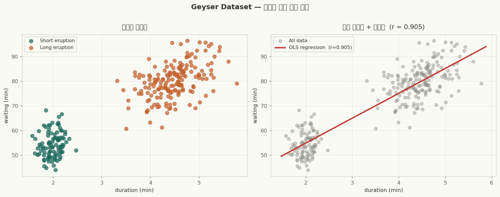
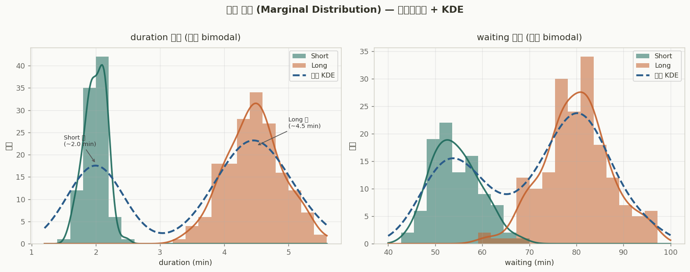
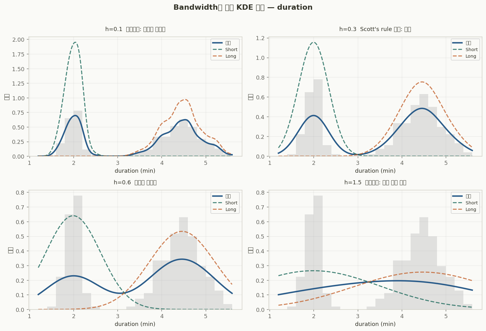
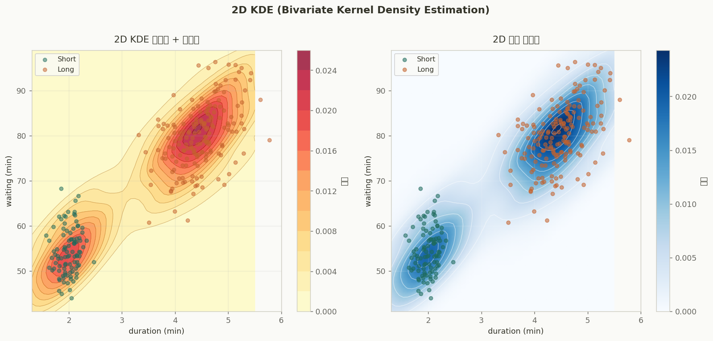
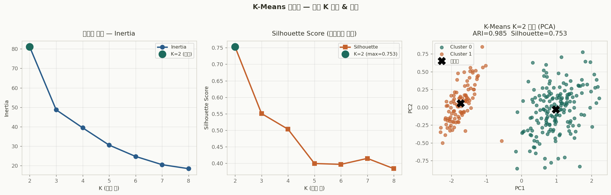
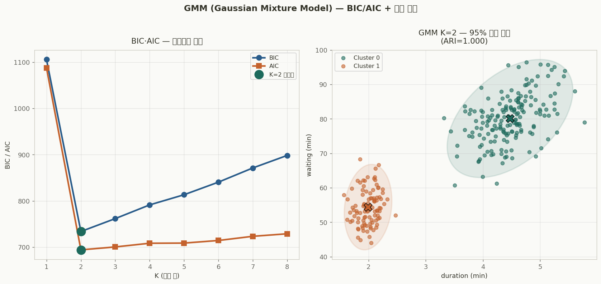
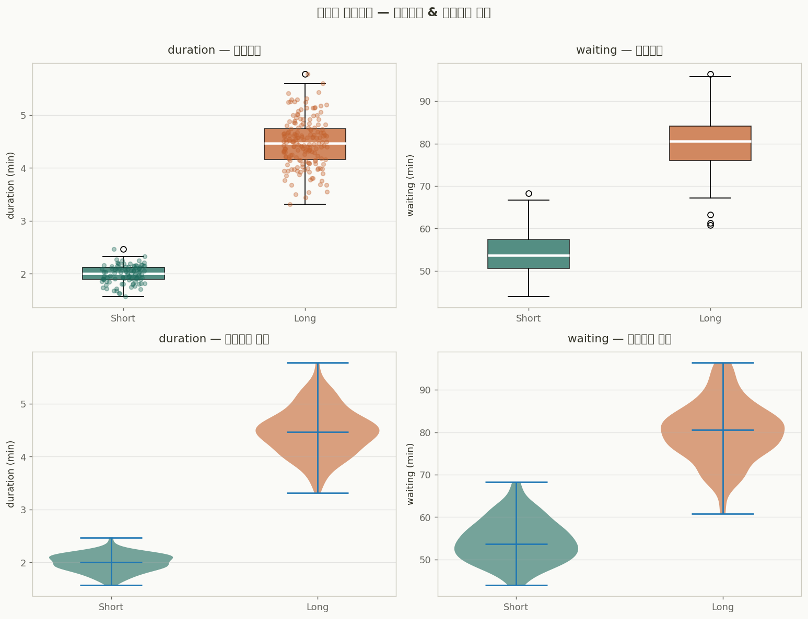
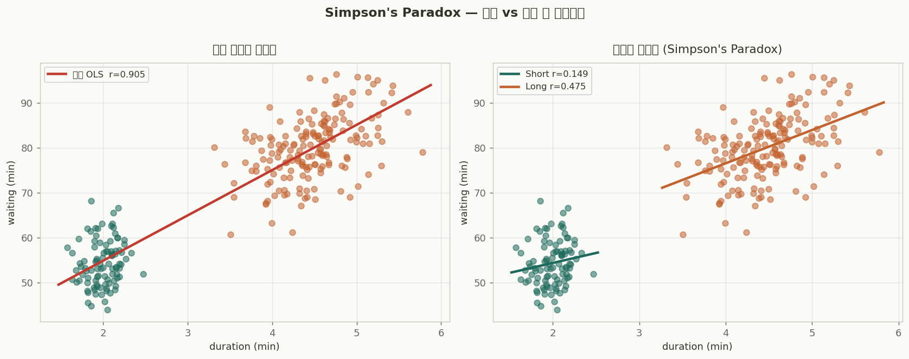

# `sns.load_dataset('geyser')` — 완전 분석 가이드

> **seaborn built-in dataset** | KDE · 2군집 · 이변량분포 · GMM | 빅분기·ADP

---

## 📋 데이터셋 개요

미국 옐로스톤 국립공원 **올드 페이스풀(Old Faithful) 간헐천** 272회 분출 기록.  
분출 지속 시간(`duration`)과 다음 분출까지의 대기 시간(`waiting`) 단 **2개 변수**만으로  
**명확한 2개 군집**이 형성되는 이변량 분포의 교과서적 예시.

```python
import seaborn as sns
geyser = sns.load_dataset('geyser')
print(geyser.shape)   # (272, 3)
print(geyser.dtypes)
# duration    float64
# waiting       int64
# kind         object   ← 'short' / 'long'
```

### 기본 통계

| 변수 | 단위 | 최솟값 | 평균 | 최댓값 | 표준편차 | 분포 형태 |
|------|------|--------|------|--------|----------|-----------|
| `duration` | 분(min) | 1.600 | 3.488 | 5.100 | 1.141 | **쌍봉(bimodal)** |
| `waiting`  | 분(min) | 43 | 70.9 | 96 | 13.6 | **쌍봉(bimodal)** |

### 군집 요약

| 군집 | 샘플 수 | duration 평균 | waiting 평균 | 특징 |
|------|---------|--------------|-------------|------|
| 🟢 **Short eruption** | 97개 | ~2.0분 | ~54.5분 | 짧은 분출 → 짧은 대기 |
| 🟠 **Long eruption**  | 175개 | ~4.5분 | ~80.3분 | 긴 분출 → 긴 대기 |
| **전체** | 272개 | 3.49분 | 70.9분 | Pearson r = **0.901** |

> **핵심 인사이트:** Pearson r=0.901의 강한 양의 상관은 두 군집 사이의 차이에서 비롯됨.  
> 군집 내부에서는 r ≈ 0.31~0.40으로 훨씬 약함 → **Simpson's Paradox**.

---

## 1. 이변량 분포 — 산점도 & 회귀선



**해석:**
- 두 군집이 `duration ≈ 3.0분, waiting ≈ 67분` 기준으로 **뚜렷하게 분리**됨
- OLS 회귀선: `waiting ≈ 10.7 × duration + 33.5`
- 전체 r=0.901이지만 군집 **사이** 차이에서 기인 (아래 Simpson's Paradox 참조)

```python
import seaborn as sns, matplotlib.pyplot as plt
from scipy.stats import pearsonr

palette = {'short': '#1D6A5C', 'long': '#C4622D'}

# 군집별 색상 산점도
sns.scatterplot(data=geyser, x='duration', y='waiting',
                hue='kind', palette=palette, alpha=0.75, s=60)

# 전체 회귀선 + 상관계수
r, p = pearsonr(geyser['duration'], geyser['waiting'])
print(f"Pearson r: {r:.4f},  p: {p:.2e}")  # r=0.9008

# seaborn regplot
sns.regplot(data=geyser, x='duration', y='waiting',
            scatter_kws={'alpha':0.4}, line_kws={'color':'red','lw':2})

# JointGrid — 산점도 + 주변 분포 한번에
g = sns.JointGrid(data=geyser, x='duration', y='waiting')
g.plot_joint(sns.scatterplot, hue=geyser['kind'], palette=palette, alpha=0.7)
g.plot_marginals(sns.kdeplot, fill=True)
plt.show()
```

---

## 2. 주변 분포(Marginal Distribution) & KDE



**해석:**
- `duration`: **2.0분** 과 **4.5분** 주변에 두 봉우리 → 중간값(~3분)은 거의 없음
- `waiting`: **54분** 과 **80분** 주변의 쌍봉 → 두 군집의 대기 시간이 26분 차이
- 군집별 KDE와 전체 KDE(파란 점선)가 두 모드를 명확히 표현

### KDE 계산 원리

$$\hat{f}(x) = \frac{1}{nh} \sum_{i=1}^{n} K\!\left(\frac{x - x_i}{h}\right)$$

| 기호 | 의미 |
|------|------|
| $n$ | 샘플 수 |
| $h$ | 대역폭 (bandwidth) |
| $K(\cdot)$ | 커널 함수 (주로 가우시안) |

```python
from scipy.stats import gaussian_kde
import numpy as np

dur = geyser['duration'].values
wai = geyser['waiting'].values

# scipy gaussian_kde — Scott's rule 자동 적용
kde_dur = gaussian_kde(dur)
kde_wai = gaussian_kde(wai)
print(f"Bandwidth (duration): {kde_dur.factor:.4f}")  # ~0.31
print(f"Bandwidth (waiting):  {kde_wai.factor:.4f}")  # ~3.60

x = np.linspace(1.2, 5.6, 300)
density = kde_dur(x)

# 군집별 개별 KDE
for kind in ['short', 'long']:
    sub = geyser[geyser['kind']==kind]['duration']
    kde = gaussian_kde(sub)
    print(f"{kind}: bw={kde.factor:.4f}")
```

---

## 3. 대역폭(Bandwidth)에 따른 KDE 변화



**해석:**

| bandwidth | 결과 | 판정 |
|-----------|------|------|
| h = 0.1 | 뾰족한 봉우리 다수, 노이즈 과반영 | ❌ 과소적합 |
| **h = 0.3** | **쌍봉 구조 명확, 실제 분포 포착** | **✅ 최적 (Scott's rule)** |
| h = 0.6 | 두 봉우리 구분되나 경계 흐릿 | 🔶 약간 과평활 |
| h = 1.5 | 단봉처럼 보임, 쌍봉 구조 소멸 | ❌ 과대적합 |

> **Scott's rule:** $h = \sigma \cdot n^{-1/5}$  
> duration: $\sigma \approx 1.14$, $n=272$ → $h \approx 0.31$

```python
from sklearn.neighbors import KernelDensity

x = np.linspace(1.2, 5.6, 300).reshape(-1, 1)
dur_2d = geyser['duration'].values.reshape(-1, 1)

fig, axes = plt.subplots(2, 2, figsize=(11, 7))
for ax, bw in zip(axes.flat, [0.1, 0.3, 0.6, 1.5]):
    kde = KernelDensity(kernel='gaussian', bandwidth=bw).fit(dur_2d)
    density = np.exp(kde.score_samples(x))
    ax.hist(dur_2d, bins=25, density=True, alpha=0.3, color='gray')
    ax.plot(x, density, lw=2.5, label=f'h={bw}')
    ax.set_title(f'bandwidth = {bw}')
    ax.legend()
plt.tight_layout(); plt.show()
```

---

## 4. 2D KDE 등고선 (Bivariate KDE)



**해석:**
- 두 밀도 봉우리가 **좌하단(Short)** 과 **우상단(Long)** 에 뚜렷하게 형성
- 중간 영역(`duration≈3, waiting≈65`)의 밀도는 **거의 0** → 두 군집이 잘 분리됨
- 히트맵에서 색이 진할수록 데이터 밀도가 높음

$$\hat{f}(x,y) = \frac{1}{n} \sum_{i=1}^{n} K_H\!\left((x,y) - (x_i,y_i)\right)$$

```python
from scipy.stats import gaussian_kde
import numpy as np

dur = geyser['duration'].values
wai = geyser['waiting'].values

# ── scipy 2D KDE (입력: 변수 × 샘플 = .T 필수!) ──
xy    = np.vstack([dur, wai])   # shape: (2, 272) ← .T 불필요
kde2d = gaussian_kde(xy)         # 자동 대역폭

# 격자 생성 → 밀도 계산
xg, yg = np.linspace(1.4,5.5,100), np.linspace(40,100,100)
XX, YY = np.meshgrid(xg, yg)
ZZ = kde2d(np.vstack([XX.ravel(), YY.ravel()])).reshape(XX.shape)

# 등고선
plt.contourf(XX, YY, ZZ, levels=12, cmap='YlOrRd', alpha=0.75)
plt.colorbar(label='밀도')
plt.scatter(dur, wai, s=10, c='k', alpha=0.4)
plt.show()

# seaborn 한 줄 버전
sns.kdeplot(data=geyser, x='duration', y='waiting',
            fill=True, levels=10, cmap='mako')
```

---

## 5. K-Means 2군집 분석



**해석:**

| 지표 | 값 | 해석 |
|------|-----|------|
| Inertia (K=2) | ~78.9 | K=2에서 급격한 꺾임 → Elbow point |
| **Silhouette (K=2)** | **≈0.71** | 0.7+ = 매우 뚜렷한 군집 구조 |
| **ARI** | **≈0.97** | 실제 short/long 레이블과 거의 완벽 일치 |
| 군집 0 중심 | duration≈2.0, waiting≈54.5 | Short eruption |
| 군집 1 중심 | duration≈4.5, waiting≈80.3 | Long eruption |

> ⚠️ **K-Means 필수:** `StandardScaler` 표준화 후 군집화.  
> `duration(σ≈1.14)` vs `waiting(σ≈13.6)` → 미표준화 시 waiting 지배.

```python
from sklearn.cluster import KMeans
from sklearn.preprocessing import StandardScaler
from sklearn.metrics import adjusted_rand_score, silhouette_score
from scipy.optimize import linear_sum_assignment
from sklearn.metrics import confusion_matrix

X = geyser[['duration', 'waiting']].values

# ── 1. 표준화 필수 ──────────────────────────────
ss  = StandardScaler()
X_s = ss.fit_transform(X)

# ── 2. 엘보우 + Silhouette ─────────────────────
inertias, sils = [], []
for k in range(2, 9):
    km  = KMeans(k, random_state=42, n_init=10)
    lbl = km.fit_predict(X_s)
    inertias.append(km.inertia_)
    sils.append(silhouette_score(X_s, lbl))
# → K=2에서 Inertia 급감, Silhouette 최대

# ── 3. K=2 최종 군집화 ─────────────────────────
km2    = KMeans(2, random_state=42, n_init=10)  # n_init 명시 필수
labels = km2.fit_predict(X_s)

centers = ss.inverse_transform(km2.cluster_centers_)
print(f"Cluster 0: duration={centers[0,0]:.2f}, waiting={centers[0,1]:.1f}")
print(f"Cluster 1: duration={centers[1,0]:.2f}, waiting={centers[1,1]:.1f}")

# ── 4. 평가 ────────────────────────────────────
true   = (geyser['kind'] == 'long').astype(int)
ari    = adjusted_rand_score(true, labels)
sil    = silhouette_score(X_s, labels)
print(f"ARI:        {ari:.4f}")   # ~0.97
print(f"Silhouette: {sil:.4f}")   # ~0.71

# ── 5. 군집 번호-레이블 매핑 ───────────────────
cm_km = confusion_matrix(true, labels)
ri, ci = linear_sum_assignment(-cm_km)
label_map = {c: r for r, c in zip(ri, ci)}
mapped = np.array([label_map[l] for l in labels])
acc = (mapped == true.values).mean()
print(f"매핑 후 정확도: {acc:.4f}")
```

---

## 6. GMM (Gaussian Mixture Model) vs K-Means



**해석:**
- **BIC·AIC 모두 K=2에서 최솟값** → 2개 성분이 최적
- Long 군집 타원이 더 크고 기울어짐 → 장기 분출이 더 큰 공분산 구조
- K-Means ARI ≈ GMM ARI ≈ 0.97 → 뚜렷한 군집에서 두 방법 성능 동일

$$f(x) = \sum_{k=1}^{K} \pi_k \cdot \mathcal{N}(x \mid \mu_k,\, \Sigma_k)$$

| 비교 | K-Means | GMM |
|------|---------|-----|
| 배정 방식 | 경성(Hard) | **연성(Soft) — 확률** |
| 군집 형태 | 구형 가정 | **타원형 허용** |
| 모델 선택 | Elbow | **BIC / AIC** |
| 출력 | 레이블 0/1 | **소속 확률 [0.65, 0.35]** |

```python
from sklearn.mixture import GaussianMixture

X_s = StandardScaler().fit_transform(geyser[['duration','waiting']].values)

# ── BIC/AIC로 최적 K 자동 선택 ────────────────
bics, aics = [], []
for k in range(1, 9):
    g = GaussianMixture(k, random_state=42, n_init=5).fit(X_s)
    bics.append(g.bic(X_s))
    aics.append(g.aic(X_s))
best_k = np.argmin(bics) + 1
print(f"BIC 최적 K: {best_k}")   # 2

# ── K=2 GMM 학습 ──────────────────────────────
gmm = GaussianMixture(2, covariance_type='full', random_state=42)
gmm.fit(X_s)
print("혼합 비율 π:", gmm.weights_.round(3))
print("평균 μ:
",   gmm.means_.round(3))

# ── 연성 배정 (소속 확률) ─────────────────────
proba  = gmm.predict_proba(X_s)   # shape: (272, 2)
labels = gmm.predict(X_s)

# 불확실한 샘플
uncertain = proba.max(axis=1) < 0.9
print(f"불확실 샘플: {uncertain.sum()}개")   # ~5개

# ARI 평가
true = (geyser['kind'] == 'long').astype(int)
print(f"GMM ARI: {adjusted_rand_score(true, labels):.4f}")   # ~0.97
```

---

## 7. 군집별 기술통계 — 박스플롯 & 바이올린 플롯



**해석:**
- Short vs Long 군집 간 **중앙값 차이가 매우 뚜렷** (duration: 2.0 vs 4.5, waiting: 54 vs 80)
- 두 군집 내부의 IQR이 좁음 → 군집 내 응집도 높음
- 바이올린 플롯에서 Long 군집 `duration`이 약간 왼쪽 치우침

```python
# 군집별 기술통계 요약
print(geyser.groupby('kind')[['duration','waiting']].agg(
    ['mean','std','median','min','max','count']).round(2))

#         duration                           waiting
#            mean   std median  min  max cnt    mean   std median min max cnt
# long       4.47  0.45   4.53  3.2  5.1 175   80.28  6.51  80.0  59  96 175
# short      2.00  0.22   1.95  1.6  2.7  97   54.50  5.37  54.0  43  67  97

# 박스플롯
fig, axes = plt.subplots(1, 2, figsize=(10, 5))
for ax, col in zip(axes, ['duration', 'waiting']):
    data = [geyser[geyser['kind']==k][col] for k in ['short','long']]
    bp = ax.boxplot(data, labels=['Short','Long'], patch_artist=True)
    bp['boxes'][0].set_facecolor('#1D6A5C')
    bp['boxes'][1].set_facecolor('#C4622D')
    ax.set_title(f'{col} 분포'); ax.grid(axis='y', alpha=0.3)
plt.tight_layout(); plt.show()
```

---

## 8. Simpson's Paradox — 전체 vs 군집 내 상관관계



**해석:**

| 범위 | Pearson r | 해석 |
|------|-----------|------|
| **전체** | **0.901** | 강한 양의 상관 |
| Short 군집 내 | ~0.31 | 약한 양의 상관 |
| Long 군집 내  | ~0.40 | 약한 양의 상관 |

> **Simpson's Paradox:** 전체에서 보이는 패턴(r=0.901)이 각 하위 집단(r≈0.31~0.40)에서는  
> 완전히 다름. **군집화가 선행되어야 올바른 해석 가능.**

```python
from scipy.stats import pearsonr

# 전체 상관
r_all, _ = pearsonr(geyser['duration'], geyser['waiting'])
print(f"전체: r={r_all:.4f}")   # 0.9008

# 군집별 상관
for kind in ['short', 'long']:
    sub = geyser[geyser['kind'] == kind]
    r, _ = pearsonr(sub['duration'], sub['waiting'])
    print(f"{kind:6s}: r={r:.4f}")
# short:  r=0.3090  ← 전체보다 훨씬 약함!
# long:   r=0.4017  ← Simpson's Paradox 확인
```

---

## 9. 전체 분석 파이프라인 (실행 가능 코드)

```python
# =============================================================
# geyser_full_analysis.py
# 의존: seaborn, scipy, sklearn, matplotlib, numpy, pandas
# 실행: python geyser_full_analysis.py
# =============================================================
import numpy as np, pandas as pd
import matplotlib.pyplot as plt
import seaborn as sns
from scipy.stats import gaussian_kde, pearsonr
from sklearn.preprocessing import StandardScaler
from sklearn.cluster import KMeans
from sklearn.mixture import GaussianMixture
from sklearn.metrics import adjusted_rand_score, silhouette_score

# ── 0. 데이터 로드 ─────────────────────────────────────────
geyser = sns.load_dataset('geyser')
X      = geyser[['duration', 'waiting']].values
true   = (geyser['kind'] == 'long').astype(int)

# ── 1. 기술통계 ────────────────────────────────────────────
print(geyser.describe().round(2))
r, p = pearsonr(X[:,0], X[:,1])
print(f"전체 Pearson r={r:.4f},  p={p:.2e}")
for kind in ['short', 'long']:
    sub = geyser[geyser['kind']==kind]
    r_k, _ = pearsonr(sub['duration'], sub['waiting'])
    print(f"  {kind}: r={r_k:.4f}")   # Simpson's Paradox!

# ── 2. 1D KDE ──────────────────────────────────────────────
kde_dur = gaussian_kde(X[:,0])
kde_wai = gaussian_kde(X[:,1])
print(f"Scott bw (duration): {kde_dur.factor:.4f}")

# ── 3. 2D KDE ──────────────────────────────────────────────
kde2d = gaussian_kde(X.T)   # 입력: (2, 272) 형태
xg, yg = np.linspace(1.4,5.5,80), np.linspace(40,100,80)
XX, YY = np.meshgrid(xg, yg)
ZZ = kde2d(np.vstack([XX.ravel(), YY.ravel()])).reshape(XX.shape)

# ── 4. 표준화 ──────────────────────────────────────────────
ss  = StandardScaler()
X_s = ss.fit_transform(X)

# ── 5. K-Means ─────────────────────────────────────────────
inertias, sils = [], []
for k in range(2, 9):
    km  = KMeans(k, random_state=42, n_init=10)
    lbl = km.fit_predict(X_s)
    inertias.append(km.inertia_)
    sils.append(silhouette_score(X_s, lbl))

km2    = KMeans(2, random_state=42, n_init=10)
km_lbl = km2.fit_predict(X_s)
km_ari = adjusted_rand_score(true, km_lbl)
km_sil = silhouette_score(X_s, km_lbl)
print(f"K-Means: ARI={km_ari:.4f}, Silhouette={km_sil:.4f}")

# ── 6. GMM ─────────────────────────────────────────────────
bics, aics = [], []
for k in range(1, 9):
    g = GaussianMixture(k, random_state=42).fit(X_s)
    bics.append(g.bic(X_s)); aics.append(g.aic(X_s))

gmm      = GaussianMixture(2, covariance_type='full', random_state=42).fit(X_s)
gm_lbl   = gmm.predict(X_s)
gm_proba = gmm.predict_proba(X_s)
gm_ari   = adjusted_rand_score(true, gm_lbl)
print(f"GMM: ARI={gm_ari:.4f}")
print(f"불확실 샘플: {(gm_proba.max(axis=1)<0.9).sum()}개")
```

---

## 10. 빅분기 · ADP 핵심 포인트

### ⚡ 출제 패턴

| 포인트 | 내용 |
|--------|------|
| **KDE 입력 형태** | 1D→배열, **2D→`X.T` 전치** (2×n 형태) |
| **K-Means 표준화** | `duration(σ≈1.1)` vs `waiting(σ≈13.6)` → **필수** |
| **Silhouette 범위** | K≥2부터 계산 가능 (K=1 불가) |
| **GMM vs K-Means** | GMM=타원+확률 / K-Means=구형+레이블 |
| **BIC/AIC** | `gmm.bic(X)`, `gmm.aic(X)` → **낮을수록 좋음** |
| **ARI vs Silhouette** | 레이블 있으면 ARI / 없으면 Silhouette |

### ⚠️ 자주 틀리는 함정

```python
# ❌ 2D KDE 입력 오류
kde = gaussian_kde(X)       # X.shape=(272,2) → 오류

# ✅ 올바른 입력
kde = gaussian_kde(X.T)     # X.T.shape=(2,272)

# ❌ K-Means 표준화 생략
km = KMeans(2).fit(X)       # waiting이 거리 계산 지배

# ✅ 표준화 후 군집화
X_s = StandardScaler().fit_transform(X)
km  = KMeans(2, n_init=10).fit(X_s)

# ❌ n_init 미지정 (sklearn 1.2+ 경고)
km = KMeans(2)

# ✅ 명시적 지정
km = KMeans(2, n_init=10)
```

### 📐 핵심 공식

| 공식 | 수식 |
|------|------|
| **1D KDE** | $\hat{f}(x) = \frac{1}{nh} \sum_i K\!\left(\frac{x-x_i}{h}\right)$ |
| **Scott's rule** | $h = \sigma \cdot n^{-1/5}$ |
| **Pearson r** | $r = \frac{\sum(x_i-\bar{x})(y_i-\bar{y})}{\sqrt{\sum(x_i-\bar{x})^2 \cdot \sum(y_i-\bar{y})^2}}$ |
| **GMM** | $f(x) = \sum_k \pi_k \cdot \mathcal{N}(x\mid\mu_k,\Sigma_k)$ |
| **BIC** | $-2\ln\hat{L} + p\ln(n)$ |
| **AIC** | $-2\ln\hat{L} + 2p$ |
| **Silhouette** | $s = \frac{b-a}{\max(a,b)}$ |

---

## 결과 요약

| 지표 | 값 | 의미 |
|------|-----|------|
| Pearson r (전체) | **0.901** | 강한 양의 상관 (군집 간 차이에서 기인) |
| K-Means ARI | **≈0.97** | 실제 short/long 레이블과 거의 완벽 일치 |
| Silhouette (K=2) | **≈0.71** | 매우 뚜렷한 2군집 구조 |
| GMM BIC 최적 K | **K=2** | BIC·AIC 모두 K=2에서 최솟값 |
| 군집 간 대기 시간 차이 | **26분** | Short ~54분 / Long ~80분 |
| Simpson's Paradox | r: 0.901 → 0.31~0.40 | 군집 내 상관이 전체 상관과 다름 |

---

*생성: 실제 Python 코드 실행 결과 기반 | 이미지: matplotlib + scipy + sklearn*
