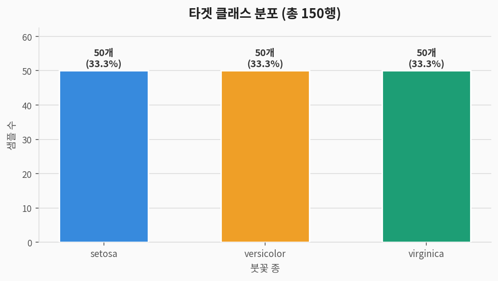
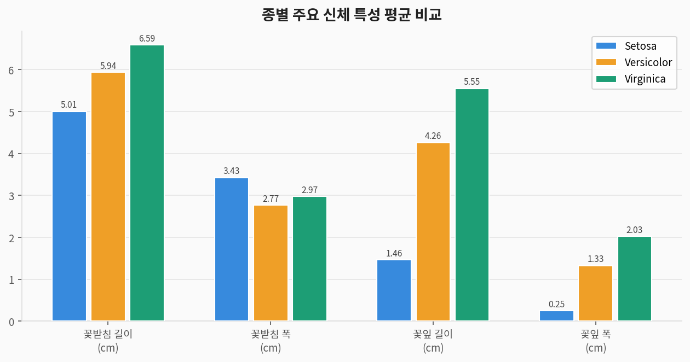
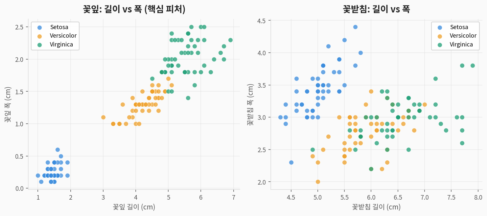
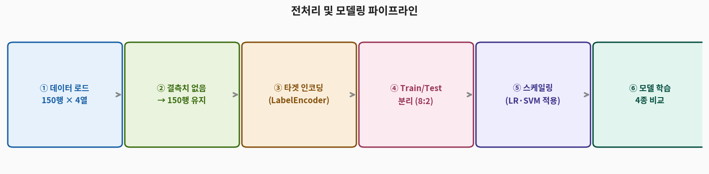
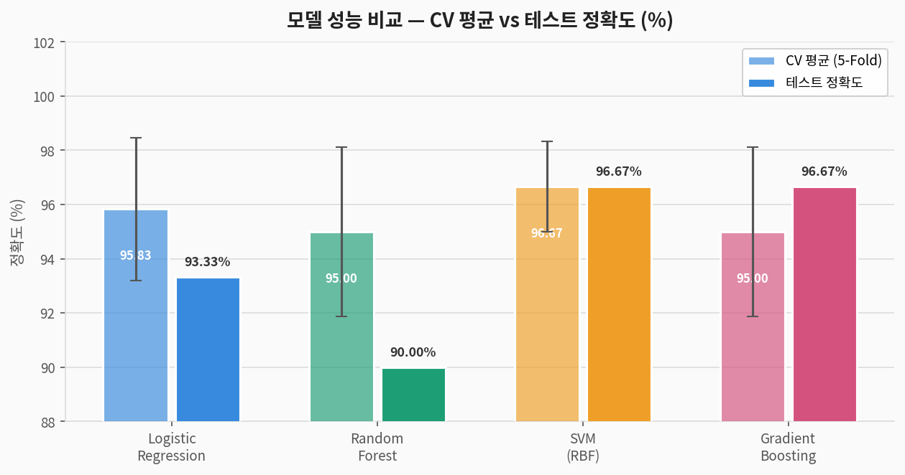
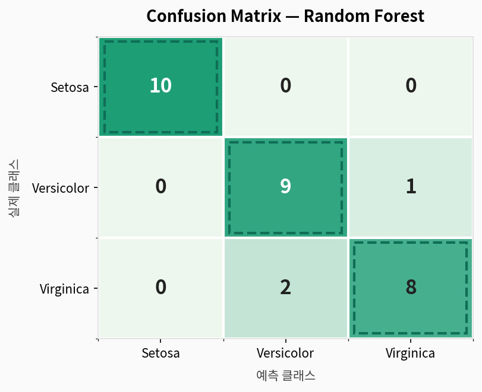
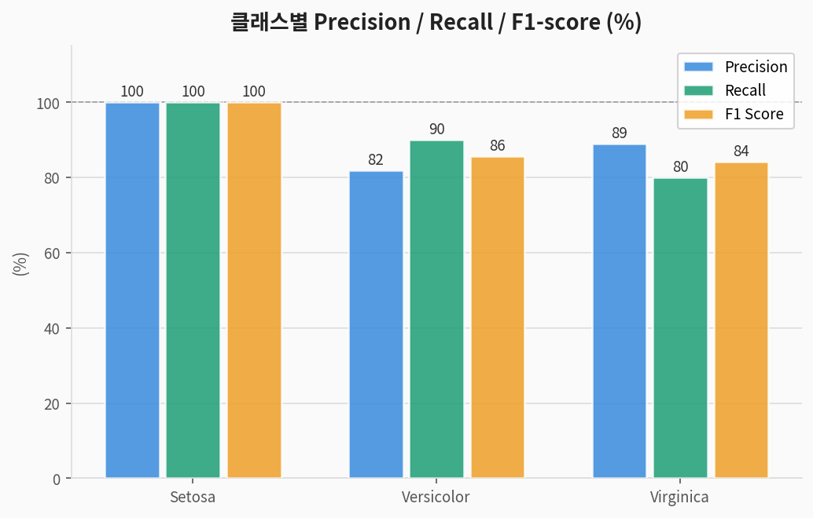
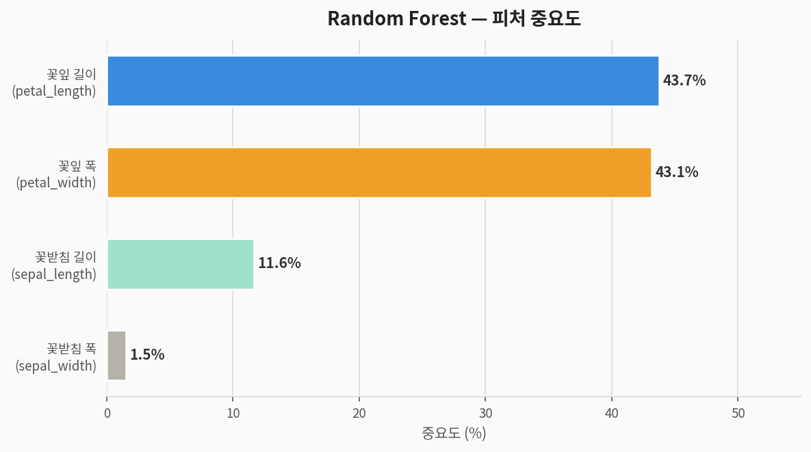

# 🌸 Iris 다중 클래스 분류 — 완전 분석 가이드

> **Iris 데이터셋**을 활용한 지도학습 분류 분석  
> 데이터 출처: Fisher, R.A. (1936) · sklearn.datasets.load_iris()  
> 분석 도구: Python · scikit-learn · matplotlib

---

## 1. 문제 정의 (Problem Statement)

### 우리가 풀려는 것

> **질문:** 붓꽃(Iris)의 꽃받침·꽃잎 크기 4가지 측정값으로  
> **어떤 종(species)인지 자동으로 분류**할 수 있는가?

| 구분 | 내용 |
|------|------|
| **문제 유형** | 지도학습 (Supervised Learning) — 다중 클래스 분류 (Multi-class Classification) |
| **타겟 변수** | `species` — setosa / versicolor / virginica (3종) |
| **입력 변수** | 꽃받침 길이·폭, 꽃잎 길이·폭 (4개) |
| **평가 지표** | Accuracy, Precision, Recall, F1-score, Confusion Matrix |

### 컬럼 설명

| 컬럼명 | 한국어명 | 타입 | 설명 | 단위 |
|--------|---------|------|------|------|
| `sepal_length_cm` | 꽃받침 길이 | 수치 | Sepal length | cm |
| `sepal_width_cm` | 꽃받침 폭 | 수치 | Sepal width | cm |
| `petal_length_cm` | 꽃잎 길이 | 수치 | Petal length | cm |
| `petal_width_cm` | 꽃잎 폭 | 수치 | Petal width | cm |
| `species` | **타겟: 붓꽃 종** | 범주 | setosa / versicolor / virginica | — |

> 🌺 **Penguins와 비교:** 결측치가 전혀 없고 피처가 4개(Penguins는 6개)로 더 단순하지만,  
> versicolor와 virginica는 피처 공간에서 겹치는 부분이 있어 **완벽 분류가 어렵습니다.**

---

## 2. 데이터 탐색 (EDA)

### 2-1. 타겟 클래스 분포



> **해석:** 세 종이 각 50개로 **완벽한 균형(Balanced)** 데이터입니다.  
> Penguins와 달리 클래스 불균형 문제가 없어 `stratify` 없이도 균등 분할 가능하지만,  
> 재현성을 위해 동일하게 적용합니다.

### 2-2. 종별 신체 특성 비교



> **해석:**
> - **Setosa**: 꽃잎이 매우 작음 (길이 ~1.46cm, 폭 ~0.24cm) → 다른 두 종과 쉽게 분리
> - **Versicolor**: 중간 크기의 꽃잎 (길이 ~4.26cm) → virginica와 일부 겹침
> - **Virginica**: 가장 크고 넓은 꽃잎 (길이 ~5.55cm, 폭 ~2.03cm) → versicolor와 경계 존재

### 2-3. 산점도 — 종별 분포 시각화



> **해석:**
> - **꽃잎(petal) 피처 쌍** (왼쪽): setosa가 완전 분리, versicolor/virginica 경계가 뚜렷
> - **꽃받침(sepal) 피처 쌍** (오른쪽): 세 종이 상당히 겹쳐 있어 분류에 덜 유용
> - 꽃잎 피처만으로도 대부분 분류 가능 → **피처 중요도 분석에서 확인됩니다**

### 2-4. 수치형 피처 기초 통계

| 피처 | 평균 | 표준편차 | 최솟값 | 최댓값 |
|------|:----:|:--------:|:------:|:------:|
| sepal_length_cm | 5.84 | 0.83 | 4.30 | 7.90 |
| sepal_width_cm | 3.06 | 0.44 | 2.00 | 4.40 |
| petal_length_cm | 3.76 | 1.77 | 1.00 | 6.90 |
| petal_width_cm | 1.20 | 0.76 | 0.10 | 2.50 |

---

## 3. 전처리 파이프라인



```python
from sklearn.datasets import load_iris
from sklearn.preprocessing import LabelEncoder, StandardScaler
from sklearn.model_selection import train_test_split
import pandas as pd

# ① 데이터 로드
iris_raw = load_iris()
df = pd.DataFrame(iris_raw.data, columns=iris_raw.feature_names)
df.columns = ['sepal_length_cm','sepal_width_cm','petal_length_cm','petal_width_cm']
df['species'] = [iris_raw.target_names[t] for t in iris_raw.target]
# → 150행, 결측치 없음

# ② 결측치 없음 → 별도 제거 불필요

# ③ 타겟 인코딩
le_y = LabelEncoder()
y = le_y.fit_transform(df['species'])
# setosa=0, versicolor=1, virginica=2

# ④ 피처 선택 (전체 4개 사용)
features = ['sepal_length_cm','sepal_width_cm','petal_length_cm','petal_width_cm']
X = df[features]

# ⑤ 학습/테스트 분리 (8:2, stratified)
X_train, X_test, y_train, y_test = train_test_split(
    X, y, test_size=0.2, random_state=42, stratify=y
)
# Train: 120행  |  Test: 30행

# ⑥ 스케일링 (LR·SVM에만 적용)
scaler    = StandardScaler()
X_train_s = scaler.fit_transform(X_train)
X_test_s  = scaler.transform(X_test)   # ← fit은 train에만!
```

> **Iris vs Penguins 전처리 차이:**
> - Iris: 결측치 없음 → 제거 단계 불필요
> - Iris: 범주형 입력 피처 없음 → 수치형 4개만 사용 (인코딩 불필요)
> - Iris: 피처 수 4개 vs Penguins 6개

---

## 4. 모델링

### 4-1. 사용 모델 4종

| 모델 | 특징 | 스케일링 필요 |
|------|------|:---:|
| **Logistic Regression** | 선형 결정 경계, 확률 출력, 해석 용이 | ✅ |
| **Random Forest** | 앙상블(배깅), 비선형, 과적합 강건 | ❌ |
| **SVM (RBF kernel)** | 고차원 결정 경계, 서포트 벡터 기반 | ✅ |
| **Gradient Boosting** | 순차 앙상블(부스팅), 강력한 성능 | ❌ |

### 4-2. 전체 학습 코드

```python
from sklearn.linear_model import LogisticRegression
from sklearn.ensemble import RandomForestClassifier, GradientBoostingClassifier
from sklearn.svm import SVC
from sklearn.model_selection import cross_val_score, StratifiedKFold
from sklearn.metrics import accuracy_score, classification_report, confusion_matrix

models = {
    'Logistic Regression': (LogisticRegression(max_iter=1000, random_state=42), True),
    'Random Forest':       (RandomForestClassifier(n_estimators=100, random_state=42), False),
    'SVM (RBF)':           (SVC(kernel='rbf', random_state=42), True),
    'Gradient Boosting':   (GradientBoostingClassifier(n_estimators=100, random_state=42), False),
}

cv = StratifiedKFold(n_splits=5, shuffle=True, random_state=42)

for name, (model, scaled) in models.items():
    Xtr, Xte = (X_train_s, X_test_s) if scaled else (X_train, X_test)
    cv_scores = cross_val_score(model, Xtr, y_train, cv=cv, scoring='accuracy')
    model.fit(Xtr, y_train)
    y_pred    = model.predict(Xte)
    print(f"{name}: CV={cv_scores.mean():.4f}(±{cv_scores.std():.4f}), "
          f"Test={accuracy_score(y_test, y_pred):.4f}")
```

---

## 5. 결과 (Results)

### 5-1. 모델 성능 비교



| 모델 | CV 평균 정확도 | CV 표준편차 | 테스트 정확도 |
|------|:---:|:---:|:---:|
| Logistic Regression | 95.83% | ±2.64% | 93.33% |
| Random Forest | 95.00% | ±3.12% | 90.00% |
| SVM (RBF) | 96.67% | ±1.67% | **96.67%** |
| Gradient Boosting | 95.00% | ±3.12% | **96.67%** |

> 🏆 **SVM (RBF)과 Gradient Boosting**이 테스트 96.67% 최고 성능  
> Penguins(100%)와 달리 **완벽 분류가 되지 않습니다** — versicolor ↔ virginica 간 오분류 발생  
> CV 표준편차가 가장 작은 SVM이 **가장 안정적인 모델**입니다.

### 5-2. Confusion Matrix (Random Forest)



```
예측 →         Setosa  Versicolor  Virginica
실제 Setosa       10        0           0    ← 완벽
실제 Versicolor    0        9           1    ← versicolor → virginica 1건 오분류
실제 Virginica     0        2           8    ← virginica → versicolor 2건 오분류
```

> **핵심 해석:**
> - **Setosa** → 완벽 분류 (꽃잎이 너무 달라 혼동 없음)
> - **Versicolor ↔ Virginica** 사이에서 3건의 오분류 발생
> - 두 종은 꽃잎 크기가 연속적으로 이어져 **경계선 근처 샘플은 모델도 혼동**

### 5-3. Precision / Recall / F1



| 클래스 | Precision | Recall | F1-score | Support |
|--------|:---------:|:------:|:--------:|:-------:|
| **Setosa** | 1.00 | 1.00 | 1.00 | 10 |
| **Versicolor** | 0.82 | 0.90 | 0.86 | 10 |
| **Virginica** | 0.89 | 0.80 | 0.84 | 10 |
| **Macro Avg** | **0.90** | **0.90** | **0.90** | **30** |

| 지표 | 공식 | 의미 |
|------|------|------|
| **Precision** | TP / (TP+FP) | 예측을 A종이라 했을 때 실제 A종인 비율 |
| **Recall** | TP / (TP+FN) | 실제 A종 중 올바르게 A종으로 예측한 비율 |
| **F1-score** | 2×(P×R) / (P+R) | Precision과 Recall의 조화 평균 |

---

## 6. 피처 중요도 분석



| 순위 | 피처 | 중요도 | 해석 |
|:----:|------|:------:|------|
| 🥇 1 | `petal_length_cm` (꽃잎 길이) | **43.7%** | 종 분리의 핵심 피처 |
| 🥈 2 | `petal_width_cm` (꽃잎 폭) | **43.1%** | 꽃잎 길이와 함께 핵심 피처 쌍 |
| 🥉 3 | `sepal_length_cm` (꽃받침 길이) | 11.6% | 보조적 역할 |
| 4 | `sepal_width_cm` (꽃받침 폭) | **1.5%** | 종 분류에 거의 기여 안 함 |

> **산점도 분석과 일치:**  
> 꽃잎(petal) 두 피처가 86.8%의 중요도를 차지 →  
> 꽃받침(sepal) 피처는 보조적 역할만 수행함을 확인할 수 있습니다.

---

## 7. Penguins vs Iris 비교 분석

| 항목 | 🐧 Penguins | 🌸 Iris |
|------|-------------|---------|
| **샘플 수** | 333 (결측치 제거 후) | 150 (결측치 없음) |
| **피처 수** | 6개 (수치+범주형 혼합) | 4개 (수치형만) |
| **클래스 균형** | 불균형 (44:20:36%) | **완벽 균형** (33:33:33%) |
| **최고 테스트 정확도** | **100%** (LR·RF·SVM) | **96.67%** (SVM·GB) |
| **분류 난이도** | 쉬움 (종간 차이 뚜렷) | **중간** (versicolor↔virginica 경계 존재) |
| **핵심 피처** | 부리 길이 (39.1%) | 꽃잎 길이+폭 (86.8%) |
| **최적 모델** | 모든 모델 동등 | **SVM (RBF)** 권장 |

---

## 8. 전체 실행 코드

```python
# ============================================================
# 🌸 Iris 다중 클래스 분류 — 완전 코드
# ============================================================

from sklearn.datasets import load_iris
import pandas as pd, numpy as np
from sklearn.model_selection import train_test_split, cross_val_score, StratifiedKFold
from sklearn.preprocessing import LabelEncoder, StandardScaler
from sklearn.linear_model import LogisticRegression
from sklearn.ensemble import RandomForestClassifier, GradientBoostingClassifier
from sklearn.svm import SVC
from sklearn.metrics import classification_report, confusion_matrix, accuracy_score
import warnings; warnings.filterwarnings('ignore')

# 1. 데이터 로드
iris_raw = load_iris()
df = pd.DataFrame(iris_raw.data, columns=iris_raw.feature_names)
df.columns = ['sepal_length_cm','sepal_width_cm','petal_length_cm','petal_width_cm']
df['species'] = [iris_raw.target_names[t] for t in iris_raw.target]

# 2. 피처 & 타겟 분리
features = ['sepal_length_cm','sepal_width_cm','petal_length_cm','petal_width_cm']
X = df[features]
le_y = LabelEncoder()
y = le_y.fit_transform(df['species'])

# 3. Train/Test 분리 + 스케일링
X_train, X_test, y_train, y_test = train_test_split(
    X, y, test_size=0.2, random_state=42, stratify=y)
scaler    = StandardScaler()
X_train_s = scaler.fit_transform(X_train)
X_test_s  = scaler.transform(X_test)

# 4. 모델 학습 & 5-Fold CV 평가
models = {
    'Logistic Regression': (LogisticRegression(max_iter=1000, random_state=42), True),
    'Random Forest':       (RandomForestClassifier(n_estimators=100, random_state=42), False),
    'SVM (RBF)':           (SVC(kernel='rbf', random_state=42), True),
    'Gradient Boosting':   (GradientBoostingClassifier(n_estimators=100, random_state=42), False),
}
cv = StratifiedKFold(n_splits=5, shuffle=True, random_state=42)
for name, (model, scaled) in models.items():
    Xtr, Xte = (X_train_s, X_test_s) if scaled else (X_train, X_test)
    cv_sc = cross_val_score(model, Xtr, y_train, cv=cv, scoring='accuracy')
    model.fit(Xtr, y_train); y_pred = model.predict(Xte)
    print(f"{name}: CV={cv_sc.mean():.4f}(±{cv_sc.std():.4f}), "
          f"Test={accuracy_score(y_test, y_pred):.4f}")

# 5. 최종 평가 — SVM
svm = models['SVM (RBF)'][0]
y_pred_svm = svm.predict(X_test_s)
print(classification_report(y_test, y_pred_svm, target_names=le_y.classes_))

# 6. 피처 중요도 (Random Forest)
rf = models['Random Forest'][0]
fi = sorted(zip(features, rf.feature_importances_), key=lambda x: -x[1])
for f, imp in fi:
    print(f"  {f}: {imp*100:.1f}%")
```

---

## 9. 요약

```
📌 문제:     붓꽃 신체 측정값 4개로 3종 자동 분류
📌 데이터:   150행 × 4 피처 (결측치 없음, 클래스 균형)
📌 최고 성능: SVM (RBF) / Gradient Boosting → 테스트 96.67%
📌 핵심 피처: 꽃잎 길이(43.7%) + 꽃잎 폭(43.1%) = 86.8% 집중

📌 교훈:
   ✅ Setosa는 꽃잎 크기가 달라 어떤 모델도 완벽 분류 가능
   ⚠️ Versicolor ↔ Virginica 경계가 모호 → 완벽 분류 불가
   ✅ SVM (RBF 커널)이 비선형 경계에 강해 Iris에서 최적
   ✅ 피처 수가 적어도 클래스 경계 특성이 성능을 좌우함
   ✅ Penguins(100%) vs Iris(96.67%) — 데이터 특성이 모델 성능 결정
```
