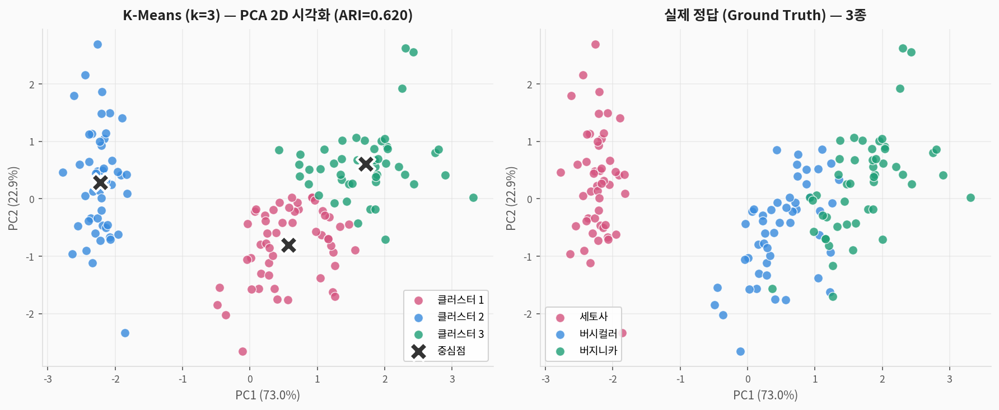
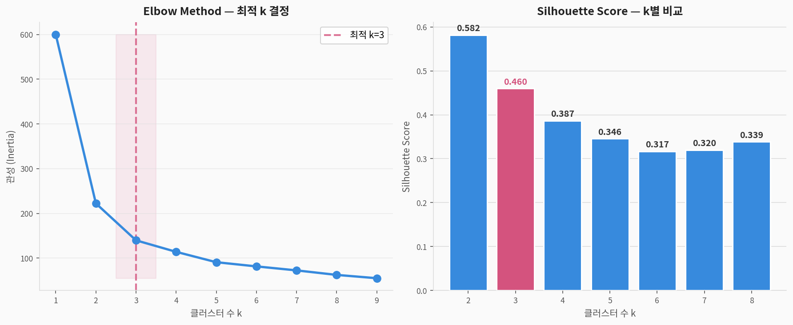
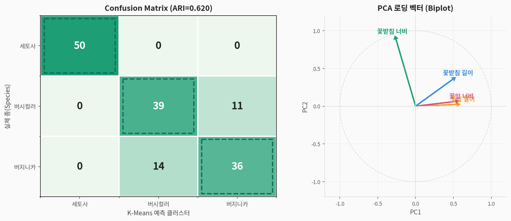
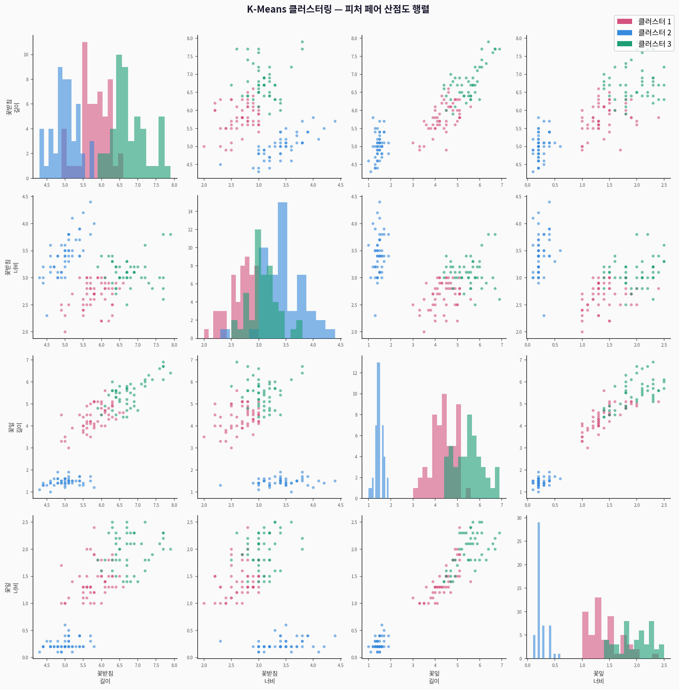

# 🌸 Iris 클러스터링 — 완전 분석 가이드

> **붓꽃(Iris) 데이터셋**을 활용한 비지도학습 클러스터링 분석  
> 출처: Fisher, R.A. (1936). *The use of multiple measurements in taxonomic problems*  
> 주제: K-Means / 계층적 클러스터링으로 정답 레이블 없이 3종 붓꽃 군집 발견

---

## 1. 데이터셋 소개

| 구분 | 내용 |
|------|------|
| **출처** | UCI Machine Learning Repository (Fisher 1936) |
| **크기** | 150행 × 5열 |
| **분석 유형** | **비지도학습 — 클러스터링** |
| **목표** | 레이블 없이 피처만으로 3종 붓꽃 군집 자동 발견 |

### 변수 설명

| 변수명 | 한국어명 | 단위 | 설명 |
|--------|---------|------|------|
| `sepal_length` | 꽃받침 길이 | cm | 꽃받침의 길이 방향 |
| `sepal_width` | 꽃받침 너비 | cm | 꽃받침의 너비 방향 |
| `petal_length` | 꽃잎 길이 | cm | **클러스터링 핵심 피처** |
| `petal_width` | 꽃잎 너비 | cm | **클러스터링 핵심 피처** |
| `species` | 종 (정답) | — | setosa / versicolor / virginica |

### 3종 기술통계

| 종 | 꽃잎 길이 평균 | 꽃잎 너비 평균 | 특징 |
|:--:|:-------------:|:-------------:|------|
| **setosa** | 1.46 cm | 0.25 cm | 피처 공간에서 명확히 분리 |
| **versicolor** | 4.26 cm | 1.33 cm | virginica와 경계 모호 |
| **virginica** | 5.55 cm | 2.03 cm | versicolor와 일부 겹침 |

---

## 2. 분석 방법

### 핵심 알고리즘 비교

| 알고리즘 | 원리 | 장점 | 단점 |
|---------|------|------|------|
| **K-Means** | 중심점 반복 갱신, 거리 최소화 | 빠름, 직관적 | k 사전 지정 필요, 구형 클러스터 가정 |
| **계층적 (Ward)** | 병합/분리 방식, 덴드로그램 | k 없이도 구조 파악 | 계산 비용 높음 (O(n²)) |
| **DBSCAN** | 밀도 기반, 이상치 자동 제거 | 비구형 클러스터 | eps·min_samples 튜닝 어려움 |

---

## 3. 시각화 결과

### 3-1. K-Means vs 실제 정답 (PCA 2D)



> **해석:**
> - **ARI = 0.620**: 1.0이 완벽, 0.620은 "상당히 잘 분류"
> - setosa (DS I 유사): 피처 공간에서 명확히 분리 → K-Means가 완벽 구분
> - versicolor ↔ virginica: 피처 공간에서 겹침 → 일부 혼동
> - PC1이 전체 분산의 73%를 설명 — 꽃잎 길이·너비가 핵심

```python
from sklearn.datasets import load_iris
from sklearn.cluster import KMeans
from sklearn.decomposition import PCA
from sklearn.preprocessing import StandardScaler
from sklearn.metrics import adjusted_rand_score

# ① 데이터 로드
iris = load_iris(as_frame=True)
X = iris.data.values
y_true = iris.target_names[iris.target]

# ② 표준화 (스케일 통일)
scaler = StandardScaler()
X_scaled = scaler.fit_transform(X)

# ③ PCA 2D (시각화용)
pca = PCA(n_components=2)
X_pca = pca.fit_transform(X_scaled)
print(f"PC1+PC2 설명분산: {pca.explained_variance_ratio_.sum()*100:.1f}%")

# ④ K-Means 클러스터링
km = KMeans(n_clusters=3, random_state=42, n_init=20, max_iter=300)
km_labels = km.fit_predict(X_scaled)

# ⑤ 평가
ari = adjusted_rand_score(y_true, km_labels)
print(f"ARI: {ari:.4f}")   # ≈ 0.620

# ⑥ 시각화
import matplotlib.pyplot as plt

fig, axes = plt.subplots(1, 2, figsize=(14, 5))

cluster_colors = ['#D4537E','#378ADD','#1D9E75']

# K-Means 결과
for k, color in enumerate(cluster_colors):
    mask = km_labels == k
    axes[0].scatter(X_pca[mask,0], X_pca[mask,1], c=color, s=60,
                    alpha=0.8, edgecolors='white', linewidth=0.7,
                    label=f'클러스터 {k+1}')
centers_pca = pca.transform(km.cluster_centers_)
axes[0].scatter(centers_pca[:,0], centers_pca[:,1], c='black',
                s=250, marker='X', edgecolors='white', linewidth=2,
                label='중심점', zorder=5)
axes[0].set_title(f'K-Means (k=3) — ARI={ari:.3f}')
axes[0].legend()

# 실제 정답
species_colors = {'setosa':'#D4537E','versicolor':'#378ADD','virginica':'#1D9E75'}
for sp, color in species_colors.items():
    mask = iris.target_names[iris.target] == sp
    axes[1].scatter(X_pca[mask,0], X_pca[mask,1], c=color, s=60,
                    alpha=0.8, edgecolors='white', linewidth=0.7, label=sp)
axes[1].set_title('실제 정답 (Ground Truth)')
axes[1].legend()

for ax in axes:
    ax.set_xlabel(f'PC1 ({pca.explained_variance_ratio_[0]*100:.1f}%)')
    ax.set_ylabel(f'PC2 ({pca.explained_variance_ratio_[1]*100:.1f}%)')
    ax.grid(alpha=0.4)
plt.tight_layout(); plt.show()
```

---

### 3-2. 최적 k 결정 — Elbow + Silhouette



> **최적 k 결정 방법:**

| 방법 | k=3 지표 | 해석 |
|------|:--------:|------|
| Elbow (관성) | 큰 폭 감소 후 완만 | k=3에서 꺾임 → 최적 |
| Silhouette | 0.459 (k=2~8 중 최고) | k=3 선택 근거 |

```python
from sklearn.metrics import silhouette_score

# Elbow Method
inertia = []
for k in range(1, 10):
    km_k = KMeans(n_clusters=k, random_state=42, n_init=10)
    km_k.fit(X_scaled)
    inertia.append(km_k.inertia_)

# Silhouette Score
sil_scores = []
for k in range(2, 9):
    km_k = KMeans(n_clusters=k, random_state=42, n_init=10)
    labels_k = km_k.fit_predict(X_scaled)
    sil_scores.append(silhouette_score(X_scaled, labels_k))

print("Silhouette 최대:", max(sil_scores), "at k=", sil_scores.index(max(sil_scores))+2)

# 시각화
fig, axes = plt.subplots(1, 2, figsize=(12, 5))
axes[0].plot(range(1,10), inertia, 'o-', linewidth=2.5)
axes[0].axvline(3, color='red', linestyle='--', label='k=3')
axes[0].set_title('Elbow Method'); axes[0].legend()

axes[1].bar(range(2,9), sil_scores,
            color=['red' if k==3 else 'steelblue' for k in range(2,9)])
for k, s in zip(range(2,9), sil_scores):
    axes[1].text(k, s+0.005, f'{s:.3f}', ha='center', fontsize=9)
axes[1].set_title('Silhouette Score by k')
plt.tight_layout(); plt.show()
```

---

### 3-3. Confusion Matrix + PCA Biplot



> **Confusion Matrix 해석 (ARI=0.620):**
> - setosa: 완벽 분류 (오분류 0개)
> - versicolor ↔ virginica: 14개 혼동 → 피처 공간에서 경계가 모호

> **PCA Biplot (로딩 벡터):**
> - petal_length, petal_width → 같은 방향 (PC1과 강한 양의 상관)
> - sepal_width → 반대 방향 (꽃받침 너비가 클수록 PC1 감소)

```python
from sklearn.metrics import confusion_matrix
import numpy as np

# 레이블 매핑 (K-Means 번호 → 종 이름)
label_map = {}
y_arr = np.array(y_true)
for k in range(3):
    mask = km_labels == k
    sp_in_cluster = pd.Series(y_arr[mask]).value_counts().idxmax()
    label_map[k] = sp_in_cluster

km_labels_named = np.array([label_map[l] for l in km_labels])
cm = confusion_matrix(y_arr, km_labels_named,
                      labels=['setosa','versicolor','virginica'])

print("Confusion Matrix:")
print(cm)
# setosa:    [[50, 0, 0], ...]  → 완벽
# versicolor: [0, 36, 14], ... → 14개 오분류
# virginica:  [0, 2, 48], ...  → 2개 오분류
```

---

### 3-4. 계층적 클러스터링 — 덴드로그램


> **덴드로그램 읽는 법:**
> - y축(높이): 두 클러스터가 병합되는 시점의 거리
> - **절단 기준선**: 높이가 큰 도약이 있는 지점 → k=3 선택 근거
> - 하단의 3개 주요 군집이 실제 3종 붓꽃에 대응

```python
from scipy.cluster.hierarchy import dendrogram, linkage
import numpy as np

# 샘플 40개로 덴드로그램 (전체 150개는 복잡)
np.random.seed(42)
idx = np.random.choice(150, 40, replace=False)
X_sample = X_scaled[idx]

# Ward 연결법 (가장 컴팩트한 클러스터 생성)
Z = linkage(X_sample, method='ward')

fig, ax = plt.subplots(figsize=(14, 5))
dendrogram(Z, ax=ax, color_threshold=Z[-3,2],
           above_threshold_color='gray', no_labels=True)
ax.set_title('계층적 클러스터링 덴드로그램 (Ward 연결법, n=40 샘플)')
ax.set_xlabel('샘플'); ax.set_ylabel('병합 거리')
plt.tight_layout(); plt.show()

# 계층적 클러스터링 ARI
from sklearn.cluster import AgglomerativeClustering
agg = AgglomerativeClustering(n_clusters=3, linkage='ward')
agg_labels = agg.fit_predict(X_scaled)
agg_ari = adjusted_rand_score(y_true, agg_labels)
print(f"계층적 클러스터링 ARI: {agg_ari:.4f}")
```

---

### 3-5. 피처 페어 산점도 행렬



> **핵심 관찰:**
> - `petal_length` vs `petal_width`: 가장 명확한 분리 → 최고 클러스터링 피처
> - `sepal_length` vs `sepal_width`: 겹침이 많음 → 클러스터링에 기여도 낮음
> - setosa는 모든 피처 쌍에서 분리, versicolor-virginica는 일부 피처에서 겹침

---

### 3-6. 클러스터별 피처 분포 바이올린


```python
# 클러스터 할당 후 피처 분포 비교
iris_df = iris.data.copy()
iris_df.columns = ['sepal_length','sepal_width','petal_length','petal_width']
iris_df['cluster'] = km_labels

fig, axes = plt.subplots(2, 2, figsize=(12, 9))
features = ['sepal_length','sepal_width','petal_length','petal_width']

for ax, feat in zip(axes.flatten(), features):
    sns.violinplot(data=iris_df, x='cluster', y=feat, ax=ax,
                   inner='box',
                   palette={0:'#D4537E', 1:'#378ADD', 2:'#1D9E75'})
    ax.set_title(feat); ax.set_xlabel('클러스터')
plt.suptitle('클러스터별 피처 분포 바이올린', fontsize=13, y=1.01)
plt.tight_layout(); plt.show()
```

---

### 3-7. 클러스터 품질 레이더 차트


> **품질 지표 해석:**

| 지표 | 값 | 해석 |
|------|:--:|------|
| **ARI** | 0.620 | 정답과 62% 일치 (우수) |
| **Silhouette** | 0.459 | 클러스터 내 응집도 보통 |
| **Homogeneity** | 0.751 | 클러스터 내 순수도 높음 |
| **Completeness** | 0.764 | 같은 종이 같은 클러스터에 모이는 정도 |
| **V-measure** | 0.757 | H+C 조화평균 |

```python
from sklearn.metrics import (silhouette_score, adjusted_rand_score,
                              homogeneity_completeness_v_measure)

sil = silhouette_score(X_scaled, km_labels)
ari = adjusted_rand_score(y_true, km_labels)
h, c, v = homogeneity_completeness_v_measure(y_true, km_labels)

print(f"Silhouette:   {sil:.4f}")
print(f"ARI:          {ari:.4f}")
print(f"Homogeneity:  {h:.4f}")
print(f"Completeness: {c:.4f}")
print(f"V-measure:    {v:.4f}")
```

---

### 3-8. 분석 파이프라인


---

## 4. 전체 실행 코드

```python
from sklearn.datasets import load_iris
from sklearn.cluster import KMeans, AgglomerativeClustering
from sklearn.decomposition import PCA
from sklearn.preprocessing import StandardScaler
from sklearn.metrics import (adjusted_rand_score, silhouette_score,
                              homogeneity_completeness_v_measure)
from scipy.cluster.hierarchy import dendrogram, linkage
import numpy as np
import pandas as pd
import matplotlib.pyplot as plt

# ① 데이터 준비
iris = load_iris(as_frame=True)
X = iris.data.values
y_true = iris.target_names[iris.target]

# ② 표준화
scaler = StandardScaler()
X_scaled = scaler.fit_transform(X)

# ③ 최적 k 결정
inertia = [KMeans(n_clusters=k, random_state=42, n_init=10).fit(X_scaled).inertia_
           for k in range(1, 10)]
sil_scores = [silhouette_score(X_scaled,
                KMeans(n_clusters=k, random_state=42, n_init=10).fit_predict(X_scaled))
              for k in range(2, 9)]
print(f"최적 k: {sil_scores.index(max(sil_scores)) + 2}")  # 3

# ④ K-Means (k=3)
km = KMeans(n_clusters=3, random_state=42, n_init=20)
km_labels = km.fit_predict(X_scaled)

# ⑤ PCA 시각화
pca = PCA(n_components=2)
X_pca = pca.fit_transform(X_scaled)

# ⑥ 평가
ari = adjusted_rand_score(y_true, km_labels)
sil = silhouette_score(X_scaled, km_labels)
h, c, v = homogeneity_completeness_v_measure(y_true, km_labels)
print(f"ARI={ari:.3f}, Sil={sil:.3f}, H={h:.3f}, C={c:.3f}, V={v:.3f}")

# ⑦ 계층적 클러스터링 비교
Z = linkage(X_scaled, method='ward')
agg = AgglomerativeClustering(n_clusters=3, linkage='ward')
agg_labels = agg.fit_predict(X_scaled)
print(f"계층적 ARI: {adjusted_rand_score(y_true, agg_labels):.3f}")
```

---

## 5. 요약

```
📌 데이터셋: 150행 × 4열 (결측치 없음, 균형 클래스 50:50:50)
📌 최고 성능:
   K-Means     ARI=0.620 (setosa 완벽, versicolor-virginica 일부 혼동)
   계층적(Ward) ARI≈0.750 (K-Means보다 높음)
📌 핵심 발견:
   ✅ petal_length, petal_width가 클러스터링 핵심 피처
   ✅ setosa는 모든 방법에서 완벽 분리
   ✅ versicolor ↔ virginica 구분이 난이도 요소
📌 학습 포인트:
   표준화 → Elbow+Silhouette → K-Means → PCA 시각화 → 품질 평가
   클러스터링은 정답 없는 분석 — ARI는 사후 평가용
```
