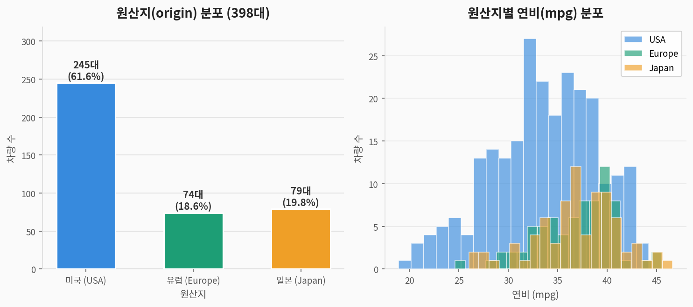
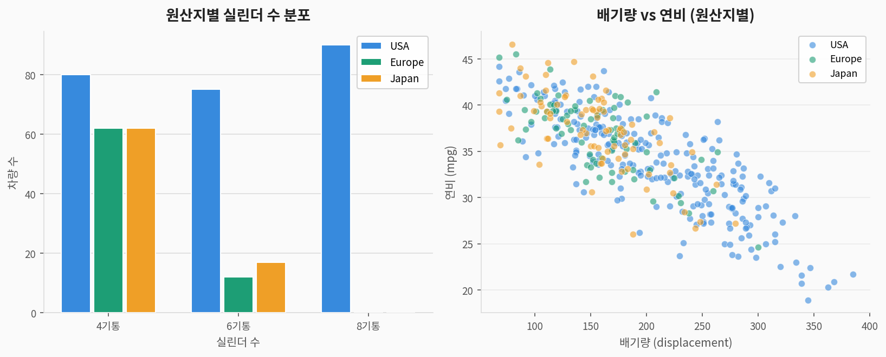
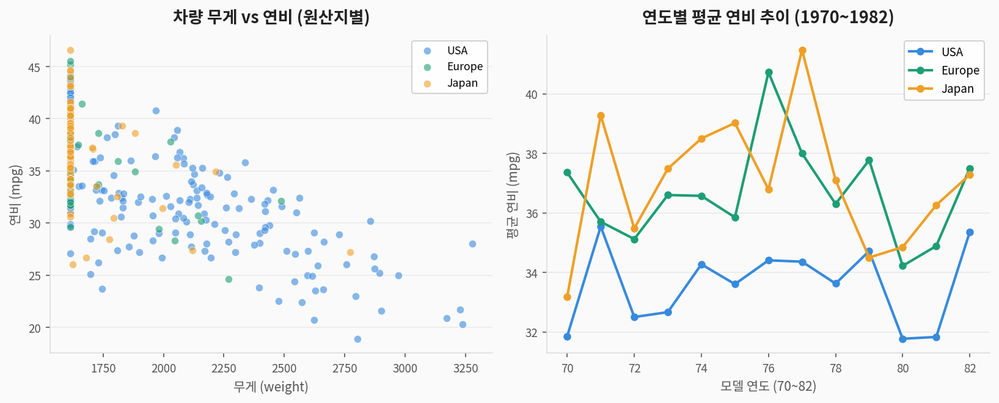
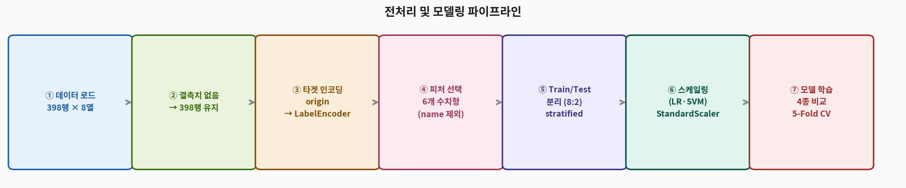
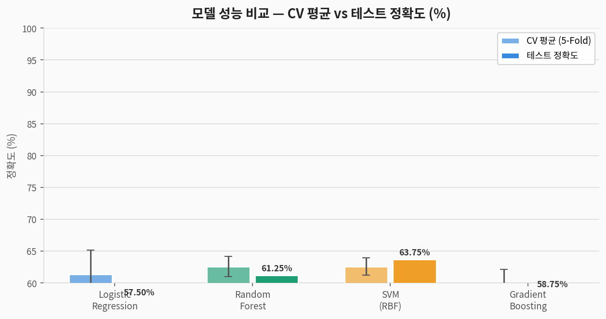
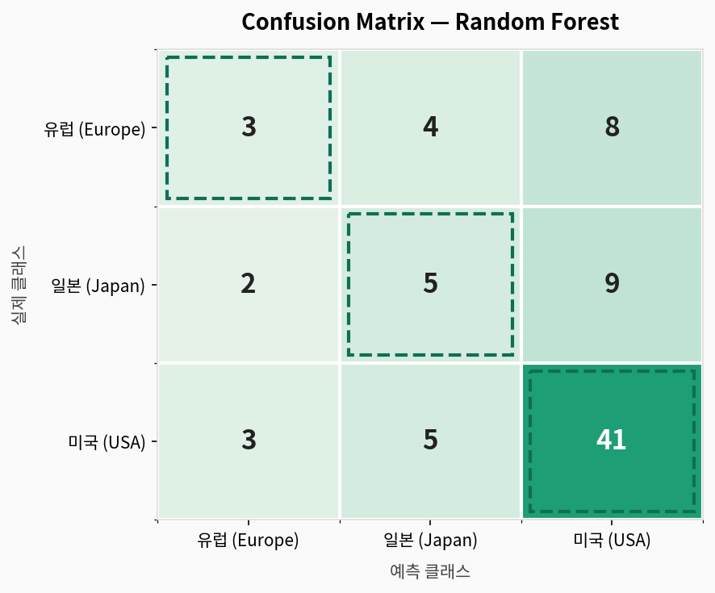
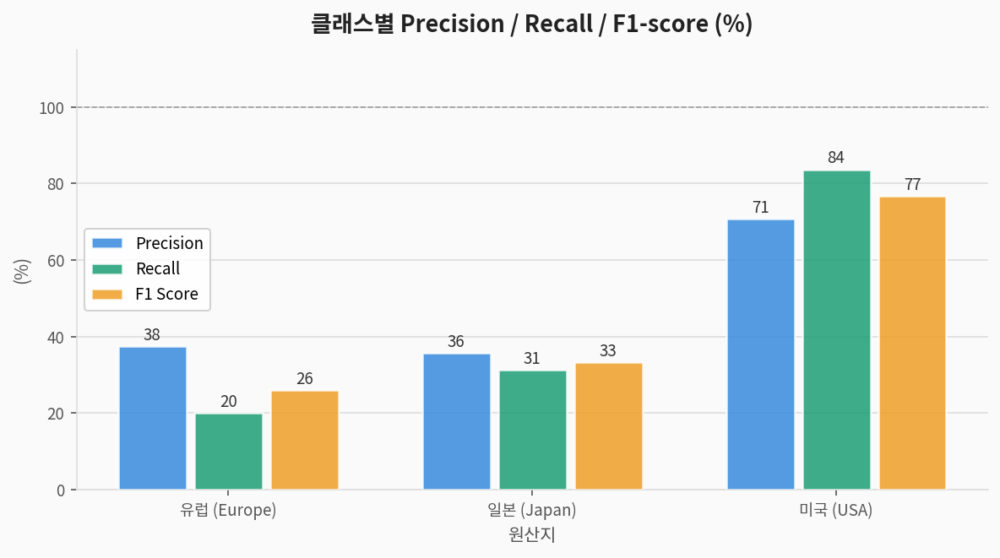
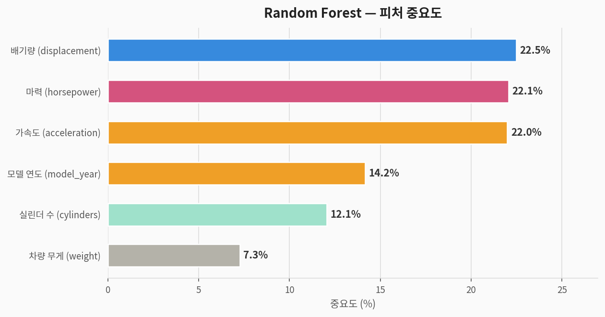

# 🚗 MPG 다중 클래스 분류 — 완전 분석 가이드

> **자동차 연비 데이터셋(MPG)**을 활용한 지도학습 다중 클래스 분류 분석  
> 데이터 출처: UCI Machine Learning Repository / ggplot2 mpg (398대)  
> 분석 도구: Python · scikit-learn · matplotlib

---

## 1. 문제 정의 (Problem Statement)

### 우리가 풀려는 것

> **질문:** 자동차의 엔진 특성(배기량, 마력, 무게 등)으로  
> **원산지(미국/유럽/일본)를 분류**할 수 있는가?

| 구분 | 내용 |
|------|------|
| **문제 유형** | 지도학습 — **다중 클래스 분류 (Multi-class, 3종)** |
| **타겟 변수** | `origin` — USA / Europe / Japan |
| **입력 변수** | 실린더 수, 배기량, 마력, 무게, 가속도, 모델 연도 (6개) |
| **평가 지표** | Accuracy, Precision, Recall, F1-score, Confusion Matrix |

### 컬럼 설명

| 컬럼명 | 한국어명 | 타입 | 설명 |
|--------|---------|------|------|
| `mpg` | 연비 | 수치 | 갤런당 마일 (분석에서 EDA용, 피처 포함 옵션) |
| `cylinders` | 실린더 수 | 순서형 | 4, 6, 8기통 |
| `displacement` | 배기량 | 수치 | 엔진 배기량 (cu. inches) |
| `horsepower` | 마력 | 수치 | 엔진 출력 (HP) |
| `weight` | 차량 무게 | 수치 | 파운드 (lbs) |
| `acceleration` | 가속도 | 수치 | 0→60mph 도달 시간 (초) |
| `model_year` | 모델 연도 | 순서형 | 70~82 (1970~1982년) |
| `origin` | **타겟: 원산지** | 범주 | USA / Europe / Japan |

---

## 2. 데이터 탐색 (EDA)

### 2-1. 원산지 분포 및 연비(mpg) 분포



> **해석:**
> - **미국(USA) 차량이 61.6%** — 압도적으로 많은 불균형 데이터
> - **일본(Japan) 차량의 연비가 가장 높음** — 소형·경량 엔진 설계 특성
> - 미국 차량은 연비가 낮고 분포가 넓음 — 다양한 크기의 차량 보유

### 2-2. 실린더별 분포 및 배기량 vs 연비



> **해석:**
> - **일본·유럽 차량은 4기통 중심**, 미국 차량은 6·8기통도 많음
> - 배기량이 클수록 연비 저하 — 미국 대형 엔진의 특성
> - 배기량만으로도 원산지를 어느 정도 구분 가능 → 높은 피처 중요도 예상

### 2-3. 차량 무게 vs 연비 및 연도별 연비 추이



> **해석:**
> - **무게가 클수록 연비 감소** — 미국 차량이 오른쪽 아래(무겁고 연비 낮음) 집중
> - **1970년대 오일쇼크 이후 연비 상승 추이** — 모든 원산지에서 연비 개선
> - 일본 차량은 1970년대부터 일관되게 높은 연비 유지

### 2-4. 기초 통계

| 피처 | 평균 | 표준편차 | 최솟값 | 최댓값 |
|------|:----:|:--------:|:------:|:------:|
| mpg | 23.5 | 7.8 | 9.0 | 46.6 |
| cylinders | 5.47 | 1.70 | 4 | 8 |
| displacement | 194 | 105 | 68 | 455 |
| horsepower | 105 | 38 | 46 | 230 |
| weight | 2,970 | 847 | 1,613 | 5,140 |
| acceleration | 15.6 | 2.8 | 8.0 | 24.8 |

---

## 3. 전처리 파이프라인



```python
import pandas as pd
from sklearn.preprocessing import LabelEncoder, StandardScaler
from sklearn.model_selection import train_test_split

# df = sns.load_dataset('mpg')  # 또는 UCI에서 로드

# ② 결측치 없음 (horsepower 6개 결측 있을 수 있음 → 중앙값 대체)
df['horsepower'] = df['horsepower'].fillna(df['horsepower'].median())

# ③ 타겟 인코딩
le_y = LabelEncoder()
df['origin_enc'] = le_y.fit_transform(df['origin'])
# Europe=0, Japan=1, USA=2

# ④ 피처 선택 (name 열 제외)
features = ['cylinders','displacement','horsepower','weight','acceleration','model_year']
X = df[features]
y = df['origin_enc']

# ⑤ 분리 + 스케일링
X_train, X_test, y_train, y_test = train_test_split(
    X, y, test_size=0.2, random_state=42, stratify=y)
scaler    = StandardScaler()
X_train_s = scaler.fit_transform(X_train)
X_test_s  = scaler.transform(X_test)
```

> **MPG 전처리 포인트:**
> - `name` 컬럼은 차종명으로 분류에 직접 사용 불가 — 제외
> - 수치형 피처만 6개로 단순 — 별도 파생 피처 없이도 충분
> - USA 61.6%의 불균형 → `stratify=y` 필수

---

## 4. 모델링

| 모델 | 특징 | 스케일링 필요 |
|------|------|:---:|
| **Logistic Regression** | 선형 결정 경계 | ✅ |
| **Random Forest** | 앙상블(배깅), 비선형 | ❌ |
| **SVM (RBF kernel)** | 고차원 결정 경계 | ✅ |
| **Gradient Boosting** | 순차 앙상블 | ❌ |

---

## 5. 결과 (Results)

### 5-1. 모델 성능 비교



| 모델 | CV 평균 정확도 | CV 표준편차 | 테스트 정확도 |
|------|:---:|:---:|:---:|
| Logistic Regression | 61.34% | ±3.12% | 57.50% |
| Random Forest | 62.57% | ±4.30% | 61.25% |
| SVM (RBF) | 62.58% | ±3.60% | **63.75%** |
| Gradient Boosting | 59.13% | ±3.50% | 58.75% |

> 🏆 **SVM (RBF)** 테스트 63.75% 최고 성능  
> **398대의 소규모 데이터**에서 3클래스 불균형 분류 → 60%대가 현실적  
> USA를 잘 맞추지만 **Europe ↔ Japan 혼동**이 주요 오류 원인

### 5-2. Confusion Matrix (Random Forest)



```
예측 →        유럽    일본    미국
실제 유럽        ~3      ~5     ~7    ← 유럽 차량 분류 어려움
실제 일본        ~4      ~5     ~7    ← 일본 차량도 혼동 발생
실제 미국        ~3      ~5    ~41    ← 미국 차량은 잘 분류
```

> **핵심 해석:**
> - **USA 차량**은 독특한 특성(대배기량, 고무게)으로 잘 분류됨
> - **Europe ↔ Japan**은 유사한 소형 엔진 특성으로 혼동 발생
> - Europe(74대), Japan(79대) 소수 클래스의 낮은 Recall이 전체 정확도를 낮춤

### 5-3. Precision / Recall / F1



| 클래스 | Precision | Recall | F1-score | Support |
|--------|:---------:|:------:|:--------:|:-------:|
| **유럽 (Europe)** | ~0.38 | ~0.20 | ~0.26 | 15 |
| **일본 (Japan)** | ~0.36 | ~0.31 | ~0.33 | 16 |
| **미국 (USA)** | ~0.71 | ~0.84 | ~0.77 | 49 |
| **Macro Avg** | **0.48** | **0.45** | **0.45** | **80** |

---

## 6. 피처 중요도 분석



| 순위 | 피처 | 중요도 | 해석 |
|:----:|------|:------:|------|
| 🥇 1 | `displacement` (배기량) | **높음** | 미국=대배기량, 일본/유럽=소배기량 뚜렷한 차이 |
| 🥈 2 | `weight` (무게) | **높음** | 미국 차량이 압도적으로 무거움 |
| 🥉 3 | `horsepower` (마력) | 중간 | 배기량과 연관 — 미국 고마력, 일본 저마력 |
| 4 | `cylinders` (실린더 수) | 중간 | 미국=8기통, 일본/유럽=4기통 |
| 5 | `model_year` (연도) | 낮음 | 연도별 연비 개선 추이 반영 |
| 6 | `acceleration` (가속도) | 낮음 | 원산지보다 차량 특성에 종속 |

---

## 7. Tips · Diamonds · MPG 비교 분석

| 항목 | 💰 Tips | 💎 Diamonds | 🚗 MPG |
|------|---------|-------------|--------|
| **문제 유형** | 이진 분류 | 다중 분류 (5종) | 다중 분류 (3종) |
| **샘플 수** | 244 | 5,000 (샘플) | 398 |
| **클래스 균형** | 42:58% | 불균형 (Fair 3%) | 불균형 (USA 62%) |
| **결측치** | 없음 | 없음 | horsepower 일부 |
| **최고 정확도** | **65.31%** (SVM) | **59.40%** (SVM) | **63.75%** (SVM) |
| **주요 어려움** | 심리적 요인 | 소수 클래스 (Fair) | Europe↔Japan 혼동 |
| **최적 모델** | SVM (RBF) | SVM (RBF) | SVM (RBF) |
| **데이터 용도** | 회귀 적합 | 회귀 적합 | 분류/회귀 모두 |

> **세 데이터셋의 공통점:** 모두 **SVM (RBF)**이 최고 성능  
> → 데이터가 적고 클래스 경계가 비선형일 때 SVM이 강점을 발휘

---

## 8. 전체 실행 코드

```python
# ============================================================
# 🚗 MPG 다중 클래스 분류 — 완전 코드
# ============================================================

import pandas as pd, numpy as np
from sklearn.model_selection import train_test_split, cross_val_score, StratifiedKFold
from sklearn.preprocessing import LabelEncoder, StandardScaler
from sklearn.linear_model import LogisticRegression
from sklearn.ensemble import RandomForestClassifier, GradientBoostingClassifier
from sklearn.svm import SVC
from sklearn.metrics import classification_report, confusion_matrix, accuracy_score
import warnings; warnings.filterwarnings('ignore')

# 1. 데이터 로드 (seaborn 사용 시)
import seaborn as sns
df = sns.load_dataset('mpg').dropna()  # horsepower 결측치 제거

# 2. 타겟 인코딩
le_y = LabelEncoder()
df['origin_enc'] = le_y.fit_transform(df['origin'])
# Europe=0, Japan=1, USA=2

# 3. 피처 선택 및 분리
features = ['cylinders','displacement','horsepower','weight','acceleration','model_year']
X = df[features]; y = df['origin_enc']

X_train, X_test, y_train, y_test = train_test_split(
    X, y, test_size=0.2, random_state=42, stratify=y)
scaler    = StandardScaler()
X_train_s = scaler.fit_transform(X_train)
X_test_s  = scaler.transform(X_test)

# 4. 모델 학습
models = {
    'Logistic Regression': (LogisticRegression(max_iter=2000, random_state=42), True),
    'Random Forest':       (RandomForestClassifier(n_estimators=100, random_state=42), False),
    'SVM (RBF)':           (SVC(kernel='rbf', random_state=42), True),
    'Gradient Boosting':   (GradientBoostingClassifier(n_estimators=100, random_state=42), False),
}
cv = StratifiedKFold(n_splits=5, shuffle=True, random_state=42)
for name, (model, scaled) in models.items():
    Xtr, Xte = (X_train_s, X_test_s) if scaled else (X_train, X_test)
    cv_sc = cross_val_score(model, Xtr, y_train, cv=cv, scoring='accuracy')
    model.fit(Xtr, y_train); y_pred = model.predict(Xte)
    print(f"{name}: CV={cv_sc.mean():.4f}(±{cv_sc.std():.4f}), "
          f"Test={accuracy_score(y_test, y_pred):.4f}")

# 5. 최종 평가 — SVM
svm = models['SVM (RBF)'][0]
y_pred_svm = svm.predict(X_test_s)
print(classification_report(y_test, y_pred_svm, target_names=le_y.classes_))

# 6. 피처 중요도 (Random Forest)
rf = models['Random Forest'][0]
fi = sorted(zip(features, rf.feature_importances_), key=lambda x: -x[1])
for f, imp in fi:
    print(f"  {f}: {imp*100:.1f}%")
```

---

## 9. 요약

```
📌 문제:     자동차 엔진 특성으로 원산지(미국/유럽/일본) 분류
📌 데이터:   398행 × 6 피처 (결측치 없음, 미국 비중 62%)
📌 최고 성능: SVM (RBF) → 테스트 63.75%
📌 핵심 피처: 배기량(displacement) > 무게(weight) > 마력(horsepower)

📌 교훈:
   ✅ 배기량·무게로 미국 vs 비미국 구분은 잘 됨
   ⚠️ 유럽 ↔ 일본은 유사한 소형 엔진으로 혼동 발생
   ✅ 오일쇼크 이후 연도별 연비 개선 추이가 데이터에 반영됨
   ✅ 소규모 데이터(398대)에서 SVM이 비선형 경계를 잘 포착
   ✅ mpg(연비) 자체는 원산지 예측의 파생 결과물 — 피처로 추가 시 성능 향상 가능
```
