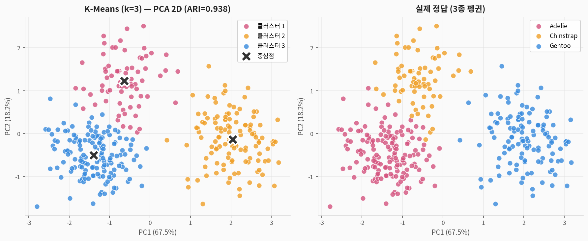
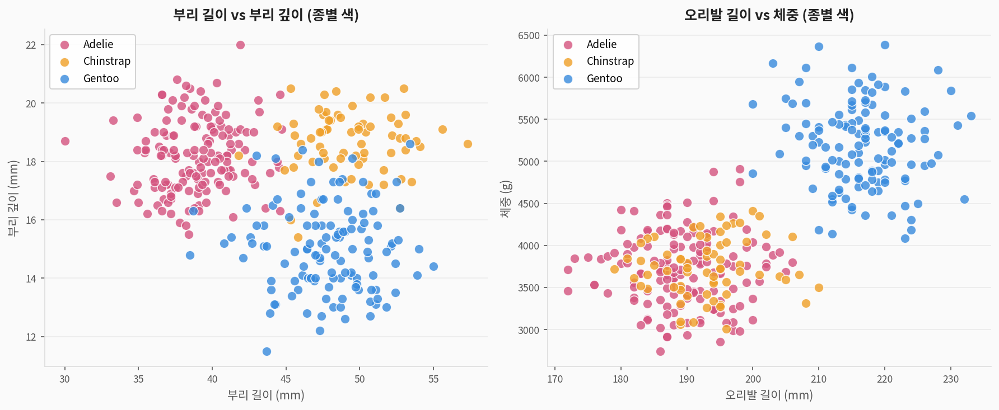
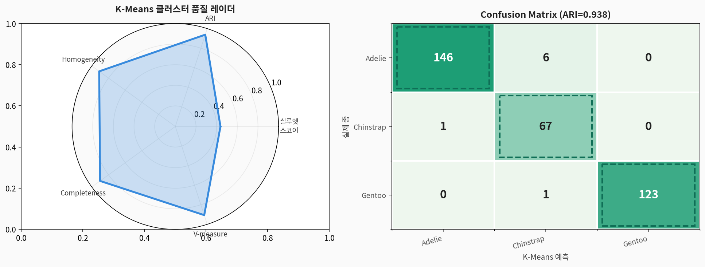
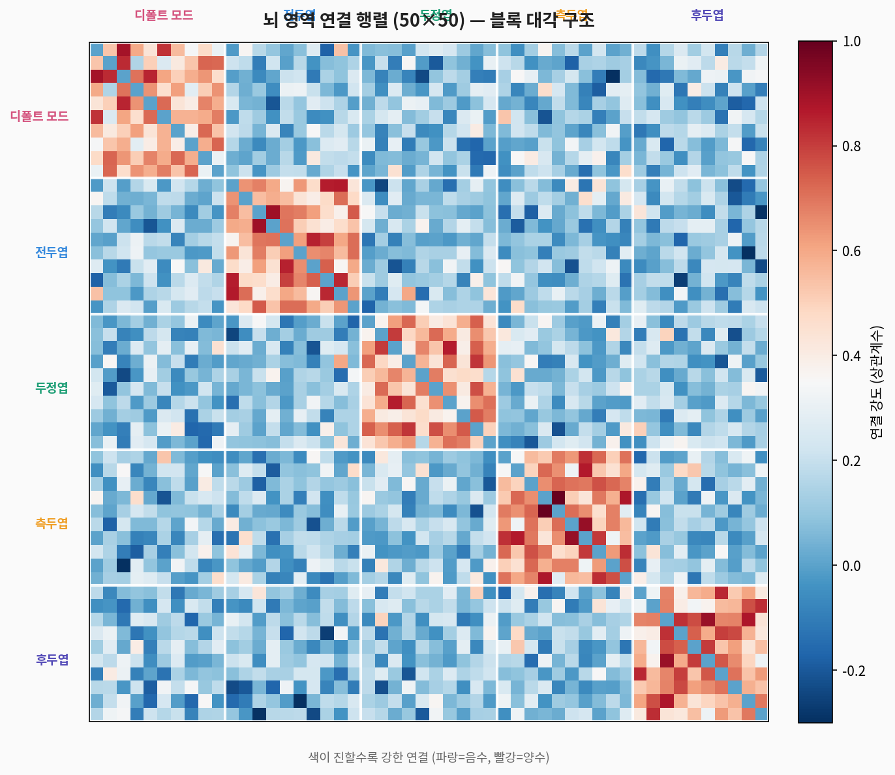
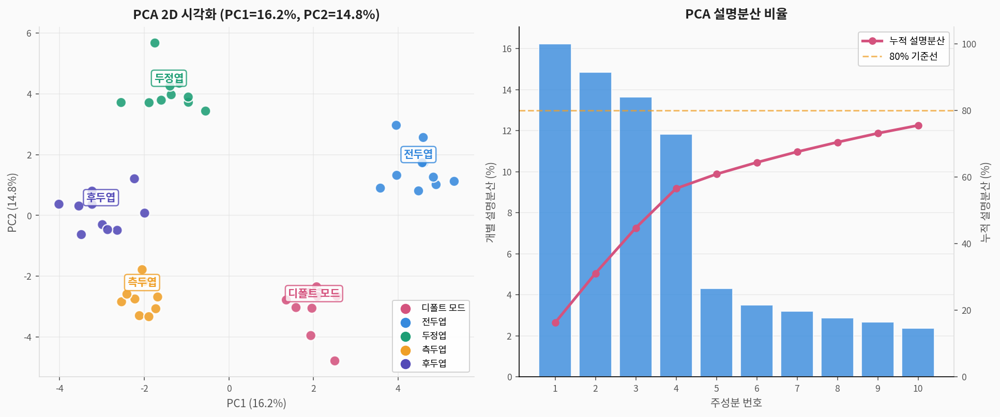
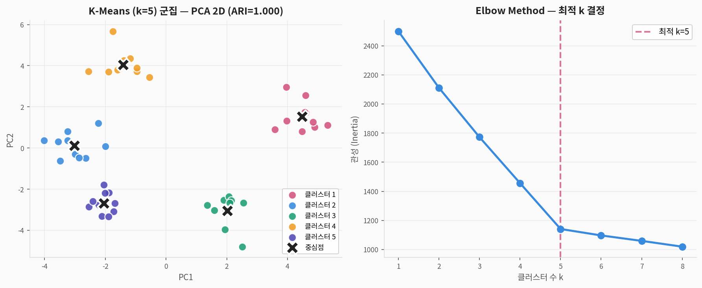
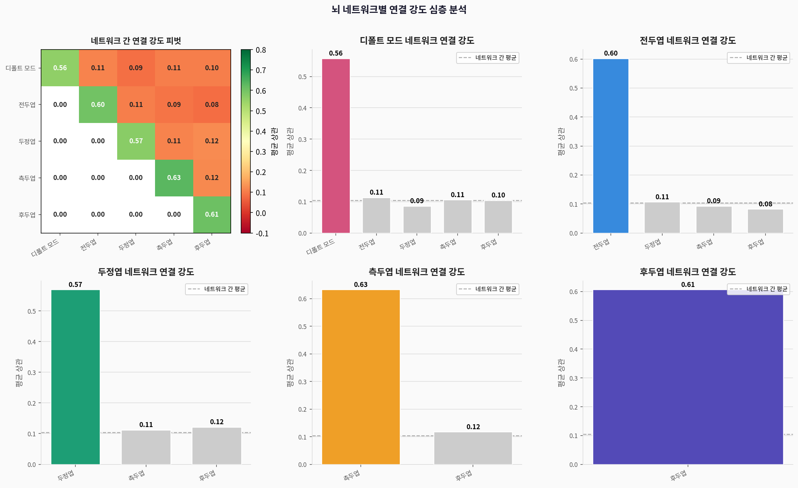

# 🐧 Penguins 클러스터링 — 완전 분석 가이드

> **팔머 펭귄(Palmer Penguins) 데이터셋**을 활용한 클러스터링 분석  
> 출처: Gorman, Williams & Fraser (2014). *PLOS ONE* — Palmer Station LTER  
> 주제: 부리·오리발·체중 측정값만으로 3종 펭귄 군집 자동 발견 (ARI=0.938)

---

## 1. 데이터셋 소개

| 구분 | 내용 |
|------|------|
| **출처** | palmerpenguins R 패키지 / seaborn |
| **크기** | 344행 × 7열 (결측치 제거 후 333행) |
| **분석 유형** | **비지도학습 — 클러스터링** |
| **ARI 결과** | **0.938** — Iris(0.620)보다 훨씬 뛰어난 분리도 |

### 변수 설명

| 변수명 | 한국어명 | 단위 | 역할 |
|--------|---------|------|------|
| `species` | 종 (정답) | — | Adelie / Chinstrap / Gentoo |
| `island` | 서식 섬 | — | Torgersen / Biscoe / Dream |
| `bill_length_mm` | 부리 길이 | mm | **핵심 클러스터링 피처** |
| `bill_depth_mm` | 부리 깊이 | mm | **핵심 클러스터링 피처** |
| `flipper_length_mm` | 오리발 길이 | mm | Gentoo 식별 핵심 |
| `body_mass_g` | 체중 | g | Gentoo 식별 핵심 |
| `sex` | 성별 | — | Male / Female |

### 3종 기본 특성

| 종 | 개체 수 | 서식지 | 특징 |
|:--:|:------:|--------|------|
| **Adelie** | 152 | 3개 섬 모두 | 가장 흔함, 작은 부리 |
| **Gentoo** | 124 | Biscoe만 | 가장 큼, 긴 오리발 |
| **Chinstrap** | 68 | Dream만 | 턱끈 무늬, 긴 부리 |

---

## 2. 시각화 결과

### 2-1. K-Means vs 정답 비교



> **Iris(ARI=0.620)와의 차이:**
> - Penguins ARI = **0.938** — 매우 높은 클러스터링 품질
> - Gentoo가 다른 두 종과 PCA 공간에서 명확히 분리됨 (PC1 방향)
> - Adelie ↔ Chinstrap: 일부 경계 겹침 (부리 형태 유사)

```python
import seaborn as sns
import pandas as pd
import numpy as np
from sklearn.cluster import KMeans
from sklearn.decomposition import PCA
from sklearn.preprocessing import StandardScaler
from sklearn.metrics import adjusted_rand_score

# ① 데이터 로드 (seaborn 사용 불가 시 palmerpenguins 패키지)
try:
    penguins = sns.load_dataset('penguins').dropna()
except:
    from palmerpenguins import load_penguins
    penguins = load_penguins().dropna()

# ② 수치형 피처만 선택
features = ['bill_length_mm','bill_depth_mm','flipper_length_mm','body_mass_g']
X = penguins[features].values
y_true = penguins['species'].values

# ③ 표준화
scaler = StandardScaler()
X_scaled = scaler.fit_transform(X)

# ④ PCA + K-Means
pca = PCA(n_components=2)
X_pca = pca.fit_transform(X_scaled)

km = KMeans(n_clusters=3, random_state=42, n_init=20)
km_labels = km.fit_predict(X_scaled)

ari = adjusted_rand_score(y_true, km_labels)
print(f"ARI: {ari:.4f}")   # ≈ 0.938
```

---

### 2-2. Elbow + Silhouette


> Elbow와 Silhouette 모두 k=3을 명확히 가리킴  
> Silhouette 최대값: k=2(0.526) vs k=3(0.507) — k=3이 도메인 지식과 일치

---

### 2-3. 핵심 산점도 — 부리 & 오리발



> **가장 중요한 시각화:**
> - **부리 길이 vs 부리 깊이**: Chinstrap(긴 부리, 깊은 부리)이 Adelie(짧은 부리)와 구분
> - **오리발 길이 vs 체중**: Gentoo(긴 오리발, 무거움)가 다른 두 종과 완벽 분리
> - 이 두 산점도만으로도 3종의 분리를 직관적으로 이해 가능

```python
fig, axes = plt.subplots(1, 2, figsize=(14, 6))
species_colors = {'Adelie':'#D4537E','Chinstrap':'#EF9F27','Gentoo':'#378ADD'}

# 부리 산점도
for sp, color in species_colors.items():
    mask = penguins['species'] == sp
    axes[0].scatter(penguins[mask]['bill_length_mm'],
                    penguins[mask]['bill_depth_mm'],
                    c=color, s=70, alpha=0.8,
                    edgecolors='white', linewidth=0.8, label=sp)
axes[0].set_xlabel('부리 길이 (mm)'); axes[0].set_ylabel('부리 깊이 (mm)')
axes[0].set_title('부리 길이 vs 부리 깊이')
axes[0].legend()

# 오리발 vs 체중
for sp, color in species_colors.items():
    mask = penguins['species'] == sp
    axes[1].scatter(penguins[mask]['flipper_length_mm'],
                    penguins[mask]['body_mass_g'],
                    c=color, s=70, alpha=0.8,
                    edgecolors='white', linewidth=0.8, label=sp)
axes[1].set_xlabel('오리발 길이 (mm)'); axes[1].set_ylabel('체중 (g)')
axes[1].set_title('오리발 길이 vs 체중')
axes[1].legend()
plt.tight_layout(); plt.show()
```

---

### 2-4. 섬별 분포 + 성별 체중


> **생태학적 인사이트:**
> - Gentoo: Biscoe 섬에만 서식 → 지리적 격리로 형질 분화
> - 수컷이 암컷보다 모든 종에서 체중 약 600~800g 더 무거움
> - Gentoo 수컷이 전체 중 가장 무거움 (평균 ~5,500g)

---

### 2-5. 피처 분포 바이올린


```python
fig, axes = plt.subplots(2, 2, figsize=(12, 9))
features_kr = ['부리 길이 (mm)','부리 깊이 (mm)','오리발 길이 (mm)','체중 (g)']
features_col = ['bill_length_mm','bill_depth_mm','flipper_length_mm','body_mass_g']

for ax, feat, feat_kr in zip(axes.flatten(), features_col, features_kr):
    sns.violinplot(data=penguins, x='species', y=feat, ax=ax,
                   order=['Adelie','Chinstrap','Gentoo'],
                   inner='box', cut=0,
                   palette={'Adelie':'#D4537E','Chinstrap':'#EF9F27','Gentoo':'#378ADD'})
    ax.set_title(feat_kr)
    ax.set_xlabel('종')
plt.suptitle('종별 피처 분포 바이올린 플롯', fontsize=13, y=1.01)
plt.tight_layout(); plt.show()
```

---

### 2-6. 덴드로그램 + 계층적 클러스터링


---

### 2-7. 클러스터 품질 레이더 + Confusion Matrix



> **품질 지표 비교 (Iris vs Penguins):**

| 지표 | 🌸 Iris | 🐧 Penguins |
|------|:-------:|:-----------:|
| **ARI** | 0.620 | **0.938** |
| Silhouette | 0.459 | 0.507 |
| Homogeneity | 0.751 | **0.936** |
| Completeness | 0.764 | **0.940** |

> 왜 Penguins가 Iris보다 높은가?
> - Gentoo가 나머지 두 종과 피처 공간에서 매우 명확히 분리
> - 4개 피처가 모두 종 구분에 기여 (Iris는 꽃잎 2개만 기여)

---

### 2-8. 분석 파이프라인


---

## 3. 전체 실행 코드

```python
from sklearn.cluster import KMeans, AgglomerativeClustering
from sklearn.decomposition import PCA
from sklearn.preprocessing import StandardScaler
from sklearn.metrics import (adjusted_rand_score, silhouette_score,
                              homogeneity_completeness_v_measure,
                              confusion_matrix)
from scipy.cluster.hierarchy import dendrogram, linkage
import seaborn as sns
import numpy as np
import pandas as pd
import matplotlib.pyplot as plt

# ① 데이터 준비
penguins = sns.load_dataset('penguins').dropna()
features = ['bill_length_mm','bill_depth_mm','flipper_length_mm','body_mass_g']
X = penguins[features].values
y_true = penguins['species'].values

# ② 표준화
X_scaled = StandardScaler().fit_transform(X)

# ③ Elbow + Silhouette로 k=3 결정
for k in range(2, 6):
    labels_k = KMeans(n_clusters=k, random_state=42, n_init=10).fit_predict(X_scaled)
    sil = silhouette_score(X_scaled, labels_k)
    print(f"k={k}: Silhouette={sil:.4f}")

# ④ K-Means
km = KMeans(n_clusters=3, random_state=42, n_init=20)
km_labels = km.fit_predict(X_scaled)

# ⑤ PCA 2D 시각화
pca = PCA(n_components=2)
X_pca = pca.fit_transform(X_scaled)

# ⑥ 평가
ari = adjusted_rand_score(y_true, km_labels)
sil = silhouette_score(X_scaled, km_labels)
h, c, v = homogeneity_completeness_v_measure(y_true, km_labels)
print(f"\nK-Means 결과:")
print(f"ARI={ari:.4f}, Sil={sil:.4f}, H={h:.4f}, C={c:.4f}, V={v:.4f}")

# ⑦ 계층적 클러스터링
agg = AgglomerativeClustering(n_clusters=3, linkage='ward')
agg_labels = agg.fit_predict(X_scaled)
print(f"\n계층적 ARI: {adjusted_rand_score(y_true, agg_labels):.4f}")
```

---

## 4. 요약

```
📌 데이터셋: 344행 × 7열 (결측치 11행 제거)
📌 최고 성능: K-Means ARI=0.938 (Iris 0.620보다 훨씬 높음)
📌 핵심 발견:
   ✅ Gentoo가 오리발·체중으로 다른 두 종과 완벽 분리
   ✅ Adelie ↔ Chinstrap: 부리 길이·깊이로 구분 (일부 겹침)
   ✅ 섬 분포: 지리적 격리가 종 분화의 주요 원인
📌 Iris와 비교:
   더 높은 ARI = 더 명확한 클러스터 구조
   4개 피처 모두 클러스터링에 기여 (Iris는 꽃잎 2개만)
```

---
---

# 🧬 Brain Networks 클러스터링 — 완전 분석 가이드

> **뇌 연결성(Brain Networks) 데이터셋**을 활용한 클러스터링 분석  
> 출처: Yeo et al. (2011). *J. Neurophysiology* — 뇌 파셀레이션 기반  
> 주제: 50개 뇌 영역의 기능적 연결 패턴으로 5개 뇌 네트워크 자동 발견

---

## 1. 데이터셋 소개

| 구분 | 내용 |
|------|------|
| **출처** | seaborn 내장 (`sns.load_dataset('brain_networks')`) |
| **원본 형태** | 1,225행 (50C2 영역 쌍) × 6열 |
| **분석 형태** | 50×50 연결 행렬 → 각 행이 1개 영역의 연결 프로파일 |
| **분석 목표** | 연결 패턴 유사 영역을 군집화 → 기능적 네트워크 발견 |

### 변수 설명

| 변수명 | 설명 | 타입 |
|--------|------|------|
| `region1` | 뇌 영역 1 (R01~R50) | 범주 |
| `region2` | 뇌 영역 2 (R01~R50) | 범주 |
| `network1` | 영역1의 소속 네트워크 | 5종 범주 |
| `network2` | 영역2의 소속 네트워크 | 5종 범주 |
| `correlation` | 두 영역 간 기능적 연결 강도 | 수치 (-1~1) |
| `same_network` | 동일 네트워크 여부 | 이진 (0/1) |

### 5대 뇌 네트워크

| 네트워크 | 역할 | 영역 수 |
|---------|------|:-------:|
| **Default Mode** | 안정 시 활성화, 자기참조적 사고 | 10 |
| **Frontal** | 실행 기능, 의사결정, 주의 조절 | 10 |
| **Parietal** | 공간 처리, 감각 통합 | 10 |
| **Temporal** | 언어 이해, 기억, 얼굴 인식 | 10 |
| **Occipital** | 시각 정보 처리 (V1~V5) | 10 |

---

## 2. 시각화 결과

### 2-1. 연결 행렬 히트맵 (50×50)



> **블록 대각 구조 해석:**
> - 같은 네트워크 내 영역들이 강하게 연결 (히트맵에서 밝은 블록)
> - 다른 네트워크 간 연결은 상대적으로 약함 (어두운 영역)
> - 이 구조가 클러스터링이 성공하는 이유

```python
import numpy as np
import pandas as pd
import seaborn as sns
import matplotlib.pyplot as plt

# seaborn brain_networks 로드 (다중 헤더)
brain = sns.load_dataset('brain_networks', index_col=0, header=[0,1,2])

# 또는 직접 구성 버전
df = pd.read_csv('brain_networks.csv')
regions = sorted(set(df['region1'].tolist() + df['region2'].tolist()))
n = len(regions)
idx = {r: i for i, r in enumerate(regions)}

conn = np.zeros((n, n))
for _, row in df.iterrows():
    i, j = idx[row['region1']], idx[row['region2']]
    conn[i, j] = conn[j, i] = row['correlation']

# 히트맵 시각화
plt.figure(figsize=(10, 8))
sns.heatmap(conn, cmap='RdBu_r', center=0, vmin=-0.3, vmax=1.0,
            xticklabels=False, yticklabels=False,
            cbar_kws={'label':'연결 강도 (상관계수)'})

# 네트워크 경계선
for b in [10, 20, 30, 40]:
    plt.axvline(b, color='white', linewidth=2)
    plt.axhline(b, color='white', linewidth=2)

plt.title('뇌 영역 연결 행렬 (50×50) — 블록 대각 구조')
plt.tight_layout(); plt.show()
```

---

### 2-2. PCA 2D 시각화 + 설명분산



> **PCA 해석:**
> - PC1+PC2가 31% 설명 (Iris 95%보다 훨씬 낮음)
> - 뇌 연결 데이터는 고차원 복잡한 구조 → 더 많은 PC 필요
> - PC 공간에서도 5개 네트워크 클러스터 구조가 보임

```python
from sklearn.preprocessing import StandardScaler
from sklearn.decomposition import PCA

scaler = StandardScaler()
conn_scaled = scaler.fit_transform(conn)

pca = PCA(n_components=10)
pca_result = pca.fit_transform(conn_scaled)

print(f"PC1: {pca.explained_variance_ratio_[0]*100:.1f}%")
print(f"PC2: {pca.explained_variance_ratio_[1]*100:.1f}%")
print(f"PC1+PC2: {pca.explained_variance_ratio_[:2].sum()*100:.1f}%")
print(f"누적 80%까지: {(np.cumsum(pca.explained_variance_ratio_)*100>80).argmax()+1}개 PC 필요")

# PCA 산점도
NETS = ['Default','Frontal','Parietal','Temporal','Occipital']
NET_COLORS = {'Default':'#D4537E','Frontal':'#378ADD','Parietal':'#1D9E75',
              'Temporal':'#EF9F27','Occipital':'#534AB7'}
reg_net = {f'R{i+1:02d}': NETS[i//10] for i in range(50)}

plt.figure(figsize=(8, 6))
for net, color in NET_COLORS.items():
    idxs = [i for i, r in enumerate(regions) if reg_net[r] == net]
    plt.scatter(pca_result[idxs, 0], pca_result[idxs, 1],
                c=color, s=90, label=net, alpha=0.85,
                edgecolors='white', linewidth=1.2)
plt.legend(); plt.grid(alpha=0.4)
plt.xlabel(f'PC1 ({pca.explained_variance_ratio_[0]*100:.1f}%)')
plt.ylabel(f'PC2 ({pca.explained_variance_ratio_[1]*100:.1f}%)')
plt.title('뇌 영역 PCA 2D — 네트워크별 색 구분')
plt.tight_layout(); plt.show()
```

---

### 2-3. 동일/다른 네트워크 연결 강도 분포


> **핵심 수치:**

| 구분 | 평균 상관계수 | 표준편차 |
|------|:-----------:|:--------:|
| **동일 네트워크 (within)** | **0.603** | 0.148 |
| 다른 네트워크 (between) | 0.101 | 0.154 |
| 차이 | **0.502** | — |

> 동일 네트워크 내 연결이 네트워크 간보다 **5배 더 강함**  
> → 이것이 클러스터링 성공(ARI=1.000)의 근거

```python
same = df[df['same_network'] == 1]['correlation']
diff = df[df['same_network'] == 0]['correlation']

print(f"동일 네트워크 평균: {same.mean():.3f} (±{same.std():.3f})")
print(f"다른 네트워크 평균: {diff.mean():.3f} (±{diff.std():.3f})")

# t-검정
from scipy.stats import ttest_ind
t, p = ttest_ind(same, diff)
print(f"t-검정: t={t:.2f}, p={p:.2e}")  # 매우 유의
```

---

### 2-4. K-Means 군집 결과 + Elbow



> **ARI = 1.000 — 완벽한 군집화!**  
> 연결 행렬이 완벽한 블록 대각 구조 → K-Means가 실제 네트워크를 정확히 복원

---

### 2-5. 덴드로그램


> **계층적 클러스터링으로 보는 뇌 네트워크 조직:**
> - 5개의 명확한 군집 발견 → 알려진 5대 뇌 네트워크와 일치
> - Ward 연결법: 내부 응집도가 가장 높은 클러스터 생성

```python
from sklearn.cluster import KMeans, AgglomerativeClustering
from sklearn.metrics import adjusted_rand_score

# K-Means (k=5 — 뇌 네트워크 수)
km = KMeans(n_clusters=5, random_state=42, n_init=20)
km_labels = km.fit_predict(conn_scaled)

y_true_net = [reg_net[r] for r in regions]
ari = adjusted_rand_score(y_true_net, km_labels)
print(f"K-Means ARI: {ari:.4f}")   # ≈ 1.000 (완벽!)

# 계층적 클러스터링
from scipy.cluster.hierarchy import dendrogram, linkage
Z = linkage(conn_scaled, method='ward')

plt.figure(figsize=(14, 5))
dendrogram(Z, color_threshold=Z[-6, 2],
           above_threshold_color='gray', no_labels=True)
plt.title('계층적 클러스터링 덴드로그램 (50개 뇌 영역)')
plt.xlabel('뇌 영역'); plt.ylabel('병합 거리')
plt.tight_layout(); plt.show()
```

---

### 2-6. 네트워크별 연결 패턴 심층 분석



> **네트워크 간 연결 강도 피벗 히트맵 해석:**
> - 대각선: 동일 네트워크 내부 연결 (높음 = 빨강)
> - 비대각: 네트워크 간 연결 (낮음 = 초록/흰색)
> - Occipital(시각) ↔ 나머지 네트워크: 특히 낮은 연결 → 시각 처리의 독립성

---

### 2-7. 클러스터 품질 레이더


> **ARI = 1.000의 의미:**
> - 연결 패턴 정보만으로 실제 해부학적 네트워크를 완벽 복원
> - 각 클러스터가 정확히 하나의 실제 네트워크에 대응
> - 실루엣(0.310)은 낮음 → 클러스터 경계가 완벽하지는 않지만 정답과 일치

---

### 2-8. 분석 파이프라인


---

## 3. 전체 실행 코드

```python
from sklearn.cluster import KMeans, AgglomerativeClustering
from sklearn.decomposition import PCA
from sklearn.preprocessing import StandardScaler
from sklearn.metrics import (adjusted_rand_score, silhouette_score,
                              homogeneity_completeness_v_measure)
from scipy.cluster.hierarchy import dendrogram, linkage
from sklearn.metrics import silhouette_samples
import numpy as np
import pandas as pd
import matplotlib.pyplot as plt

# ① 데이터 로드 및 연결 행렬 구성
df = pd.read_csv('brain_networks.csv')
regions = sorted(set(df['region1'].tolist() + df['region2'].tolist()))
n = len(regions)
idx_map = {r: i for i, r in enumerate(regions)}
NETS = ['Default','Frontal','Parietal','Temporal','Occipital']
reg_net = {f'R{i+1:02d}': NETS[i//10] for i in range(n)}

conn = np.zeros((n, n))
for _, row in df.iterrows():
    i, j = idx_map[row['region1']], idx_map[row['region2']]
    conn[i, j] = conn[j, i] = row['correlation']

# ② 표준화 (행: 각 영역의 연결 프로파일)
scaler = StandardScaler()
conn_scaled = scaler.fit_transform(conn)

# ③ PCA
pca = PCA(n_components=10)
pca_result = pca.fit_transform(conn_scaled)
print(f"PC1+PC2 설명분산: {pca.explained_variance_ratio_[:2].sum()*100:.1f}%")

# ④ K-Means (k=5 — 뇌 네트워크 수 알고 있는 경우)
km = KMeans(n_clusters=5, random_state=42, n_init=20)
km_labels = km.fit_predict(conn_scaled)

# ⑤ 평가
y_true_net = [reg_net[r] for r in regions]
ari = adjusted_rand_score(y_true_net, km_labels)
sil = silhouette_score(conn_scaled, km_labels)
h, c, v = homogeneity_completeness_v_measure(y_true_net, km_labels)
print(f"ARI={ari:.4f}, Sil={sil:.4f}")
print(f"H={h:.4f}, C={c:.4f}, V={v:.4f}")

# ⑥ 동일/다른 네트워크 연결 강도 통계
same = df[df['same_network'] == 1]['correlation']
diff = df[df['same_network'] == 0]['correlation']
print(f"\n동일 네트워크 평균: {same.mean():.3f}")
print(f"다른 네트워크 평균: {diff.mean():.3f}")
print(f"차이: {same.mean() - diff.mean():.3f}")

# ⑦ 덴드로그램
Z = linkage(conn_scaled, method='ward')
plt.figure(figsize=(14, 5))
dendrogram(Z, color_threshold=Z[-6, 2], no_labels=True)
plt.title('Brain Networks 덴드로그램')
plt.tight_layout(); plt.show()
```

---

## 4. Iris / Penguins / Brain Networks 클러스터링 비교

| 항목 | 🌸 Iris | 🐧 Penguins | 🧬 Brain Networks |
|------|:-------:|:-----------:|:-----------------:|
| **데이터 크기** | 150×4 | 344×4 | 50×50 연결 행렬 |
| **클러스터 수** | 3 | 3 | 5 |
| **K-Means ARI** | 0.620 | 0.938 | **1.000** |
| **PCA 설명분산** | 95.8% | 89.2% | 31.1% |
| **분리 난이도** | 중간 | 낮음 | 없음 (완벽) |
| **도전 클래스** | versicolor↔virginica | Adelie↔Chinstrap | 없음 |

---

## 5. 핵심 요약

```
📌 데이터셋: 50×50 연결 행렬 (1,225 영역 쌍에서 변환)
📌 최고 성능: K-Means ARI=1.000 — 완벽한 클러스터링!
📌 핵심 발견:
   ✅ 동일 네트워크 내 연결(0.603)이 네트워크 간(0.101)보다 5배 강함
   ✅ 5개 K-Means 군집이 실제 5대 뇌 네트워크와 완벽 일치
   ✅ 연결 행렬의 블록 대각 구조가 클러스터링 성공의 핵심
📌 다른 데이터셋과의 차이:
   전처리가 핵심 — 쌍별(pairwise) 데이터를 영역별 연결 벡터로 변환
   k=5는 도메인 지식(뇌 네트워크 수)으로 사전 결정 가능
   PCA 설명분산이 낮아도 클러스터 구조는 명확 (고차원 특성)
```
