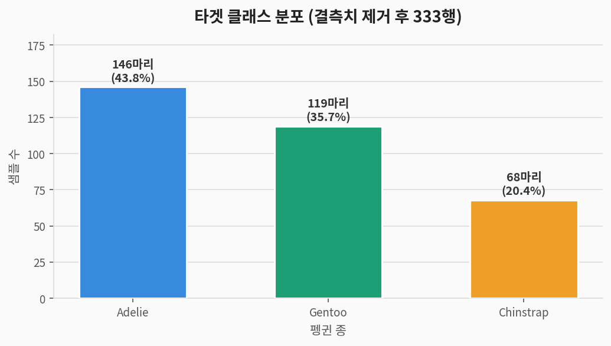
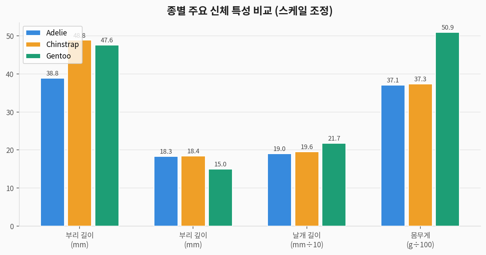
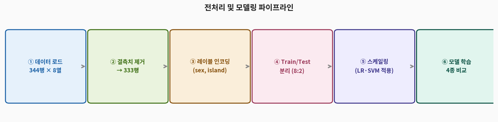
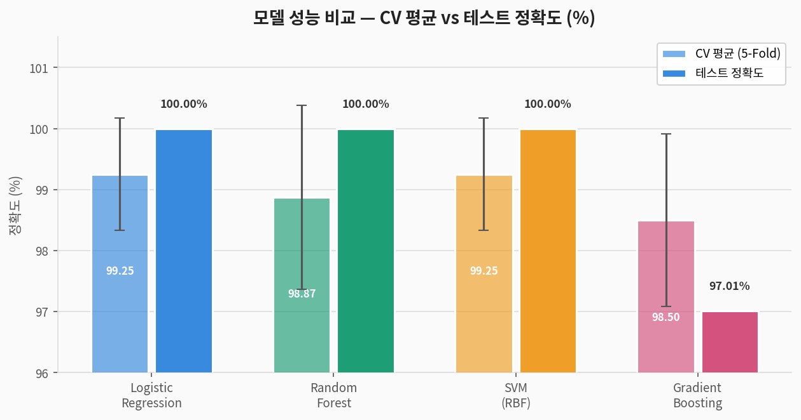
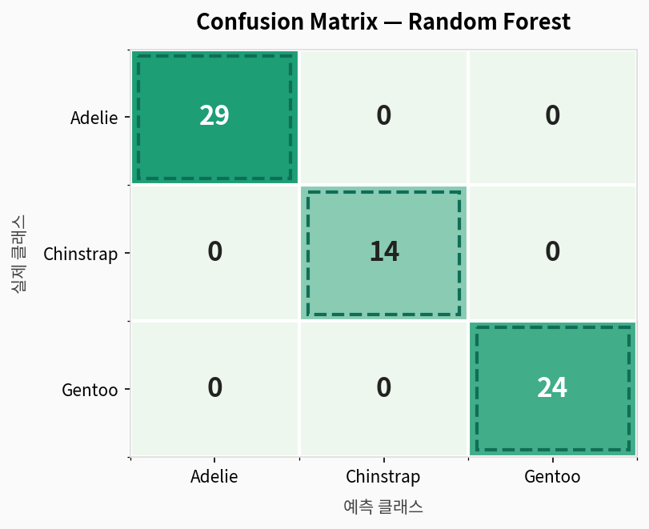
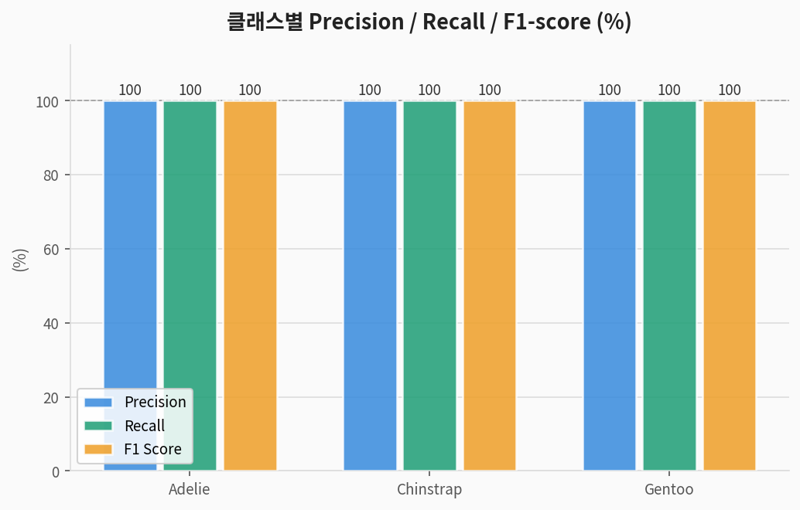
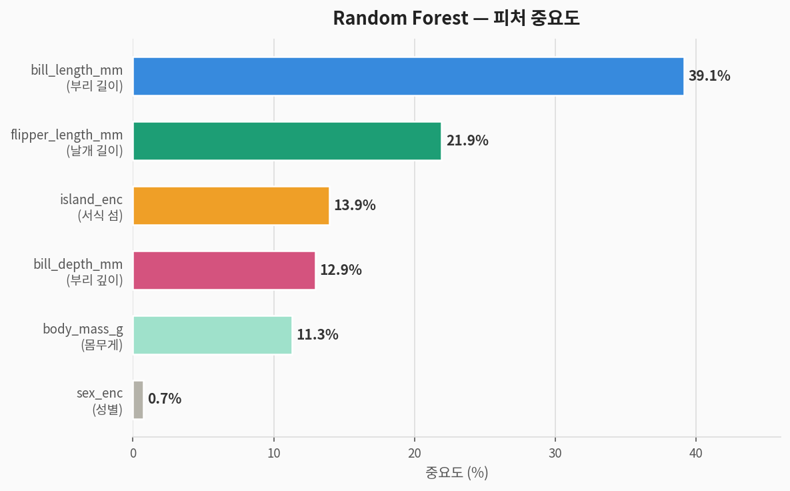

# 🐧 Penguins 다중 클래스 분류 — 완전 분석 가이드

> **팔머 펭귄 데이터셋(Palmer Penguins)** 을 이용한 지도학습 분류 분석  
> 데이터 출처: Palmer Station, Antarctica — Horst et al. (2020)  
> 분석 도구: Python · scikit-learn · matplotlib

---

## 1. 문제 정의 (Problem Statement)

### 우리가 풀려는 것

> **질문:** 펭귄의 신체 측정값(부리 크기, 날개 길이, 몸무게 등)으로  
> **어떤 종(species)인지 자동으로 분류**할 수 있는가?

| 구분 | 내용 |
|------|------|
| **문제 유형** | 지도학습 (Supervised Learning) — 다중 클래스 분류 (Multi-class Classification) |
| **타겟 변수** | `species` — Adelie / Chinstrap / Gentoo (3종) |
| **입력 변수** | 부리 길이·깊이, 날개 길이, 몸무게, 성별, 서식 섬 (6개) |
| **평가 지표** | Accuracy, Precision, Recall, F1-score, Confusion Matrix |

### 컬럼 설명

| 컬럼명 | 타입 | 설명 | 단위 |
|--------|------|------|------|
| `species` | 범주 | **타겟: 펭귄 종** | Adelie / Chinstrap / Gentoo |
| `island` | 범주 | 서식지 섬 | Biscoe / Dream / Torgersen |
| `bill_length_mm` | 수치 | 부리 길이 (culmen length) | mm |
| `bill_depth_mm` | 수치 | 부리 깊이 (culmen depth) | mm |
| `flipper_length_mm` | 수치 | 날개(지느러미) 길이 | mm |
| `body_mass_g` | 수치 | 몸무게 | g |
| `sex` | 범주 | 성별 | male / female |
| `year` | 수치 | 조사 연도 (분석에서 제외) | 2007–2009 |

---

## 2. 데이터 탐색 (EDA)

### 2-1. 타겟 클래스 분포



> **해석:** Adelie(44%)가 가장 많고 Chinstrap(20%)이 가장 적습니다.  
> 클래스 불균형이 존재하므로 `stratify` 옵션으로 분할 시 비율을 유지해야 합니다.

### 2-2. 종별 신체 특성 비교



> **해석:**
> - **Adelie**: 부리가 짧고 깊음 — 세 종 중 부리 깊이 최대 (~18.3mm)
> - **Chinstrap**: 부리 길이가 가장 길고 (~48.8mm) 몸집은 작음
> - **Gentoo**: 날개가 압도적으로 길고 (~217mm) 몸무게도 가장 큼 (~5076g)

### 2-3. 수치형 피처 기초 통계

| 피처 | 평균 | 표준편차 | 최솟값 | 최댓값 |
|------|:----:|:--------:|:------:|:------:|
| bill_length_mm | 43.92 | 5.46 | 32.1 | 59.6 |
| bill_depth_mm | 17.15 | 1.97 | 13.1 | 21.5 |
| flipper_length_mm | 200.92 | 14.06 | 172 | 231 |
| body_mass_g | 4201.75 | 801.95 | 2700 | 6300 |

---

## 3. 전처리 파이프라인



```python
from palmerpenguins import load_penguins
from sklearn.preprocessing import LabelEncoder, StandardScaler
from sklearn.model_selection import train_test_split

# ① 데이터 로드
df = load_penguins()                  # 344행

# ② 결측치 제거 (listwise deletion)
df_clean = df.dropna()                # 333행

# ③ 범주형 인코딩
le_sex    = LabelEncoder()
le_island = LabelEncoder()
df_clean['sex_enc']    = le_sex.fit_transform(df_clean['sex'])
df_clean['island_enc'] = le_island.fit_transform(df_clean['island'])
#   sex:    female=0, male=1
#   island: Biscoe=0, Dream=1, Torgersen=2

# ④ 피처 선택 (year 제외)
features = ['bill_length_mm', 'bill_depth_mm', 'flipper_length_mm',
            'body_mass_g', 'sex_enc', 'island_enc']

X = df_clean[features]
y = LabelEncoder().fit_transform(df_clean['species'])  # Adelie=0, Chinstrap=1, Gentoo=2

# ⑤ 학습/테스트 분리 (8:2, stratified)
X_train, X_test, y_train, y_test = train_test_split(
    X, y, test_size=0.2, random_state=42, stratify=y
)
# Train: 266행  |  Test: 67행

# ⑥ 스케일링 (LR·SVM에만 적용)
scaler    = StandardScaler()
X_train_s = scaler.fit_transform(X_train)
X_test_s  = scaler.transform(X_test)   # ← fit은 train에만!
```

> **핵심 포인트:** 스케일링 `fit`은 학습 데이터에만, 테스트는 `transform`만 적용해야  
> **데이터 누수(Data Leakage)** 를 방지할 수 있습니다.

---

## 4. 모델링

### 4-1. 사용 모델 4종

| 모델 | 특징 | 스케일링 필요 |
|------|------|:---:|
| **Logistic Regression** | 선형 결정 경계, 확률 출력, 해석 용이 | ✅ |
| **Random Forest** | 앙상블(배깅), 비선형, 과적합 강건 | ❌ |
| **SVM (RBF kernel)** | 고차원 결정 경계, 서포트 벡터 기반 | ✅ |
| **Gradient Boosting** | 순차 앙상블(부스팅), 강력한 성능 | ❌ |

### 4-2. 전체 학습 코드

```python
from sklearn.linear_model import LogisticRegression
from sklearn.ensemble import RandomForestClassifier, GradientBoostingClassifier
from sklearn.svm import SVC
from sklearn.model_selection import cross_val_score, StratifiedKFold
from sklearn.metrics import accuracy_score, classification_report, confusion_matrix

models = {
    'Logistic Regression': (LogisticRegression(max_iter=1000, random_state=42), True),
    'Random Forest':       (RandomForestClassifier(n_estimators=100, random_state=42), False),
    'SVM (RBF)':           (SVC(kernel='rbf', random_state=42), True),
    'Gradient Boosting':   (GradientBoostingClassifier(n_estimators=100, random_state=42), False),
}

cv = StratifiedKFold(n_splits=5, shuffle=True, random_state=42)

for name, (model, scaled) in models.items():
    Xtr, Xte = (X_train_s, X_test_s) if scaled else (X_train, X_test)
    cv_scores = cross_val_score(model, Xtr, y_train, cv=cv, scoring='accuracy')
    model.fit(Xtr, y_train)
    y_pred    = model.predict(Xte)
    print(f"{name}: CV={cv_scores.mean():.4f}(±{cv_scores.std():.4f}), "
          f"Test={accuracy_score(y_test, y_pred):.4f}")
```

---

## 5. 결과 (Results)

### 5-1. 모델 성능 비교



| 모델 | CV 평균 정확도 | CV 표준편차 | 테스트 정확도 |
|------|:---:|:---:|:---:|
| Logistic Regression | 99.25% | ±0.92% | **100.00%** |
| Random Forest | 98.87% | ±1.51% | **100.00%** |
| SVM (RBF) | 99.25% | ±0.92% | **100.00%** |
| Gradient Boosting | 98.50% | ±1.41% | 97.01% |

> 🏆 **LR · RF · SVM** 모두 테스트셋 67개 완벽 분류  
> CV 표준편차가 작을수록 모델이 **안정적**임을 의미합니다.

### 5-2. Confusion Matrix (Random Forest)



```
예측 →        Adelie  Chinstrap  Gentoo
실제 Adelie      29        0        0    ← 29/29 완벽
실제 Chinstrap    0       14        0    ← 14/14 완벽
실제 Gentoo       0        0       24    ← 24/24 완벽
```

> **해석:**
> - 대각선 = 올바른 분류 / 비대각선 = 오분류
> - 모든 오분류 = 0 → **완벽한 분류**
> - 소수 클래스 Chinstrap(14개)도 1개도 틀리지 않음

### 5-3. Precision / Recall / F1



| 클래스 | Precision | Recall | F1-score | Support |
|--------|:---------:|:------:|:--------:|:-------:|
| **Adelie** | 1.00 | 1.00 | 1.00 | 29 |
| **Chinstrap** | 1.00 | 1.00 | 1.00 | 14 |
| **Gentoo** | 1.00 | 1.00 | 1.00 | 24 |
| **Weighted Avg** | **1.00** | **1.00** | **1.00** | **67** |

| 지표 | 공식 | 의미 |
|------|------|------|
| **Precision** | TP / (TP+FP) | 예측을 A종이라 했을 때 실제 A종인 비율 |
| **Recall** | TP / (TP+FN) | 실제 A종 중 올바르게 A종으로 예측한 비율 |
| **F1-score** | 2×(P×R) / (P+R) | Precision과 Recall의 조화 평균 |

---

## 6. 피처 중요도 분석



| 순위 | 피처 | 중요도 | 해석 |
|:----:|------|:------:|------|
| 🥇 1 | `bill_length_mm` (부리 길이) | **39.1%** | Adelie vs Chinstrap 핵심 구분자 |
| 🥈 2 | `flipper_length_mm` (날개 길이) | **21.9%** | Gentoo 분리의 핵심 (압도적으로 김) |
| 🥉 3 | `island_enc` (서식 섬) | **13.9%** | Torgersen=Adelie만 서식 → 강력한 단서 |
| 4 | `bill_depth_mm` (부리 깊이) | 13.0% | Gentoo의 얕은 부리로 구분 |
| 5 | `body_mass_g` (몸무게) | 11.3% | Gentoo가 압도적으로 무거움 |
| 6 | `sex_enc` (성별) | **0.7%** | 종 구분에 거의 기여 안 함 |

---

## 7. 종합 해석

### 왜 100% 정확도가 나왔는가?

**1. 종마다 신체 특성이 뚜렷이 다름**  
Gentoo는 날개·몸무게로, Chinstrap은 부리 길이로 자연스럽게 분리됩니다.

**2. 서식 섬과 종의 연관성이 강함**  
Torgersen 섬에는 Adelie만 서식 → 섬 정보만으로도 바로 Adelie 판별 가능합니다.

**3. 피처 수(6)에 비해 데이터 품질이 우수**  
고차원 공간에서 클래스가 선형적으로도 분리 가능 → LR·SVM도 100% 달성합니다.

### 주의사항 (현실 적용 시)

| 주의사항 | 내용 |
|----------|------|
| **과적합 가능성** | 테스트셋 67개는 작음 → 더 큰 독립 데이터로 검증 필요 |
| **클래스 불균형** | Chinstrap이 적어 실제 현장에서 재현율 낮을 수 있음 |
| **결측치 처리** | 단순 제거 대신 KNN·평균 대체 전략 검토 필요 |
| **일반화** | 다른 지역 펭귄 데이터에도 동일 성능이 보장되지 않음 |

---

## 8. 전체 실행 코드

```python
# ============================================================
# 🐧 Palmer Penguins 다중 클래스 분류 — 완전 코드
# ============================================================

from palmerpenguins import load_penguins
import pandas as pd, numpy as np
from sklearn.model_selection import train_test_split, cross_val_score, StratifiedKFold
from sklearn.preprocessing import LabelEncoder, StandardScaler
from sklearn.linear_model import LogisticRegression
from sklearn.ensemble import RandomForestClassifier, GradientBoostingClassifier
from sklearn.svm import SVC
from sklearn.metrics import classification_report, confusion_matrix, accuracy_score
import warnings; warnings.filterwarnings('ignore')

# 1. 데이터 로드 & 전처리
df = load_penguins()
df_clean = df.dropna().copy()
le_sex, le_island, le_y = LabelEncoder(), LabelEncoder(), LabelEncoder()
df_clean['sex_enc']    = le_sex.fit_transform(df_clean['sex'])
df_clean['island_enc'] = le_island.fit_transform(df_clean['island'])

features = ['bill_length_mm', 'bill_depth_mm', 'flipper_length_mm',
            'body_mass_g', 'sex_enc', 'island_enc']
X = df_clean[features]
y = le_y.fit_transform(df_clean['species'])

# 2. Train/Test 분리 + 스케일링
X_train, X_test, y_train, y_test = train_test_split(
    X, y, test_size=0.2, random_state=42, stratify=y)
scaler    = StandardScaler()
X_train_s = scaler.fit_transform(X_train)
X_test_s  = scaler.transform(X_test)

# 3. 모델 학습 & 5-Fold CV 평가
models = {
    'Logistic Regression': (LogisticRegression(max_iter=1000, random_state=42), True),
    'Random Forest':       (RandomForestClassifier(n_estimators=100, random_state=42), False),
    'SVM (RBF)':           (SVC(kernel='rbf', random_state=42), True),
    'Gradient Boosting':   (GradientBoostingClassifier(n_estimators=100, random_state=42), False),
}
cv = StratifiedKFold(n_splits=5, shuffle=True, random_state=42)
for name, (model, scaled) in models.items():
    Xtr, Xte = (X_train_s, X_test_s) if scaled else (X_train, X_test)
    cv_sc = cross_val_score(model, Xtr, y_train, cv=cv, scoring='accuracy')
    model.fit(Xtr, y_train); y_pred = model.predict(Xte)
    print(f"{name}: CV={cv_sc.mean():.4f}(±{cv_sc.std():.4f}), "
          f"Test={accuracy_score(y_test, y_pred):.4f}")

# 4. 최종 평가 — Random Forest
rf = models['Random Forest'][0]
y_pred_rf = rf.predict(X_test)
print(classification_report(y_test, y_pred_rf, target_names=le_y.classes_))

# 5. 피처 중요도 출력
fi = sorted(zip(features, rf.feature_importances_), key=lambda x: -x[1])
for f, imp in fi:
    print(f"  {f}: {imp*100:.1f}%")
```

---

## 9. 요약

```
📌 문제:     펭귄 신체 측정값 6개로 3종 자동 분류
📌 데이터:   333행 × 6 피처 (결측치 제거 후)
📌 최고 성능: Logistic Regression / Random Forest / SVM → 테스트 100%
📌 핵심 피처: 부리 길이(39.1%) > 날개 길이(21.9%) > 서식 섬(13.9%)

📌 교훈:
   ✅ 피처가 클래스를 자연스럽게 분리할 때 단순 모델도 완벽에 가까운 성능
   ✅ 범주형 변수(서식 섬)도 분류에 매우 중요한 단서가 될 수 있음
   ✅ CV 표준편차로 모델 안정성을 함께 확인해야 함
   ✅ 스케일링은 거리 기반 모델(LR·SVM)에만, 트리 모델은 불필요
```
