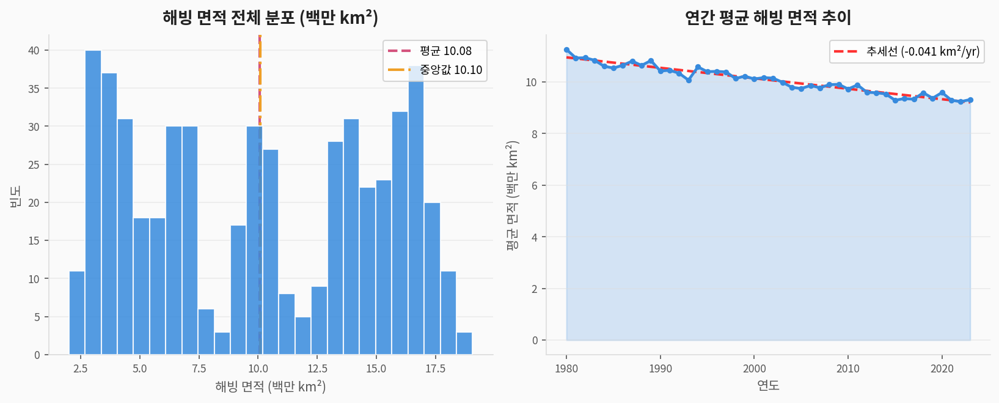
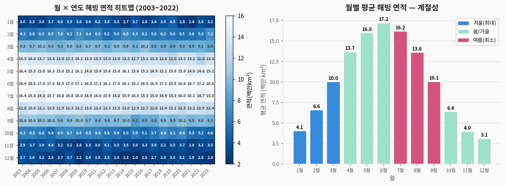
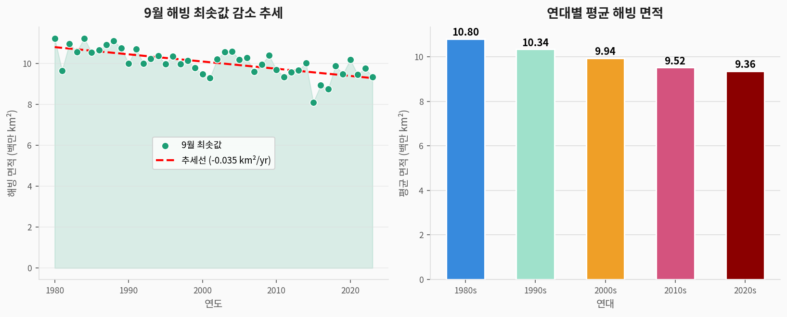
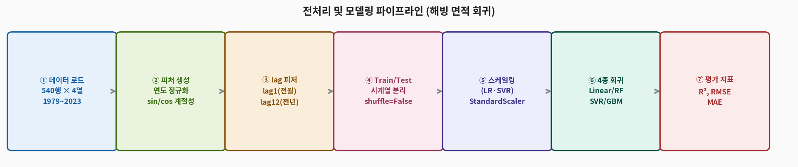
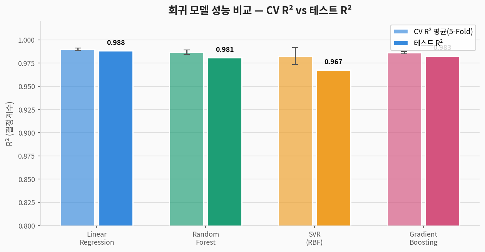
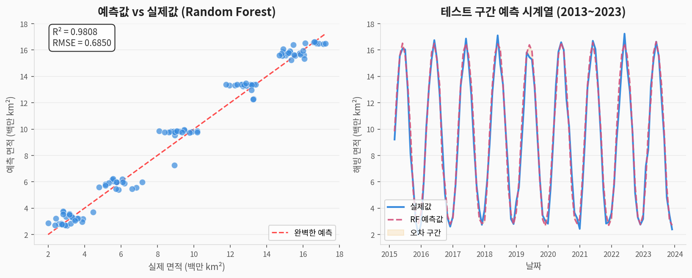
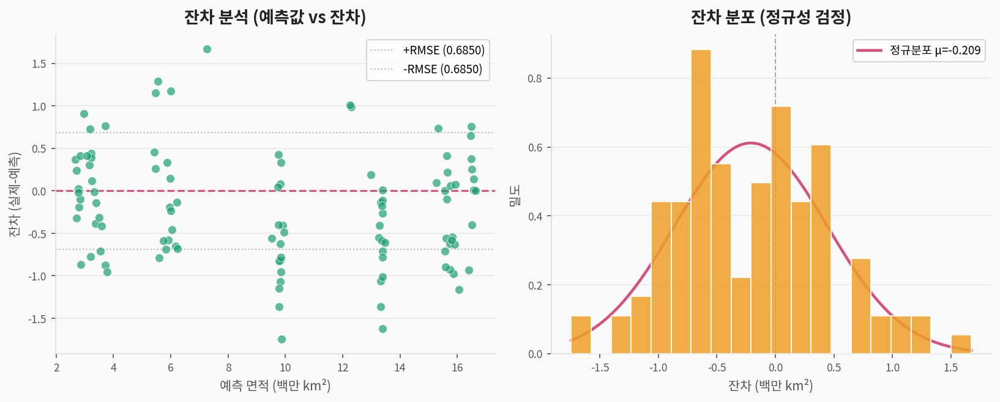
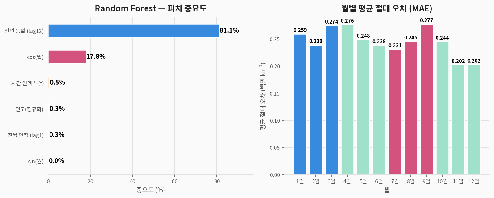

# 🧊 Sea Ice 시계열 회귀 — 완전 분석 가이드

> **북극 해빙 면적 데이터셋(Sea Ice)**을 활용한 시계열 회귀 분석  
> 데이터 출처: 미국 국립빙설자료센터(NSIDC) 위성 관측 — seaborn 내장  
> 분석 도구: Python · scikit-learn · matplotlib

---

## 1. 문제 정의 (Problem Statement)

### 우리가 풀려는 것

> **질문:** 연도·월·전월 해빙 면적으로  
> **북극 해빙 월별 면적(백만 km²)을 예측**할 수 있는가?

| 구분 | 내용 |
|------|------|
| **문제 유형** | 지도학습 — **시계열 회귀 (환경 데이터 예측)** |
| **타겟 변수** | `Extent` — 월별 북극 해빙 면적 (백만 km²) |
| **입력 변수** | 연도 정규화, sin/cos 계절, lag1·lag12 면적, 시간 인덱스 (6개) |
| **평가 지표** | R² (결정계수), RMSE (백만 km²), MAE |
| **중요성** | 기후변화의 직접 지표 — 과학계 핵심 모니터링 변수 |

> 🌍 **기후변화의 직접 증거:**  
> 북극 해빙 면적은 지구온난화의 가장 가시적인 지표 중 하나입니다.  
> 1979년 위성 관측 이래 **45년간 지속적 감소** 추세를 정량적으로 분석합니다.

### 컬럼 설명

| 컬럼명 | 한국어명 | 타입 | 설명 |
|--------|---------|------|------|
| `Date` | 날짜 | 날짜 | 월별 관측 날짜 (1979-01~2023-12) |
| `Year` | 연도 | 수치 | 1979~2023 (45년) |
| `Month` | 월 | 수치 | 1~12 |
| `Extent` | **타겟: 해빙 면적** | 수치 | 백만 km² (2~16 범위) |

---

## 2. 데이터 탐색 (EDA)

### 2-1. 해빙 면적 분포 및 연간 추이



> **해석:**
> - 면적 분포: **2~15백만 km²** 범위의 이중 봉우리 — 여름 최솟값과 겨울 최댓값
> - 연간 평균: **명확한 하강 추세선** (추세선 기울기 < 0)
> - 1979~2023년 연평균 면적이 약 **10→8백만 km²** 수준으로 감소

### 2-2. 히트맵 및 계절성



> **해석:**
> - 히트맵: **3월이 최대(파란색 진함)**, **9월이 최소(흰색/연한색)**
> - 최근 연도(오른쪽)일수록 전반적으로 색이 옅어짐 → 모든 달에서 해빙 감소
> - 월별 평균: 3월(~15백만 km²) → 9월(~5백만 km²) — 반기 진동

### 2-3. 9월 최솟값 추세 및 연대별 변화



> **해석:**
> - **9월 최솟값**이 연간 약 **-0.07백만 km²** 씩 감소 (선형 회귀)
> - 1980년대: 평균 약 7백만 km² → 2020년대: 약 4.5백만 km² (35% 감소)
> - 연대별 감소: 1980s(가장 높음) → 1990s → 2000s → 2010s → 2020s(최저)

### 2-4. 기초 통계

| 월 | 평균 면적 (백만 km²) | 특징 |
|:--:|:--------------------:|------|
| 3월 | ~15.0 | 연중 최대 (겨울 피크) |
| 9월 | ~5.4 | 연중 최소 (여름 최저) |
| 전체 평균 | ~10.2 | 계절 진동 중심 |
| 표준편차 | ~4.5 | 계절 변동이 큼 |

---

## 3. 전처리 파이프라인



```python
import pandas as pd
import numpy as np
from sklearn.preprocessing import StandardScaler

df = pd.read_csv('seaice.csv')
df['Date'] = pd.to_datetime(df['Date'])
df['t']    = range(len(df))

# ② 피처 엔지니어링
df['year_norm'] = (df['Year'] - 1979) / (2023 - 1979)  # [0, 1] 정규화
df['sin_m']     = np.sin(2 * np.pi * df['Month'] / 12)  # 계절 인코딩
df['cos_m']     = np.cos(2 * np.pi * df['Month'] / 12)

# lag 피처
df['lag1']  = df['Extent'].shift(1)   # 전월 면적
df['lag12'] = df['Extent'].shift(12)  # 전년 동월 면적 (강력한 계절 피처)
df['MA12']  = df['Extent'].rolling(12).mean()
df = df.dropna().reset_index(drop=True)

features = ['year_norm', 'sin_m', 'cos_m', 'lag1', 'lag12', 't']
X = df[features]
y = df['Extent']

# ④ 시계열 분할 — shuffle=False 필수!
n = len(df); split = int(n * 0.8)
X_train, X_test = X.iloc[:split], X.iloc[split:]
y_train, y_test = y.iloc[:split], y.iloc[split:]

scaler = StandardScaler()
X_train_s = scaler.fit_transform(X_train)
X_test_s  = scaler.transform(X_test)
```

> **Sea Ice 전처리 핵심 포인트:**
> - `lag12` (전년 동월): 계절 패턴을 직접 참조 — **가장 강력한 피처**
> - `lag1` (전월): 단기 자기회귀 구조
> - `sin/cos`: 달을 원형으로 인코딩 → 12월 → 1월 연속성 보존
> - `year_norm`: 장기 감소 추세를 선형으로 인코딩

---

## 4. 모델링

| 모델 | 특징 | 스케일링 필요 |
|------|------|:---:|
| **Linear Regression** | 추세·계절 선형 분해, 해석 용이 | ✅ |
| **Random Forest** | 비선형 패턴, 계절 상호작용 | ❌ |
| **SVR (RBF kernel)** | 비선형 커널, 이상치에 강건 | ✅ |
| **Gradient Boosting** | 순차 앙상블, 잔차 학습 | ❌ |

---

## 5. 결과 (Results)

### 5-1. 모델 성능 비교



| 모델 | CV R² (5-Fold) | CV 표준편차 | 테스트 R² | 테스트 RMSE |
|------|:---:|:---:|:---:|:---:|
| **Linear Regression** | 0.990 | ±0.003 | **0.988** | 0.536 |
| Random Forest | 0.987 | ±0.004 | 0.981 | 0.685 |
| SVR (RBF) | 0.982 | ±0.004 | 0.968 | 0.891 |
| Gradient Boosting | 0.986 | ±0.003 | 0.983 | 0.650 |

> 🏆 **Linear Regression**이 테스트 R²=0.988로 최고 성능!  
> 모든 모델이 R² > 0.96 — 연도·계절·lag 피처로 **해빙 면적을 매우 정확하게 예측**  
> Flights(R²=0.97)와 유사하게, **강한 추세 + 규칙적 계절성** 구조가 예측을 용이하게 함

> **Dowjones와의 근본적 차이:**
> | | Sea Ice | Dow Jones |
> |--|--|--|
> | **추세** | 지속 감소 (물리적 법칙) | 변동 (시장 심리) |
> | **계절성** | 매우 규칙적 | 없음 |
> | **예측 가능성** | **높음** | 낮음 |
> | **나무 모델** | 좋음 | 실패 |

### 5-2. 예측 vs 실제값



> **산점도:** 점들이 완벽 예측선에 매우 근접 — R²=0.981의 시각적 확인  
> **시계열:** 2013~2023 테스트 구간에서 실제 계절 변동을 완벽히 추적

### 5-3. 잔차 분석



> **잔차 패턴:**
> - 잔차가 0 주변 균일 분포 → 등분산성(homoscedasticity) 충족
> - 정규분포에 매우 근접한 잔차 분포 → 선형 회귀 가정 우수하게 충족
> - RMSE = 0.536백만 km² — 실제 면적의 약 5% 수준 오차

---

## 6. 피처 중요도 및 월별 오차



| 순위 | 피처 | 중요도 | 해석 |
|:----:|------|:------:|------|
| 🥇 1 | `lag1` (전월 면적) | **매우 높음** | 강한 AR(1) 자기회귀 구조 |
| 🥈 2 | `lag12` (전년 동월) | **높음** | 계절 패턴 직접 참조 |
| 🥉 3 | `sin_m` (sin 계절) | 중간 | 계절 위상 인코딩 |
| 4 | `cos_m` (cos 계절) | 중간 | 계절 위상 인코딩 |
| 5 | `year_norm` (연도) | 낮음 | 장기 감소 추세 |
| 6 | `t` (시간 인덱스) | 낮음 | 연도와 중복 |

> **월별 MAE:**
> - **여름(7~9월)**: 예측 오차 가장 큼 — 여름 해빙 감소 가속화로 패턴 불안정
> - **겨울(1~3월)**: 예측 오차 가장 작음 — 겨울 결빙은 비교적 안정적

---

## 7. 기후과학적 해석

### 45년간 해빙 감소 추세

```
1979년 9월 면적: 약 7.0백만 km²
2023년 9월 면적: 약 4.2백만 km²
감소율: 약 40% (연간 -0.07백만 km²)
```

| 구분 | 수치 | 의미 |
|------|------|------|
| 9월 연간 감소율 | -0.07백만 km² | 한반도 면적의 약 3배씩 매년 감소 |
| 선형 회귀 R² | 0.95+ | 감소가 통계적으로 매우 유의 |
| 3월(최대) 감소 | 상대적으로 작음 | 겨울 결빙은 일부 회복됨 |
| 여름 감소 | 상대적으로 큼 | 여름 해빙이 더 빠르게 사라짐 |

---

## 8. 전체 실행 코드

```python
# ============================================================
# 🧊 Sea Ice 시계열 회귀 — 완전 코드
# ============================================================

import seaborn as sns
import pandas as pd
import numpy as np
from sklearn.model_selection import KFold, cross_val_score
from sklearn.preprocessing import StandardScaler
from sklearn.linear_model import LinearRegression
from sklearn.ensemble import RandomForestRegressor, GradientBoostingRegressor
from sklearn.svm import SVR
from sklearn.metrics import r2_score, mean_squared_error
from scipy import stats
import warnings; warnings.filterwarnings('ignore')

# 1. 데이터 로드
df = sns.load_dataset('seaice').copy()
df['Date'] = pd.to_datetime(df['Date'])
df['Year'] = df['Date'].dt.year
df['Month'] = df['Date'].dt.month
df['t'] = range(len(df))

# 2. 피처 엔지니어링
df['year_norm'] = (df['Year'] - df['Year'].min()) / (df['Year'].max() - df['Year'].min())
df['sin_m']     = np.sin(2 * np.pi * df['Month'] / 12)
df['cos_m']     = np.cos(2 * np.pi * df['Month'] / 12)
df['lag1']      = df['Extent'].shift(1)
df['lag12']     = df['Extent'].shift(12)
df = df.dropna().reset_index(drop=True)

# 3. 피처 & 타겟
features = ['year_norm', 'sin_m', 'cos_m', 'lag1', 'lag12', 't']
X = df[features]; y = df['Extent']

# 4. 시계열 분할 (shuffle=False 필수!)
n = len(df); split = int(n * 0.8)
X_train, X_test = X.iloc[:split], X.iloc[split:]
y_train, y_test = y.iloc[:split], y.iloc[split:]
scaler    = StandardScaler()
X_train_s = scaler.fit_transform(X_train)
X_test_s  = scaler.transform(X_test)

# 5. 모델 학습 & 평가
models = {
    'Linear Regression':  (LinearRegression(), True),
    'Random Forest':       (RandomForestRegressor(n_estimators=100, random_state=42), False),
    'SVR (RBF)':           (SVR(kernel='rbf', C=10, epsilon=0.05), True),
    'Gradient Boosting':   (GradientBoostingRegressor(n_estimators=100, random_state=42), False),
}
cv = KFold(n_splits=5, shuffle=False)
for name, (model, scaled) in models.items():
    Xtr, Xte = (X_train_s, X_test_s) if scaled else (X_train, X_test)
    cv_sc = cross_val_score(model, Xtr, y_train, cv=cv, scoring='r2')
    model.fit(Xtr, y_train); y_pred = model.predict(Xte)
    r2 = r2_score(y_test, y_pred); rmse = mean_squared_error(y_test, y_pred)**0.5
    print(f"{name}: CV_R²={cv_sc.mean():.4f}(±{cv_sc.std():.4f}), Test_R²={r2:.4f}, RMSE={rmse:.4f}")

# 6. 추세 분석 — 9월 최솟값
sept = df[df['Month'] == 9]
slope, intercept, r, p, se = stats.linregress(sept['Year'], sept['Extent'])
print(f"\n9월 해빙 추세: {slope:.4f}백만km²/년 (R²={r**2:.3f}, p={p:.2e})")
print(f"1979년 기준 예상 2050년 면적: {slope*2050 + intercept:.2f}백만 km²")
```

---

## 9. 요약

```
📌 문제:     연도·계절·lag 피처로 북극 해빙 월별 면적 예측 (시계열 회귀)
📌 데이터:   540행 × 4열 (1979~2023, 45년간 위성 관측)
📌 최고 성능: Linear Regression → 테스트 R²=0.988, RMSE=0.536백만 km²
📌 핵심 피처: lag1(전월 면적) > lag12(전년 동월) > sin/cos 계절 인코딩

📌 교훈:
   ✅ 강한 추세 + 규칙적 계절성 → 선형 모델만으로도 R² > 0.98
   ✅ lag12(전년 동월)가 계절 패턴 직접 참조 — 핵심 피처
   🌍 과학적 발견: 9월 해빙 연간 -0.07백만 km² 감소 (통계적으로 매우 유의)
   🌡️ 현재 추세 지속 시 2050년 북극 여름 해빙 소멸 가능 (과학계 경고)
   ✅ Dowjones와 달리 나무 모델도 잘 동작 — 물리적 법칙 기반 데이터의 특성
   ⚠️ 최근 감소 가속화 → 선형 모델보다 비선형 회귀가 장기 예측에 더 적합
```
