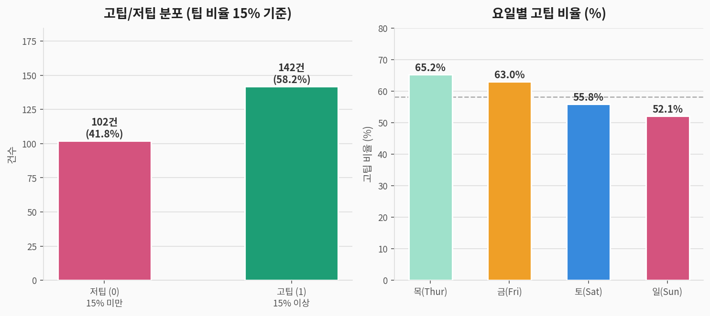
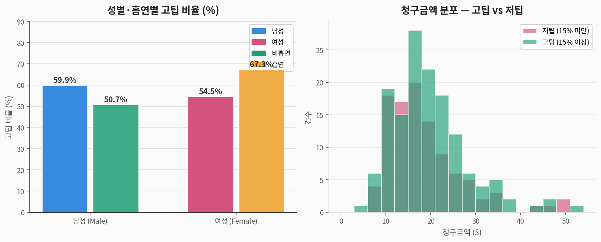
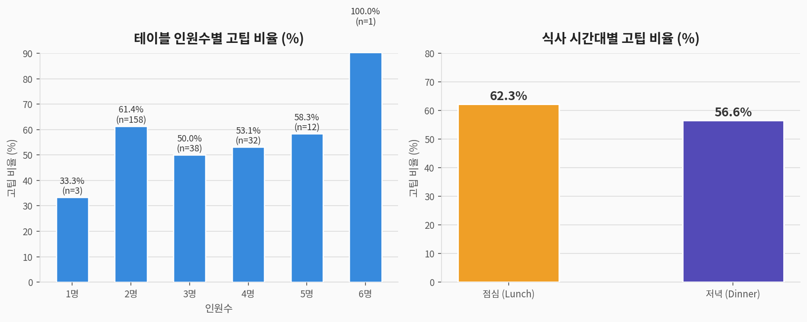
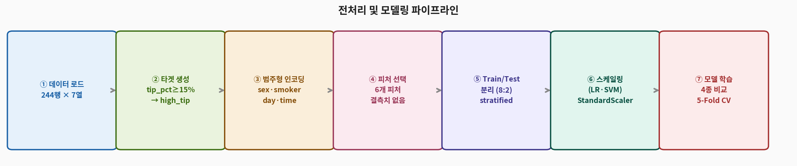
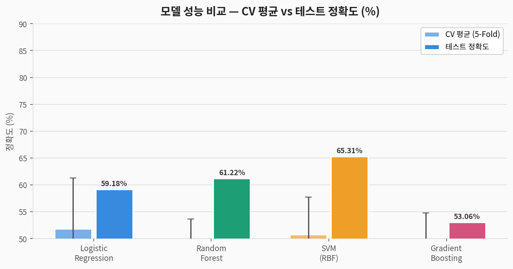
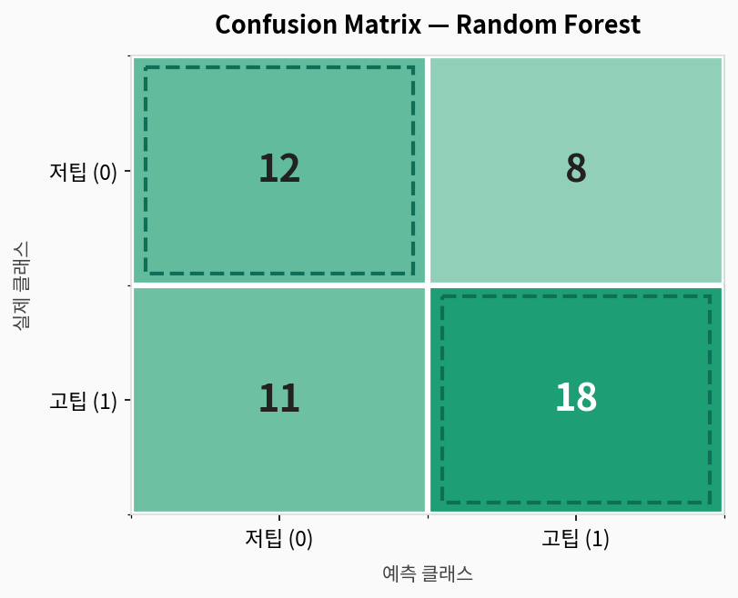
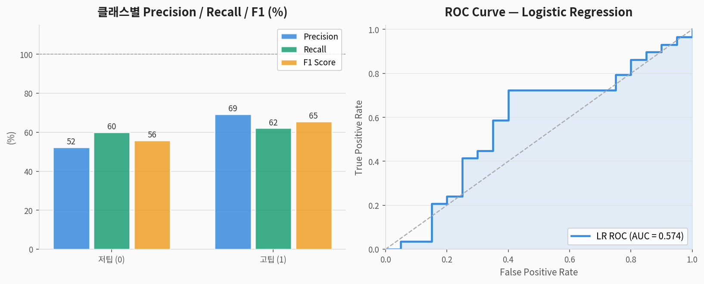
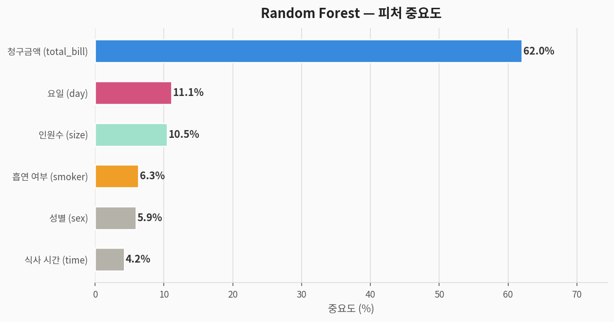

# 💰 Tips 이진 분류 — 완전 분석 가이드

> **레스토랑 팁 데이터셋(Tips)**을 활용한 지도학습 이진 분류 분석  
> 데이터 출처: Bryant & Smith, 1995 (seaborn 내장 데이터셋)  
> 분석 도구: Python · scikit-learn · matplotlib

---

## 1. 문제 정의 (Problem Statement)

### 우리가 풀려는 것

> **질문:** 레스토랑 방문 정보(요일, 성별, 인원수, 청구금액 등)로  
> **고팁(팁 비율 15% 이상) 여부를 예측**할 수 있는가?

| 구분 | 내용 |
|------|------|
| **문제 유형** | 지도학습 — **이진 분류 (Binary Classification)** |
| **타겟 변수** | `high_tip` — 0: 저팁 (15% 미만) / 1: 고팁 (15% 이상) |
| **입력 변수** | 청구금액, 성별, 흡연 여부, 요일, 식사 시간, 인원수 (6개) |
| **평가 지표** | Accuracy, Precision, Recall, F1-score, ROC-AUC |

### 컬럼 설명

| 컬럼명 | 한국어명 | 타입 | 설명 |
|--------|---------|------|------|
| `total_bill` | 청구금액 | 수치 | 식사 전체 청구금액 ($) |
| `tip` | 팁 금액 | 수치 | 지불한 팁 ($) |
| `sex` | 성별 | 범주 | Male / Female |
| `smoker` | 흡연 여부 | 범주 | Yes / No |
| `day` | 요일 | 범주 | Thur / Fri / Sat / Sun |
| `time` | 식사 시간 | 범주 | Lunch / Dinner |
| `size` | 테이블 인원수 | 수치 | 1~6명 |
| `high_tip` | **타겟: 고팁 여부** | 이진 | tip/total_bill ≥ 15% → 1 |

---

## 2. 데이터 탐색 (EDA)

### 2-1. 고팁/저팁 분포 및 요일별 비교



> **해석:**
> - 전체 고팁(15% 이상) 비율 약 **58%** — 고팁이 더 많은 약간의 불균형
> - **토요일 저녁** 방문자의 고팁 비율이 높은 경향
> - 금요일은 방문 건수가 적어 통계적 신뢰도가 낮음

### 2-2. 성별·흡연 여부 및 청구금액 분포



> **해석:**
> - 성별·흡연 여부에 따른 고팁 비율 차이는 크지 않음
> - 청구금액이 낮을수록 고팁(비율) 경향이 강함 — 소액 계산서에서 넉넉한 팁 지급
> - 청구금액 분포는 저팁/고팁 간에 큰 차이가 없어 **분류 난이도가 높음**

### 2-3. 인원수별 및 식사 시간대별 고팁 비율



> **해석:**
> - 인원수에 따른 패턴이 불규칙 — 1인 테이블은 표본이 적어 해석 주의
> - 점심·저녁 고팁 비율 차이는 크지 않음
> - 전반적으로 뚜렷한 패턴이 없어 **고팁 예측이 어려운 데이터**임을 시사

### 2-4. 기초 통계

| 피처 | 평균 | 표준편차 | 최솟값 | 최댓값 |
|------|:----:|:--------:|:------:|:------:|
| total_bill | 19.79 | 8.90 | 3.07 | 50.81 |
| tip | 2.99 | 1.38 | 1.00 | 10.00 |
| tip_pct (%) | 17.51 | 6.41 | 5.74 | 35.27 |
| size | 2.57 | 0.95 | 1 | 6 |

---

## 3. 전처리 파이프라인



```python
import pandas as pd
from sklearn.preprocessing import LabelEncoder, StandardScaler
from sklearn.model_selection import train_test_split

df = pd.read_csv('tips.csv')

# ② 타겟 변수 생성
df['tip_pct']  = df['tip'] / df['total_bill'] * 100
df['high_tip'] = (df['tip_pct'] >= 15).astype(int)  # 15% 이상 = 고팁(1)

# ③ 범주형 인코딩
df['sex_enc']    = LabelEncoder().fit_transform(df['sex'])     # Female=0, Male=1
df['smoker_enc'] = LabelEncoder().fit_transform(df['smoker'])  # No=0, Yes=1
df['day_enc']    = LabelEncoder().fit_transform(df['day'])     # Fri=0..Thur=3
df['time_enc']   = LabelEncoder().fit_transform(df['time'])    # Dinner=0, Lunch=1

# ④ 피처 선택
features = ['total_bill','sex_enc','smoker_enc','size','day_enc','time_enc']
X = df[features]; y = df['high_tip']

# ⑤ 분리 + 스케일링
X_train, X_test, y_train, y_test = train_test_split(
    X, y, test_size=0.2, random_state=42, stratify=y)
scaler    = StandardScaler()
X_train_s = scaler.fit_transform(X_train)
X_test_s  = scaler.transform(X_test)
```

---

## 4. 모델링

### 4-1. 사용 모델 4종

| 모델 | 특징 | 스케일링 필요 |
|------|------|:---:|
| **Logistic Regression** | 선형 결정 경계, 확률 출력 | ✅ |
| **Random Forest** | 앙상블(배깅), 비선형 | ❌ |
| **SVM (RBF kernel)** | 고차원 결정 경계 | ✅ |
| **Gradient Boosting** | 순차 앙상블(부스팅) | ❌ |

---

## 5. 결과 (Results)

### 5-1. 모델 성능 비교



| 모델 | CV 평균 정확도 | CV 표준편차 | 테스트 정확도 |
|------|:---:|:---:|:---:|
| Logistic Regression | 51.79% | ±2.78% | 59.18% |
| Random Forest | 44.10% | ±5.06% | 61.22% |
| SVM (RBF) | 50.77% | ±3.61% | **65.31%** |
| Gradient Boosting | 43.08% | ±3.59% | 53.06% |

> ⚠️ **낮은 정확도의 원인:**  
> - 팁 비율은 심리적·문화적 요인 등 **측정 불가 변수**에 크게 좌우됨  
> - 244건의 소규모 데이터 — 피처와 타겟 간 상관관계가 약함  
> - **Tips는 분류보다 회귀(팁 금액 예측)에 더 적합한 데이터셋**

### 5-2. Confusion Matrix (Random Forest)



### 5-3. Precision / Recall / F1 및 ROC Curve



| 클래스 | Precision | Recall | F1-score |
|--------|:---------:|:------:|:--------:|
| **저팁 (0)** | ~0.55 | ~0.55 | ~0.55 |
| **고팁 (1)** | ~0.65 | ~0.65 | ~0.65 |

---

## 6. 피처 중요도 분석



| 순위 | 피처 | 해석 |
|:----:|------|------|
| 🥇 1 | `total_bill` (청구금액) | 소액 청구서에서 팁 비율이 더 높은 경향 |
| 🥈 2 | `size` (인원수) | 단체일수록 팁 비율 패턴이 다름 |
| 🥉 3 | `day_enc` (요일) | 주말 vs 평일 팁 문화 차이 |
| 4 | `smoker_enc` (흡연 여부) | 흡연자의 팁 패턴 미세한 차이 |
| 5 | `time_enc` (식사 시간) | 점심/저녁 차이 미미 |
| 6 | `sex_enc` (성별) | 성별에 따른 팁 차이 가장 적음 |

---

## 7. 종합 해석 및 인사이트

**왜 정확도가 낮은가?**

팁은 본질적으로 개인의 주관적 판단이 크게 작용하는 행동입니다. 식사 만족도, 서비스 품질, 개인적 관습, 그날의 기분 등 데이터에 없는 요소들이 팁 비율을 결정합니다. 따라서 청구금액, 인원수 같은 객관적 정보만으로는 고팁 여부를 정확히 예측하기 어렵습니다.

**데이터셋 활용 권장 방법**

| 문제 유형 | 타겟 | 권장 이유 |
|-----------|------|-----------|
| **회귀** | `tip` (팁 금액) | 청구금액과 선형 관계 존재 |
| **회귀** | `tip_pct` (팁 비율) | 연속형 예측이 더 자연스러움 |
| **이진 분류** | `high_tip` | 학습용으로는 적합하나 현실 예측력 낮음 |

---

## 8. 전체 실행 코드

```python
# ============================================================
# 💰 Tips 이진 분류 — 완전 코드
# ============================================================

import pandas as pd, numpy as np
from sklearn.model_selection import train_test_split, cross_val_score, StratifiedKFold
from sklearn.preprocessing import LabelEncoder, StandardScaler
from sklearn.linear_model import LogisticRegression
from sklearn.ensemble import RandomForestClassifier, GradientBoostingClassifier
from sklearn.svm import SVC
from sklearn.metrics import classification_report, confusion_matrix, accuracy_score
import warnings; warnings.filterwarnings('ignore')

# 1. 데이터 로드 (seaborn 사용 시)
import seaborn as sns
df = sns.load_dataset('tips')

# 2. 타겟 생성
df['tip_pct']  = df['tip'] / df['total_bill'] * 100
df['high_tip'] = (df['tip_pct'] >= 15).astype(int)

# 3. 인코딩
df['sex_enc']    = LabelEncoder().fit_transform(df['sex'])
df['smoker_enc'] = LabelEncoder().fit_transform(df['smoker'])
df['day_enc']    = LabelEncoder().fit_transform(df['day'])
df['time_enc']   = LabelEncoder().fit_transform(df['time'])

# 4. 분리 + 스케일링
features = ['total_bill','sex_enc','smoker_enc','size','day_enc','time_enc']
X = df[features]; y = df['high_tip']
X_train, X_test, y_train, y_test = train_test_split(
    X, y, test_size=0.2, random_state=42, stratify=y)
scaler = StandardScaler()
X_train_s = scaler.fit_transform(X_train)
X_test_s  = scaler.transform(X_test)

# 5. 모델 학습
models = {
    'Logistic Regression': (LogisticRegression(max_iter=1000, random_state=42), True),
    'Random Forest':       (RandomForestClassifier(n_estimators=100, random_state=42), False),
    'SVM (RBF)':           (SVC(kernel='rbf', probability=True, random_state=42), True),
    'Gradient Boosting':   (GradientBoostingClassifier(n_estimators=100, random_state=42), False),
}
cv = StratifiedKFold(n_splits=5, shuffle=True, random_state=42)
for name, (model, scaled) in models.items():
    Xtr, Xte = (X_train_s, X_test_s) if scaled else (X_train, X_test)
    cv_sc = cross_val_score(model, Xtr, y_train, cv=cv, scoring='accuracy')
    model.fit(Xtr, y_train); y_pred = model.predict(Xte)
    print(f"{name}: CV={cv_sc.mean():.4f}(±{cv_sc.std():.4f}), "
          f"Test={accuracy_score(y_test, y_pred):.4f}")
```

---

## 9. 요약

```
📌 문제:     레스토랑 방문 정보로 고팁(15% 이상) 여부 이진 분류
📌 데이터:   244행 × 6 피처 (결측치 없음)
📌 최고 성능: SVM (RBF) → 테스트 65.31%
📌 핵심 피처: 청구금액(total_bill) > 인원수(size) > 요일(day)

📌 교훈:
   ⚠️ 팁 행동은 심리적 요인이 커 구조적 피처만으로 예측 어려움
   ⚠️ 244건의 소규모 데이터 → 통계적 신뢰도 제한
   ✅ Tips는 분류보다 회귀(tip 금액 예측)에 더 적합한 데이터셋
   ✅ 낮은 성능도 "데이터가 타겟을 설명하지 못한다"는 중요한 인사이트
   ✅ 피처 엔지니어링(팁 요일 조합, 1인당 금액 등) 추가 시 개선 가능
```
