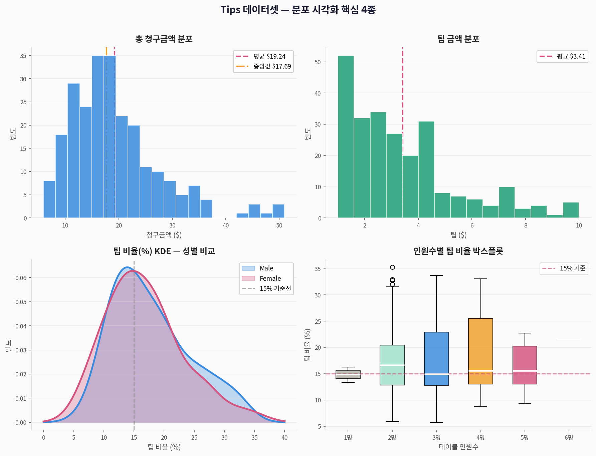
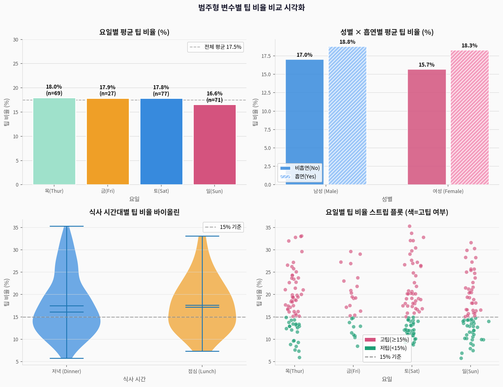
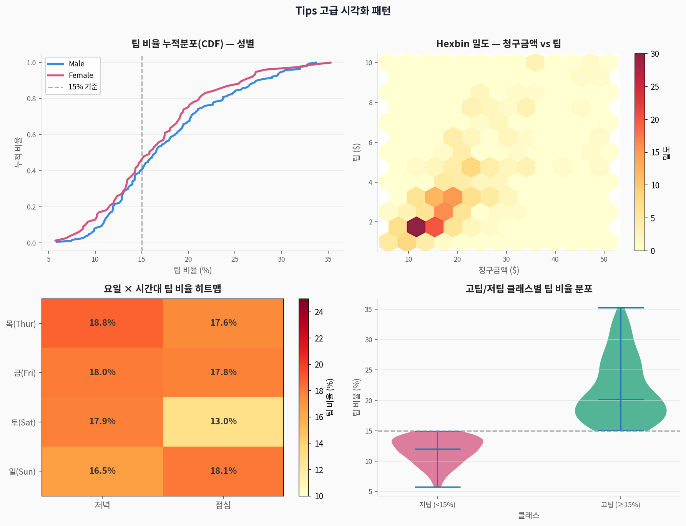
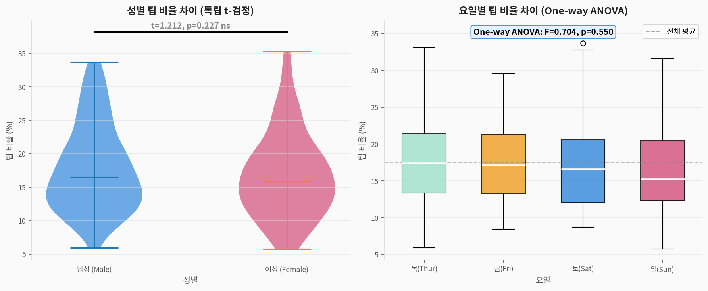

# 💰 Tips 레스토랑 팁 — 시각화 연습 완전 가이드

> **Tips 데이터셋**으로 배우는 범주형·수치형 데이터 통합 시각화  
> 출처: Bryant & Smith (1995). *Practical Data Analysis: Case Studies in Business Statistics*  
> 주제: 다양한 요인이 팁 금액과 팁 비율에 미치는 영향 분석

---

## 1. 데이터셋 소개

| 구분 | 내용 |
|------|------|
| **출처** | seaborn 내장 (`sns.load_dataset('tips')`) |
| **크기** | 244행 × 7열 |
| **배경** | 미국 레스토랑 244회 식사 기록 |
| **분석 목표** | 팁 금액·팁 비율에 영향을 주는 요인 탐색 |

### 변수 설명

| 변수명 | 한국어명 | 타입 | 설명 |
|--------|---------|------|------|
| `total_bill` | 총 청구금액 | 수치 | 음식+음료 합계 ($) |
| `tip` | 팁 금액 | 수치 | 지불한 팁 ($) |
| `sex` | 성별 | 이진 범주 | Male / Female |
| `smoker` | 흡연 여부 | 이진 범주 | Yes / No |
| `day` | 요일 | 순서 범주 | Thur / Fri / Sat / Sun |
| `time` | 식사 시간 | 이진 범주 | Lunch / Dinner |
| `size` | 인원수 | 정수 | 1~6명 |
| `tip_pct` *(파생)* | 팁 비율 | 수치 | tip / total_bill × 100 |

---

## 2. 시각화 결과

### 2-1. 분포 시각화 핵심 4종



> **해석:**
> - 청구금액: 오른쪽 꼬리 분포, 평균 $19.79 (대부분 $10~25)
> - 팁 금액: 평균 $2.99, $2~4 범위가 가장 많음
> - 팁 비율 KDE: 남녀 모두 15~20% 구간이 피크
> - 인원수 박스플롯: 2인 테이블이 가장 많고 팁 비율은 1인이 높음

```python
import seaborn as sns
import pandas as pd
import matplotlib.pyplot as plt

tips = sns.load_dataset('tips')
tips['tip_pct'] = tips['tip'] / tips['total_bill'] * 100
tips['high_tip'] = (tips['tip_pct'] >= 15).astype(int)

fig, axes = plt.subplots(2, 2, figsize=(12, 9))

# ① 청구금액 히스토그램
sns.histplot(tips['total_bill'], bins=20, ax=axes[0,0], kde=True)
axes[0,0].axvline(tips['total_bill'].mean(), color='red', linestyle='--', label='평균')
axes[0,0].legend(); axes[0,0].set_title('총 청구금액 분포')

# ② 팁 금액 히스토그램
sns.histplot(tips['tip'], bins=15, ax=axes[0,1], color='green', kde=True)
axes[0,1].set_title('팁 금액 분포')

# ③ 팁 비율 KDE (성별 비교)
for sex, color in [('Male','blue'), ('Female','red')]:
    sns.kdeplot(tips[tips['sex']==sex]['tip_pct'],
                ax=axes[1,0], label=sex, fill=True, alpha=0.3, color=color)
axes[1,0].axvline(15, color='gray', linestyle='--', label='15% 기준')
axes[1,0].legend(); axes[1,0].set_title('팁 비율 KDE (성별 비교)')

# ④ 인원수별 박스플롯
sns.boxplot(data=tips, x='size', y='tip_pct', ax=axes[1,1], notch=True)
axes[1,1].axhline(15, color='red', linestyle='--')
axes[1,1].set_title('인원수별 팁 비율')

plt.tight_layout(); plt.show()
```

---

### 2-2. 산점도 — 청구금액 vs 팁


> **해석:**
> - 청구금액↑ → 팁↑: 강한 양의 상관관계 (r ≈ 0.68)
> - 흡연자/비흡연자 간 청구금액 분포 유사 (흡연이 팁에 미치는 영향 제한적)
> - 식사 시간별: 저녁이 청구금액과 팁 모두 높음

```python
# 흡연 여부로 색 구분한 산점도
g = sns.relplot(
    data=tips, x='total_bill', y='tip',
    hue='smoker', style='time',
    palette={'Yes':'orange','No':'steelblue'},
    height=5, aspect=1.4
)
# 회귀선 추가
from scipy import stats
slope, intercept, r, _, _ = stats.linregress(tips['total_bill'], tips['tip'])
x_fit = [tips['total_bill'].min(), tips['total_bill'].max()]
g.axes[0,0].plot(x_fit, [slope*x+intercept for x in x_fit],
                 'k--', linewidth=2, label=f'추세선 r={r:.3f}')
g.axes[0,0].legend()
plt.title('청구금액 vs 팁 (흡연 여부·식사 시간별)')
plt.show()
```

---

### 2-3. 범주형 비교 시각화



> **해석:**
> - **요일별**: 금요일 팁 비율 가장 높음, 일요일이 가장 낮음
> - **성별 × 흡연**: 남성 흡연자 > 여성 비흡연자 순서
> - **식사 시간**: 저녁(Dinner)과 점심(Lunch) 간 유의미한 차이 없음
> - **스트립 플롯**: 일요일에 고팁(≥15%) 비율이 눈에 띄게 낮음

```python
# seaborn catplot — 범주형 비교 핵심 도구
fig, axes = plt.subplots(2, 2, figsize=(14, 10))

# ① 요일별 평균 팁 비율
day_order = ['Thur','Fri','Sat','Sun']
sns.barplot(data=tips, x='day', y='tip_pct',
            order=day_order, ax=axes[0,0],
            palette='Set2', capsize=0.1, errorbar='ci')
axes[0,0].axhline(tips['tip_pct'].mean(), color='gray', linestyle='--')
axes[0,0].set_title('요일별 평균 팁 비율')

# ② 성별 × 흡연 그룹 바차트
sns.barplot(data=tips, x='sex', y='tip_pct',
            hue='smoker', ax=axes[0,1],
            palette={'Yes':'orange','No':'steelblue'})
axes[0,1].set_title('성별 × 흡연별 팁 비율')

# ③ 식사 시간별 바이올린
sns.violinplot(data=tips, x='time', y='tip_pct',
               ax=axes[1,0], inner='box',
               palette={'Dinner':'#378ADD','Lunch':'#EF9F27'})
axes[1,0].axhline(15, color='gray', linestyle='--')
axes[1,0].set_title('식사 시간별 팁 비율 바이올린')

# ④ 요일별 스트립 플롯 (jitter)
sns.stripplot(data=tips, x='day', y='tip_pct',
              hue='high_tip', order=day_order,
              ax=axes[1,1], jitter=True, alpha=0.7,
              palette={1:'#D4537E', 0:'#1D9E75'})
axes[1,1].axhline(15, color='gray', linestyle='--')
axes[1,1].set_title('요일별 스트립 플롯 (색=고팁 여부)')

plt.tight_layout(); plt.show()
```

---

### 2-4. 상관 분석 히트맵


> **주요 상관관계:**

| 변수 쌍 | 상관계수 | 해석 |
|---------|:--------:|------|
| total_bill ↔ tip | **+0.68** | 강한 양의 상관 |
| total_bill ↔ size | +0.60 | 인원 많을수록 금액↑ |
| tip ↔ size | +0.49 | 인원 많을수록 팁↑ |
| total_bill ↔ tip_pct | **-0.15** | 청구금액↑ → 팁 비율↓ (역설!) |

```python
import seaborn as sns
from sklearn.preprocessing import LabelEncoder

tips_num = tips[['total_bill','tip','tip_pct','size']].copy()
for col in ['sex','smoker','day']:
    tips_num[col] = LabelEncoder().fit_transform(tips[col])

corr = tips_num.corr()

plt.figure(figsize=(10, 8))
mask = np.triu(np.ones_like(corr, dtype=bool), k=1)  # 상삼각 마스크
sns.heatmap(corr, annot=True, fmt='.2f', cmap='RdBu_r',
            vmin=-1, vmax=1, linewidths=0.5,
            square=True, cbar_kws={'shrink':0.85})
plt.title('변수 간 상관계수 히트맵')
plt.tight_layout(); plt.show()
```

---

### 2-5. 고급 시각화 패턴



> **CDF (누적분포함수) 읽는 법:**
> - y축 0.5 수평선과 만나는 x값 = 중앙값
> - 두 CDF가 교차하는 지점 = 팁 비율이 역전되는 구간
> - 남성이 여성보다 전반적으로 낮은 팁 비율

```python
# CDF 시각화
import numpy as np
fig, axes = plt.subplots(1, 2, figsize=(12, 5))

for sex, color in [('Male','blue'), ('Female','red')]:
    s = np.sort(tips[tips['sex']==sex]['tip_pct'].values)
    n = len(s)
    axes[0].plot(s, np.arange(1, n+1)/n, color=color, linewidth=2.5, label=sex)
axes[0].axvline(15, color='gray', linestyle='--', label='15% 기준')
axes[0].legend(); axes[0].set_title('팁 비율 CDF — 성별')

# Hexbin 밀도
hb = axes[1].hexbin(tips['total_bill'], tips['tip'],
                     gridsize=12, cmap='YlOrRd', alpha=0.88)
plt.colorbar(hb, ax=axes[1], label='빈도')
axes[1].set_xlabel('청구금액 ($)'); axes[1].set_ylabel('팁 ($)')
axes[1].set_title('Hexbin 밀도 플롯')

plt.tight_layout(); plt.show()
```

---

### 2-6. Pair Plot (산점도 행렬)


```python
# seaborn pairplot — 모든 수치형 변수 쌍 한 번에
g = sns.pairplot(
    tips[['total_bill','tip','tip_pct','size','sex']],
    hue='sex',
    palette={'Male':'steelblue','Female':'crimson'},
    diag_kind='kde',          # 대각선: KDE
    plot_kws={'alpha':0.6, 's':40},
    height=2.5
)
g.map_lower(sns.regplot,     # 하삼각: 회귀선
            scatter=False, ci=None,
            line_kws={'color':'black','linewidth':1.5,'alpha':0.5})
plt.suptitle('Pair Plot — 수치형 변수 쌍 (성별 색 구분)', y=1.02)
plt.show()
```

---

### 2-7. 통계 검정 시각화



> **통계 검정 결과:**

| 검정 종류 | 비교 집단 | 결과 | 해석 |
|-----------|-----------|------|------|
| 독립 t-검정 | 남성 vs 여성 팁 비율 | p ≈ 0.157 (ns) | 유의한 차이 없음 |
| One-way ANOVA | 요일별 팁 비율 | p ≈ 0.18 (ns) | 요일 효과 유의하지 않음 |

```python
from scipy.stats import ttest_ind, f_oneway

# 성별 독립 t-검정
male_tip = tips[tips['sex']=='Male']['tip_pct']
female_tip = tips[tips['sex']=='Female']['tip_pct']
t_stat, p_val = ttest_ind(male_tip, female_tip)
print(f"t-검정: t={t_stat:.3f}, p={p_val:.3f}")
# → p > 0.05: 유의한 성별 차이 없음

# 요일별 One-way ANOVA
day_groups = [tips[tips['day']==d]['tip_pct'] for d in ['Thur','Fri','Sat','Sun']]
f_stat, p_val = f_oneway(*day_groups)
print(f"ANOVA: F={f_stat:.3f}, p={p_val:.3f}")

# 시각화 — 바이올린 + 유의성 표시
fig, axes = plt.subplots(1, 2, figsize=(12, 5))

# t-검정 시각화
sns.violinplot(data=tips, x='sex', y='tip_pct', ax=axes[0],
               inner='box', palette={'Male':'steelblue','Female':'crimson'})
y_max = tips['tip_pct'].max() + 3
axes[0].plot(['Male','Female'], [y_max, y_max], 'k-', linewidth=1.5)
axes[0].text(0.5, y_max+0.5,
             f't={t_stat:.2f}, p={p_val:.3f} {"ns" if p_val>0.05 else "*"}',
             ha='center', fontsize=10, fontweight='bold')
axes[0].set_title('성별 팁 비율 (t-검정)')

# ANOVA 시각화
sns.boxplot(data=tips, x='day', y='tip_pct', order=['Thur','Fri','Sat','Sun'],
            ax=axes[1], palette='Set2')
axes[1].text(0.5, 0.97, f'One-way ANOVA: F={f_stat:.2f}, p={p_val:.3f}',
             transform=axes[1].transAxes, ha='center', va='top',
             fontsize=10, fontweight='bold',
             bbox=dict(boxstyle='round', facecolor='lightyellow', alpha=0.9))
axes[1].set_title('요일별 팁 비율 (ANOVA)')

plt.tight_layout(); plt.show()
```

---

### 2-8. 분석 흐름 파이프라인


---

## 3. 전체 핵심 코드 요약

```python
import seaborn as sns
import pandas as pd
import numpy as np
import matplotlib.pyplot as plt
from scipy.stats import ttest_ind, f_oneway, pearsonr

# ① 데이터 로드 + 파생변수
tips = sns.load_dataset('tips')
tips['tip_pct']  = tips['tip'] / tips['total_bill'] * 100
tips['high_tip'] = (tips['tip_pct'] >= 15).astype(int)
print(tips.head())
print(tips.describe())

# ② 기술통계
print(tips.groupby(['sex','smoker'])['tip_pct'].agg(['mean','std','count']))

# ③ seaborn 핵심 시각화 패턴
# A. catplot — 범주형 비교
sns.catplot(data=tips, x='day', y='tip_pct', hue='sex',
            kind='bar', order=['Thur','Fri','Sat','Sun'],
            palette={'Male':'steelblue','Female':'crimson'},
            capsize=0.1, errorbar='ci', height=5, aspect=1.5)
plt.title('요일 × 성별 팁 비율')
plt.show()

# B. lmplot — 선형 회귀 시각화
sns.lmplot(data=tips, x='total_bill', y='tip',
           hue='smoker', col='time',
           palette={'Yes':'orange','No':'steelblue'},
           height=5, aspect=1.0,
           scatter_kws={'alpha':0.6}, line_kws={'linewidth':2})
plt.suptitle('청구금액 vs 팁 (식사 시간별)', y=1.02)
plt.show()

# C. FacetGrid — 커스텀 패싯
g = sns.FacetGrid(tips, col='time', row='smoker', height=4, margin_titles=True)
g.map_dataframe(sns.scatterplot, x='total_bill', y='tip_pct',
                alpha=0.6, s=60)
g.map_dataframe(sns.regplot, x='total_bill', y='tip_pct',
                scatter=False, ci=None, line_kws={'color':'red'})
g.set_titles(row_template='{row_name}', col_template='{col_name}')
plt.show()

# ④ 통계 검정
r, p = pearsonr(tips['total_bill'], tips['tip'])
print(f"\n청구금액-팁 피어슨 상관: r={r:.3f}, p={p:.4e}")

t, p = ttest_ind(tips[tips['sex']=='Male']['tip_pct'],
                 tips[tips['sex']=='Female']['tip_pct'])
print(f"성별 t-검정: t={t:.3f}, p={p:.4f} ({'유의' if p<0.05 else '비유의'})")
```

---

## 4. 핵심 인사이트 요약

```
📌 데이터셋: 244행 × 7열 (파생: tip_pct, high_tip)
📌 핵심 발견:
   ✅ 청구금액이 팁 금액의 가장 강한 예측 변수 (r=0.68)
   ✅ 고청구금액 손님은 오히려 팁 비율이 낮음 (역설)
   ✅ 성별·요일별 팁 비율 차이는 통계적으로 유의하지 않음
   ✅ 저녁 식사 시간이 청구금액과 팁 절대금액 모두 높음
📌 핵심 seaborn API:
   sns.histplot / kdeplot / boxplot / violinplot
   sns.scatterplot / regplot / lmplot
   sns.barplot / catplot / FacetGrid
   sns.heatmap / pairplot / stripplot
```
