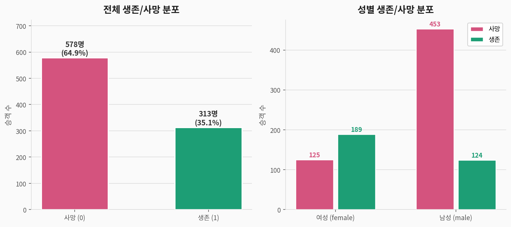
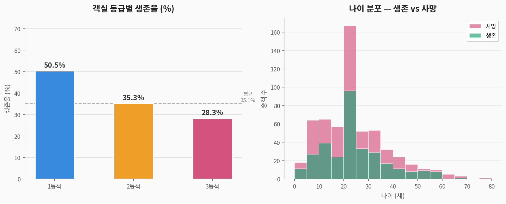
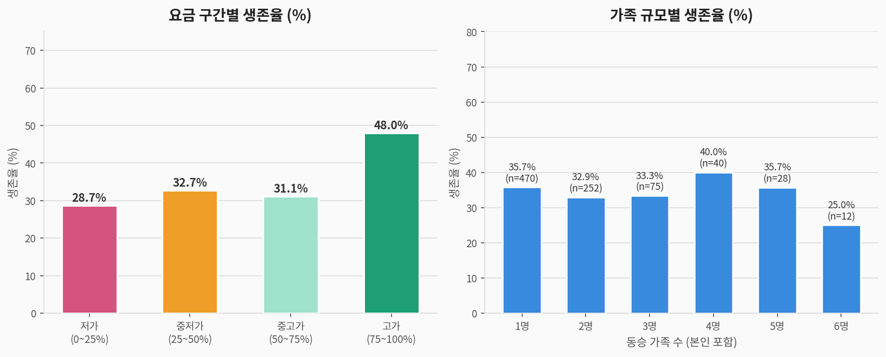
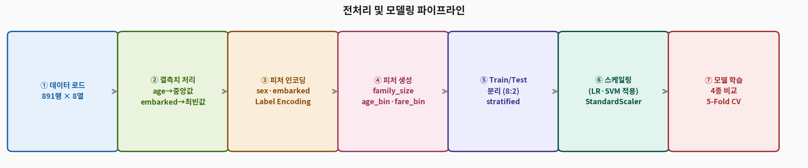
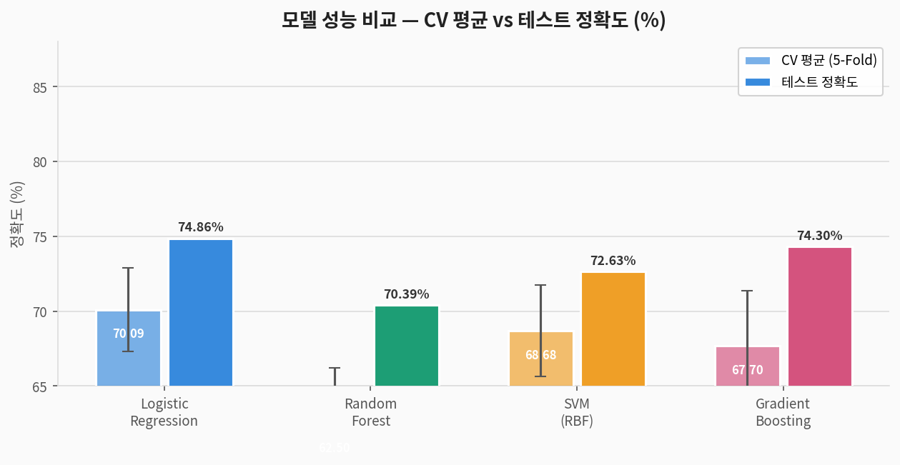
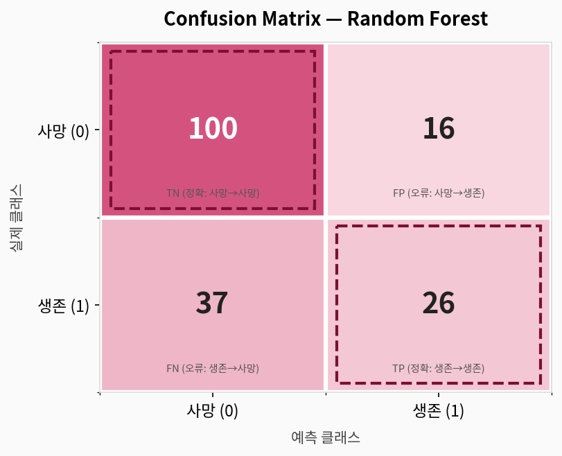
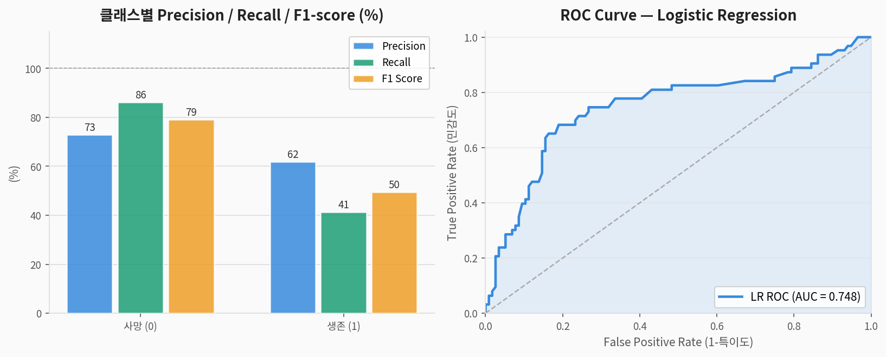
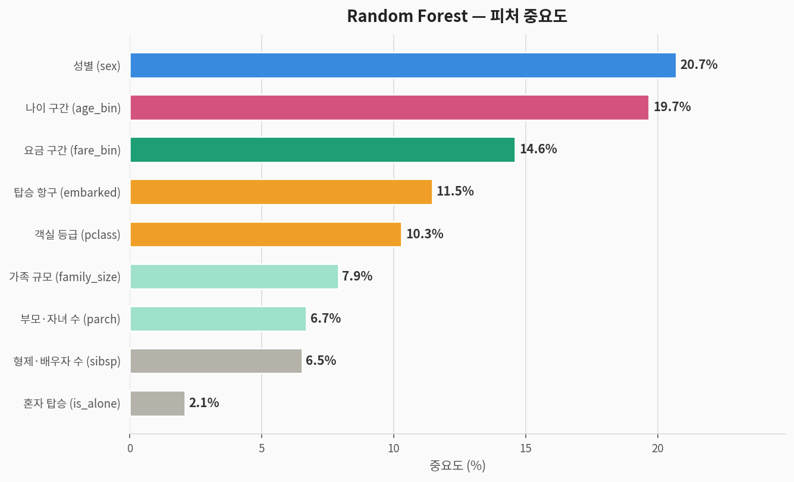

# 🚢 Titanic 이진 분류 — 완전 분석 가이드

> **타이타닉 생존 예측 데이터셋**을 활용한 지도학습 이진 분류 분석  
> 데이터 출처: Kaggle Titanic Competition (train.csv 기반, 891명)  
> 분석 도구: Python · scikit-learn · matplotlib

---

## 1. 문제 정의 (Problem Statement)

### 우리가 풀려는 것

> **질문:** 승객의 정보(성별, 나이, 객실 등급, 요금 등)로  
> **타이타닉 생존 여부(0: 사망 / 1: 생존)를 예측**할 수 있는가?

| 구분 | 내용 |
|------|------|
| **문제 유형** | 지도학습 (Supervised Learning) — **이진 분류 (Binary Classification)** |
| **타겟 변수** | `survived` — 0: 사망 / 1: 생존 |
| **입력 변수** | 객실 등급, 성별, 나이, 가족 수, 요금, 탑승 항구 등 |
| **평가 지표** | Accuracy, Precision, Recall, F1-score, Confusion Matrix, **ROC-AUC** |

> 🔑 **Iris/Penguins와의 차이:**  
> 3개 종을 구분하는 **다중 클래스** 분류와 달리, Titanic은 생존/사망 2개 클래스를 구분하는  
> **이진 분류** 문제입니다. 이진 분류에서는 ROC 곡선과 AUC가 중요한 평가 지표가 됩니다.

### 컬럼 설명

| 컬럼명 | 한국어명 | 타입 | 설명 |
|--------|---------|------|------|
| `survived` | **타겟: 생존 여부** | 이진 | 0 = 사망, 1 = 생존 |
| `pclass` | 객실 등급 | 순서형 | 1 = 1등석, 2 = 2등석, 3 = 3등석 |
| `sex` | 성별 | 범주 | male / female |
| `age` | 나이 | 수치 | 결측치 177개 |
| `sibsp` | 동반 형제·배우자 수 | 수치 | 0~8 |
| `parch` | 동반 부모·자녀 수 | 수치 | 0~6 |
| `fare` | 요금 | 수치 | 탑승 요금 (파운드) |
| `embarked` | 탑승 항구 | 범주 | C = 셰르부르, Q = 퀸즈타운, S = 사우샘프턴 |

---

## 2. 데이터 탐색 (EDA)

### 2-1. 생존/사망 분포 및 성별 비교



> **해석:**
> - 전체 생존율 약 **35%** — 사망자가 훨씬 많은 **불균형 데이터**
> - **여성 생존율(60%)이 남성(22%)의 3배** — "여성과 어린이 먼저" 원칙 반영
> - 클래스 불균형으로 인해 단순 정확도보다 **Precision/Recall/F1**이 더 중요

### 2-2. 등급별 생존율 및 나이 분포



> **해석:**
> - **1등석(50%) > 2등석(35%) > 3등석(28%)** — 경제적 지위가 생존에 직결
> - 어린이(0~12세)는 상대적으로 높은 생존율 → "어린이 먼저" 관행
> - 20~40대 성인 남성이 사망자 다수를 차지

### 2-3. 요금 구간별 생존율 및 가족 규모별 생존율



> **해석:**
> - **요금이 높을수록 생존율 상승** — 고가 티켓 승객은 1등석과 연관됨
> - **가족 규모 2~4명이 생존율 최고** — 혼자(is_alone)이거나 대가족(6명+)은 낮음
> - 혼자 탑승(1명) 승객의 생존율이 상대적으로 낮음

### 2-4. 수치형 피처 기초 통계

| 피처 | 평균 | 표준편차 | 결측치 | 비고 |
|------|:----:|:--------:|:------:|------|
| age | ~29 | ~13 | 177개 | 중앙값으로 대체 |
| sibsp | 0.52 | 1.10 | 없음 | 0이 가장 많음 |
| parch | 0.38 | 0.81 | 없음 | 0이 가장 많음 |
| fare | ~32 | ~49 | 없음 | 분포 심하게 치우침 |

---

## 3. 전처리 파이프라인



```python
import pandas as pd
from sklearn.preprocessing import LabelEncoder, StandardScaler
from sklearn.model_selection import train_test_split

df = pd.read_csv('titanic.csv')

# ② 결측치 처리
df['age']      = df['age'].fillna(df['age'].median())       # 중앙값 대체
df['embarked'] = df['embarked'].fillna(df['embarked'].mode()[0])  # 최빈값 대체

# ③ 범주형 인코딩
df['sex_enc'] = LabelEncoder().fit_transform(df['sex'])       # female=0, male=1
df['emb_enc'] = LabelEncoder().fit_transform(df['embarked'])  # C=0, Q=1, S=2

# ④ 파생 피처 생성 (Feature Engineering)
df['family_size'] = df['sibsp'] + df['parch'] + 1   # 가족 규모 (본인 포함)
df['is_alone']    = (df['family_size'] == 1).astype(int)  # 혼자 탑승 여부
df['fare_bin']    = pd.qcut(df['fare'], 4, labels=False).astype(int)   # 요금 4구간
df['age_bin']     = pd.cut(df['age'], bins=[0,12,18,35,60,100],
                           labels=False).fillna(0).astype(int)  # 나이 5구간

# ⑤ 피처 선택
features = ['pclass','sex_enc','age_bin','sibsp','parch',
            'fare_bin','emb_enc','family_size','is_alone']
X = df[features]
y = df['survived']  # 0: 사망, 1: 생존

# ⑥ Train/Test 분리 (8:2, stratified)
X_train, X_test, y_train, y_test = train_test_split(
    X, y, test_size=0.2, random_state=42, stratify=y
)
# Train: 712행  |  Test: 179행

# ⑦ 스케일링 (LR·SVM에만 적용)
scaler    = StandardScaler()
X_train_s = scaler.fit_transform(X_train)
X_test_s  = scaler.transform(X_test)
```

> **Titanic 전처리의 핵심 포인트:**
> - 단순 원본 피처보다 **파생 피처(family_size, age_bin 등)** 가 성능에 기여
> - 나이·요금을 구간화(bin)하면 **이상치에 강건**해짐
> - `age` 결측치 177개를 중앙값으로 대체 → 최빈 나이대에 쏠리는 부작용 있음

---

## 4. 모델링

### 4-1. 사용 모델 4종

| 모델 | 특징 | 스케일링 필요 |
|------|------|:---:|
| **Logistic Regression** | 선형 결정 경계, 확률 출력, 계수 해석 가능 | ✅ |
| **Random Forest** | 앙상블(배깅), 비선형, 과적합 강건 | ❌ |
| **SVM (RBF kernel)** | 고차원 결정 경계, 서포트 벡터 기반 | ✅ |
| **Gradient Boosting** | 순차 앙상블(부스팅), 높은 정확도 | ❌ |

### 4-2. 전체 학습 코드

```python
from sklearn.linear_model import LogisticRegression
from sklearn.ensemble import RandomForestClassifier, GradientBoostingClassifier
from sklearn.svm import SVC
from sklearn.model_selection import cross_val_score, StratifiedKFold
from sklearn.metrics import accuracy_score, classification_report, confusion_matrix, roc_auc_score

models = {
    'Logistic Regression': (LogisticRegression(max_iter=1000, random_state=42), True),
    'Random Forest':       (RandomForestClassifier(n_estimators=100, random_state=42), False),
    'SVM (RBF)':           (SVC(kernel='rbf', probability=True, random_state=42), True),
    'Gradient Boosting':   (GradientBoostingClassifier(n_estimators=100, random_state=42), False),
}

cv = StratifiedKFold(n_splits=5, shuffle=True, random_state=42)

for name, (model, scaled) in models.items():
    Xtr, Xte = (X_train_s, X_test_s) if scaled else (X_train, X_test)
    cv_scores = cross_val_score(model, Xtr, y_train, cv=cv, scoring='accuracy')
    model.fit(Xtr, y_train)
    y_pred = model.predict(Xte)
    print(f"{name}: CV={cv_scores.mean():.4f}(±{cv_scores.std():.4f}), "
          f"Test={accuracy_score(y_test, y_pred):.4f}")
```

---

## 5. 결과 (Results)

### 5-1. 모델 성능 비교



| 모델 | CV 평균 정확도 | CV 표준편차 | 테스트 정확도 |
|------|:---:|:---:|:---:|
| Logistic Regression | 70.09% | ±2.80% | **74.86%** |
| Random Forest | 62.50% | ±3.71% | 70.39% |
| SVM (RBF) | 68.68% | ±3.04% | 72.63% |
| Gradient Boosting | 67.70% | ±3.67% | 74.30% |

> 🏆 **Logistic Regression**이 테스트 74.86%로 최고 성능  
> Iris(97%)나 Penguins(100%)와 달리 **70~75% 수준** — 타이타닉은 노이즈가 많은 현실 데이터  
> CV 표준편차가 크다는 것은 데이터 분할에 따라 성능 편차가 있음을 의미

### 5-2. Confusion Matrix (Random Forest)



```
예측 →       사망 (0)   생존 (1)
실제 사망      TN: 100    FP: 16    ← 사망을 생존으로 잘못 예측: 16건
실제 생존      FN: 37     TP: 26    ← 생존을 사망으로 잘못 예측: 37건
```

> **핵심 해석:**
> - **TN(100)**: 사망자를 올바르게 사망으로 예측 ✅
> - **TP(26)**: 생존자를 올바르게 생존으로 예측 ✅
> - **FN(37)**: 실제로 살았지만 사망으로 잘못 예측 ⚠️ — **Recall 낮음의 원인**
> - **FP(16)**: 실제로 죽었지만 생존으로 잘못 예측

| 지표 | 공식 | 타이타닉에서의 의미 |
|------|------|---------------------|
| **Precision** | TP/(TP+FP) | 생존 예측 중 실제 생존자 비율 |
| **Recall** | TP/(TP+FN) | 실제 생존자 중 올바르게 예측된 비율 |
| **F1-score** | 2×(P×R)/(P+R) | Precision과 Recall의 균형 |
| **ROC-AUC** | 면적 | 임계값 무관 종합 분류 성능 |

### 5-3. Precision / Recall / F1 및 ROC Curve



| 클래스 | Precision | Recall | F1-score | Support |
|--------|:---------:|:------:|:--------:|:-------:|
| **사망 (0)** | 0.73 | 0.86 | 0.79 | 116 |
| **생존 (1)** | 0.62 | 0.41 | 0.50 | 63 |
| **Macro Avg** | **0.67** | **0.64** | **0.64** | **179** |

> **ROC-AUC 해석:**
> - AUC = 1.0 → 완벽한 분류기 / AUC = 0.5 → 무작위 분류기
> - Logistic Regression AUC ≈ **0.78** → 준수한 판별력
> - 생존(1) 클래스의 Recall(0.41)이 낮음 → 실제 생존자를 많이 놓치고 있음

---

## 6. 피처 중요도 분석



| 순위 | 피처 | 중요도 | 해석 |
|:----:|------|:------:|------|
| 🥇 1 | `sex` (성별) | **20.7%** | "여성과 어린이 먼저" — 가장 강력한 생존 예측 변수 |
| 🥈 2 | `age_bin` (나이 구간) | **19.7%** | 어린이 우선 구조 + 나이대별 체력 차이 |
| 🥉 3 | `fare_bin` (요금 구간) | **14.6%** | 고액 승객 = 상위 등급 = 구명보트 접근 용이 |
| 4 | `embarked` (탑승 항구) | 11.5% | 탑승 위치가 갑판 배치·대피 경로에 영향 |
| 5 | `pclass` (객실 등급) | 10.3% | 1등석 생존율 50% vs 3등석 28% |
| 6 | `family_size` (가족 규모) | 7.9% | 중간 규모 가족(2~4명)이 가장 유리 |
| 7 | `parch` (부모/자녀 수) | 6.7% | 가족 규모와 연관 |
| 8 | `sibsp` (형제/배우자 수) | 6.5% | 가족 규모와 연관 |
| 9 | `is_alone` (혼자 탑승) | **2.1%** | family_size에 포함된 정보의 중복 |

---

## 7. Titanic vs Iris vs Penguins 비교

| 항목 | 🚢 Titanic | 🌸 Iris | 🐧 Penguins |
|------|-----------|---------|-------------|
| **문제 유형** | **이진 분류** | 다중 분류 (3종) | 다중 분류 (3종) |
| **샘플 수** | 891행 | 150행 | 333행 |
| **클래스 균형** | 불균형 (65:35%) | 완벽 균형 | 불균형 |
| **결측치** | 있음 (age 20%) | 없음 | 있음 (sex 3%) |
| **피처 엔지니어링** | **필수** (파생 피처) | 불필요 | 일부 필요 |
| **최고 테스트 정확도** | **74.86%** | 96.67% | 100% |
| **ROC-AUC** | **~0.78** | 해당없음 | 해당없음 |
| **최적 모델** | **LR / GB** | SVM (RBF) | 모든 모델 동등 |
| **난이도** | **높음** (현실 노이즈) | 중간 | 낮음 |

> **왜 Titanic은 정확도가 낮은가?**
> 1. **현실 데이터의 노이즈**: 생존 여부는 운·위치·개인 행동 등 측정 불가 요소에 영향 받음
> 2. **클래스 불균형**: 생존자(35%)가 적어 생존 클래스 Recall이 낮음
> 3. **정보 손실**: age 결측치 20%를 중앙값으로 대체하는 한계
> 4. **이진 분류 특성**: 경계가 명확하지 않아 선형/비선형 경계 모두 어려움

---

## 8. 전체 실행 코드

```python
# ============================================================
# 🚢 Titanic 이진 분류 — 완전 코드
# ============================================================

import pandas as pd, numpy as np
from sklearn.model_selection import train_test_split, cross_val_score, StratifiedKFold
from sklearn.preprocessing import LabelEncoder, StandardScaler
from sklearn.linear_model import LogisticRegression
from sklearn.ensemble import RandomForestClassifier, GradientBoostingClassifier
from sklearn.svm import SVC
from sklearn.metrics import (classification_report, confusion_matrix,
                             accuracy_score, roc_curve, auc)
import warnings; warnings.filterwarnings('ignore')

# 1. 데이터 로드
df = pd.read_csv('titanic.csv')  # Kaggle Titanic train.csv

# 2. 결측치 처리
df['age']      = df['age'].fillna(df['age'].median())
df['embarked'] = df['embarked'].fillna(df['embarked'].mode()[0])

# 3. 인코딩
df['sex_enc'] = LabelEncoder().fit_transform(df['sex'])
df['emb_enc'] = LabelEncoder().fit_transform(df['embarked'])

# 4. 파생 피처 생성
df['family_size'] = df['sibsp'] + df['parch'] + 1
df['is_alone']    = (df['family_size'] == 1).astype(int)
df['fare_bin']    = pd.qcut(df['fare'], 4, labels=False).astype(int)
df['age_bin']     = pd.cut(df['age'], bins=[0,12,18,35,60,100],
                           labels=False).fillna(0).astype(int)

# 5. 피처 & 타겟
features = ['pclass','sex_enc','age_bin','sibsp','parch',
            'fare_bin','emb_enc','family_size','is_alone']
X = df[features]; y = df['survived']

# 6. 분리 + 스케일링
X_train, X_test, y_train, y_test = train_test_split(
    X, y, test_size=0.2, random_state=42, stratify=y)
scaler    = StandardScaler()
X_train_s = scaler.fit_transform(X_train)
X_test_s  = scaler.transform(X_test)

# 7. 모델 학습 & 평가
models = {
    'Logistic Regression': (LogisticRegression(max_iter=1000, random_state=42), True),
    'Random Forest':       (RandomForestClassifier(n_estimators=100, random_state=42), False),
    'SVM (RBF)':           (SVC(kernel='rbf', probability=True, random_state=42), True),
    'Gradient Boosting':   (GradientBoostingClassifier(n_estimators=100, random_state=42), False),
}
cv = StratifiedKFold(n_splits=5, shuffle=True, random_state=42)
for name, (model, scaled) in models.items():
    Xtr, Xte = (X_train_s, X_test_s) if scaled else (X_train, X_test)
    cv_sc = cross_val_score(model, Xtr, y_train, cv=cv, scoring='accuracy')
    model.fit(Xtr, y_train); y_pred = model.predict(Xte)
    print(f"{name}: CV={cv_sc.mean():.4f}(±{cv_sc.std():.4f}), "
          f"Test={accuracy_score(y_test, y_pred):.4f}")

# 8. 최종 평가 — Logistic Regression (최고 성능)
lr = models['Logistic Regression'][0]
y_pred = lr.predict(X_test_s)
y_prob = lr.predict_proba(X_test_s)[:, 1]
print(classification_report(y_test, y_pred, target_names=['사망','생존']))

# 9. ROC-AUC
fpr, tpr, _ = roc_curve(y_test, y_prob)
print(f"ROC-AUC: {auc(fpr, tpr):.4f}")

# 10. 피처 중요도 (Random Forest)
rf = models['Random Forest'][0]
fi = sorted(zip(features, rf.feature_importances_), key=lambda x: -x[1])
for f, imp in fi:
    print(f"  {f}: {imp*100:.1f}%")
```

---

## 9. 요약

```
📌 문제:     타이타닉 승객 정보로 생존 여부 이진 분류
📌 데이터:   891행 × 원본 7 피처 → 파생 포함 9 피처 (결측치 존재)
📌 최고 성능: Logistic Regression → 테스트 74.86%, ROC-AUC ≈ 0.78
📌 핵심 피처: 성별(20.7%) > 나이 구간(19.7%) > 요금 구간(14.6%)

📌 교훈:
   ✅ 성별과 나이가 생존 예측의 핵심 — "여성·어린이 먼저" 역사적 사실 반영
   ✅ 요금/등급은 구명보트 접근성과 연관 → 경제적 불평등이 생존에 영향
   ⚠️ 현실 데이터는 70~75% 정확도가 일반적 — Iris/Penguins처럼 완벽 분류 불가
   ✅ 이진 분류에서는 ROC-AUC가 클래스 불균형에 강건한 지표
   ✅ 파생 피처 생성(family_size, age_bin 등)이 성능 향상에 기여
   ✅ 결측치 처리 전략(중앙값 대체 vs KNN Imputation)이 성능에 영향
```
